---
title: "Geospatial AI Playbook"
toc: true
---

::: {.content-visible when-format="llms-txt"}

## Summary

A hands-on guide to running machine-learning projects with openEO end to end, from feature extraction and training to model packaging, inference, validation, and upscaling.

:::

This playbook focuses on what works in real projects and where teams usually lose time.

It complements [Machine Learning](cube_operations/machine_learning.qmd), [User Defined Functions](cube_operations/udf.qmd), [User Defined Processes](cube_operations/udp.qmd), and [Execute openEO Jobs](cube_operations/execute_jobs.qmd).

## Where openEO helps most in an ML workflow

openEO is strongest at consistent, reproducible EO data access and processing at scale. In practice, a robust setup uses openEO for feature extraction and operational inference, while heavy training often stays in external GPU environments. Once trained, the model is brought back into openEO as a reusable inference block.

This split is usually a strength: extraction and inference stay reproducible, while model development stays flexible.
By keeping openEO constraints in mind from the start, many later operational hurdles can be avoided.


This playbook shares the working patterns we therefore learned from real projects.

## End-to-end story

```mermaid
flowchart LR
  A[Reference data + labels] --> B[openEO feature extraction graph]
  B --> C[Training dataset]
  C --> D[Model training<br/>offline or online]
  D --> E[Model export<br/>ONNX or framework package]
  E --> F[Offline validation]
  F --> G[STAC model description + hosting]
  G --> H[openEO inference graph<br/>predict_onnx or UDF]
  H --> I[Online validation + metrics]
  I --> J[Upscaling + tuning<br/>job manager sweeps]
```



## 1. Data extraction and feature engineering in openEO

If your goal is an ML model that is eventually operationalized through openEO, start with openEO constraints in mind from the first day. The biggest failures we see are not model or openEO failures, they are data-distribution failures: training on data that is not available on target backends, or training on a product variant that differs from what operations will use (for example processing baseline differences).

That is why the first real step is backend discovery, not model design. Check which collections are available, whether temporal coverage is good enough, and whether the backend processing level matches your planned production workflow.

No single backend has everything. When a needed source is missing, openEO's `load_stac` is often the clean fallback path for integrating external, open, STAC-compliant assets: [load_stac process reference](https://open-eo.github.io/openeo-python-client/api-processes.html#openeo.processes.load_stac).

The practical goal is simple: make feature extraction an openEO-native graph from day one so that the model trained on those features still behaves correctly during openEO inference. Once extraction is reproducible and composable, you can turn it into integration and regression checks (for example in ESA APEx project environments and algorithm support workflows: https://apex.esa.int/project-environments and https://apex.esa.int/algorithm-support). That gives you a clear MLOps path and a way to share preprocessing recipes with the community.

In this way you maintain an exmplicit data-input pipeline which is transparant on the input bands and source collections, physical units and scaling (for example reflectance in $[0,1]$, DN, SAR dB vs linear), CRS and resolution, temporal compositing, cloud/no-data handling, and feature engineering steps.


When moving towards the  training step, freeze the extraction graph revision and treat it as part of the model definition.

Example extraction graph and feature export:

```python
import openeo

connection = openeo.connect("https://openeo.dataspace.copernicus.eu").authenticate_oidc()

cube = connection.load_collection(
  "SENTINEL2_L2A",
  spatial_extent={"west": 5.08, "south": 51.20, "east": 5.22, "north": 51.31},
  temporal_extent=["2024-04-01", "2024-09-30"],
  bands=["B02", "B03", "B04", "B08", "SCL"],
)

features = (
  cube.filter_bands(["B02", "B03", "B04", "B08"])
  .resample_spatial(resolution=10, projection=32631)
  .aggregate_temporal_period(period="dekad", reducer="median")
)

job = features.execute_batch(
  out_format="NetCDF",
  title="features_s2_dekad_v1",
  job_options={"executor-memory": "2g", "max-executors": 8},
)
```

Example sampling over training polygons:

```python
samples = features.aggregate_spatial(
  geometries=label_polygons,
  reducer="mean",
)
samples.download("training_features.geojson")
```


## 2. Training strategy: where openEO fits

### 2.1 Training outside openEO (common path)

Deep learning training usually runs outside openEO on GPU-capable environments. European initiatives such as [EOTDL](https://www.eotdl.com/) are a good option if you want cloud-based training on EU infrastructure.

The important part for this playbook is not where training runs, but that training sees exactly the same feature semantics as operational inference.

Reference implementation used here: [random-forest forest-fire example](https://github.com/Open-EO/openeo-community-examples/tree/main/python/40_machine-learning/random-forest-forest-fire).

In that example, the workflow is split in a way that maps well to production:
- EO feature engineering is handled in openEO (`eo_extractor.py` and a feature UDF).
- The model is trained as a lightweight random forest.
- Inference is executed as an openEO process graph (`fire_using_RF.json`) using `load_ml_model` and `predict_random_forest`.


### 2.2 Training in openEO for lightweight models: the forest-fire example, cell by cell

For tree-based models, openEO-native training and inference is a strong option, and it's genuinely CPU-friendly: `fit_class_random_forest` trains server-side on the backend's regular compute nodes, not on a GPU.  You send openEO a cube of infut features, e.g. determined in the previous step,  and a set of labelled points, and the backend fits the trees.

Here's the actual training call from `random-forest-training.ipynb`. By this point in the notebook, Sentinel-1 (`s1_features`) and Sentinel-2 (`s2_features`, including the GLCM texture UDF) cubes have already been merged into a single `training_cube`, and `y_train` is a GeoDataFrame of labelled points (fire / no-fire):

```python
# Train the model and DOWNLOAD THE IMAGE USED FOR TRAINING THE MODEL
predictors = training_cube.aggregate_spatial(
    json.loads(y_train.to_json()), reducer="median"
)
model = predictors.fit_class_random_forest(
    target=json.loads(y_train.to_json()),
    num_trees=200,
    seed=2082,
)
# Save the model as a batch job result asset
# so that we can load it in another job.
model = model.save_ml_model()
```

`fit_class_random_forest` then trains directly on the backend against those aggregated predictors and the `target` labels. 

When saving the model, it does not return to your laptop but it tells the backend to persist the fitted model as a batch job result asset, alongside the usual STAC metadata.
In this manner meta data is added to inform the user on the spatio temporal information of the training data; thereby making the application area of the model transparant. 
When you `execute_batch()` this graph, the job's results include an `ml_model_metadata.json` asset that any other openEO job can reference directly by URL. 


### 2.3 Using the trained model at inference time

The companion notebook, `random-forest-inference-udp.ipynb`, picks the model up purely by URL:

```python
# link to the trained model
model = "https://s3.waw3-1.cloudferro.com/swift/v1/apex-examples/RF-ForestFire/RandomForest-ForestFire-model.json"
```

Because the same `s1_features` / `s2_features` helper functions are reused to build the inference cube, there's no risk of training/serving skew from re-implementing feature logic twice:

```python
# Load s1 and s2 features
s1_feature_cube = s1_features(connection, temporal_extent, spatial_extent, "median")
s2_feature_cube = s2_features(connection, temporal_extent, spatial_extent, "median", padding_window_size)
# Merge the two feature cubes
inference_cube = s2_feature_cube.merge_cubes(s1_feature_cube)

# predict on new data
inference = inference_cube.predict_random_forest(
    model=model,
    dimension="bands",
)
```


If your model can't be expressed as a random forest (or another `predict_*` process openEO ships natively), fall back to the ONNX/UDF path described in the section below.


### 2.5 Embedding-first strategy

While at a first glance this support seems limiting, it opens interasting alternative options in todays's new paradime with embeddings. 

Embeddings are 'general' features learned based on multi model sattelite data. Such pre-computed or on demand computed features based on advanced ML architectures can already provide the heavy lifting for many applications.

Hence In combination with such embeddings, CPU friendly training methodologies becomes a cost efficient way for getting to specific insights.

Within openEO it is perfectly possible to generate embeddings on the fly as part of the 'feature extraction' pipeline.


A practical pattern is:

1. compute embeddings once in openEO,
2. train small downstream models on top,
3. deploy those light models back into openEO.


In the next few sections we detail how such heavy weight (embedding) models can be converted and integrated into openEO.
While the reference material focusses on embeddings; similar methods have been used to integrate alternative AI model workflows into openEO 
(https://github.com/Lavreniuk/Delineate-Anything/tree/main/openeo_udp, https://github.com/ray-climate/solar_openEO/tree/main/openeo_udp)

Reference: [geospatial embeddings examples](https://github.com/Open-EO/openeo-community-examples/tree/main/python/60_geospatial-embeddings).


## 3. Packaging (embedding) models for openEO inference

### 3.1 User-Defined Functions: the integration point

The most common way to run an ML model inside openEO is a [User-Defined Function (UDF)](https://open-eo.github.io/openeo-python-client/udf.html), simply because it offers incredible flexibility: a UDF lets you import arbitrary Python code into your process graph instead of being limited to what the backend ships natively.

That flexibility comes with a catch: UDF runtimes in the cloud are intentionally minimal. You can inspect what's available with the [runtime docs](https://openeo.dataspace.copernicus.eu/openeo/1.2/udf_runtimes) or, on an established connection, with:

```python
connection.list_udf_runtimes()
```

At first glance this looks very limiting, but there are two ways to extend what a UDF can use:

1. **Small packages**: install them inline inside the UDF itself via the [PEP 723 "inline script metadata" standard](https://open-eo.github.io/openeo-python-client/udf.html#declaration-of-udf-dependencies). This is the lightest option and works well for pure-Python dependencies.
2. **Heavier packages** (the common case for ML): ship a prebuilt dependency archive and attach it through [job options](https://documentation.dataspace.copernicus.eu/APIs/openEO/job_config.html). Building and maintaining such archives requires dedicated tooling and solid openEO/runtime knowledge, so we build and maintain ready-to-use archives ourselves for the common ML formats (ONNX, PyTorch).

A good strategy order is: start with pre-built dependency archives, then use small runtime additions for tiny extras, and keep heavy runtime installation as a last resort.

Our strong default recommendation is ONNX: it's a much lighter dependency than a full framework archive, which directly lowers the cost of the job (smaller archive to ship, faster cold start, less memory/time spent on imports).

A local import-path hack can accelerate prototyping, but production should use explicit deployable artifacts.

Example of wiring a dependency archive through job options:

```python
job = pred.execute_batch(
  out_format="NetCDF",
  title="udf_inference_with_deps",
  job_options={
    "udf-dependency-archives": [
      "https://example.org/archives/onnxruntime_deps.zip#deps"
    ],
    "executor-memory": "3g",
    "max-executors": 12,
  },
)
```

### 3.2 Prefer ONNX when feasible

Default to ONNX export for stable inference models.

In practice this usually wins because it is lighter and simpler to operate.
You generally get faster startup and less dependency pain than shipping a full deep-learning framework.

Use full-framework deployment only when you really need it: custom operators that do not export, highly dynamic model logic, or models that are still changing every week.

#### Fast decision rule 

Pick ONNX when all of these are true:

1. The architecture is mostly fixed.
2. You can define one stable input/output contract (shape, dtype, layout).
3. You can pass source-vs-ONNX parity on representative data.
4. The target backend/runtime can run the exported opset with acceptable latency.

Stay on full-framework packaging for now when at least one is true:

1. The model does not export cleanly.
2. You still change architecture/training code every week.
3. Runtime behavior depends on framework features that ONNX does not capture.

#### Treat export as an interface contract

Export is not just "run one command and done". Before publishing a model, lock these fields explicitly:

1. **Input signature**: names, dtypes, rank, layout (`NCHW`/`NHWC`), dynamic axes. Dynamic axes can be a great asset for openEO, because optimization often means making the model run over as large an area as possible in one go.
2. **Opset version**: explicit and pinned, never implicit defaults.
3. **Output semantics**: logits/probabilities/embeddings and exact expected shape.
4. **Runtime target**: test on the runtime you will actually use in production (usually ONNX Runtime CPU in openEO UDF jobs).

If any of these are fuzzy, you're not done packaging.

#### Reference export pipeline (PyTorch)

```python
import torch

# 1) Build a realistic dummy input in the exact layout your runtime will receive.
dummy = torch.randn(1, 4, 224, 224, dtype=torch.float32)

# 2) Export with explicit names, dynamic axes, and pinned opset.
torch.onnx.export(
  wrapped.eval().cpu(),
  dummy,
  "encoder.onnx",
  input_names=["data"],
  output_names=["embedding"],
  dynamic_axes={"data": {0: "batch"}, "embedding": {0: "batch"}},
  opset_version=17,
)
```

#### Sanity Checks

Once the model is ported to e.g. onnx and you want to incorperate the inference into an openEO UDF there are a few safety check one has to build in.
As openEO passes the input cube to the UDF, its not warrented that the order of bands, dimensions or dtype of the cube is as expected. This might even differe per back-end.

Therefore within the UDF implementation it is good practice to ensure there is no:

1. **Layout mismatch**: trained with `NCHW`, inferred with `NHWC`.
2. **Band-order mismatch**: model expects `B02,B03,B04,B08`, runtime sends different order.
3. **Implicit preprocessing**: training normalized input but exported graph assumes raw data.
4. **dtype drift**: training path used `float32`, runtime path silently casts/feeds another dtype.
5. **Dynamic axis mismatch**: batch dynamic but spatial dimensions accidentally fixed (or vice versa).

Most of these do not crash. They just give wrong outputs quietly, which is even worse.


### 3.3 Calibration lives inside the model

An added benefit of the use of onnx is that the framework provides more than a CPU friendly transition,  it's flexible enough to embed the input calibration the network depends on (e.g. z-score normalization), so the exported graph stays self-contained instead of relying on the UDF to reproduce preprocessing exactly. The [TerraMind](https://github.com/Open-EO/openeo-community-examples/tree/main/python/60_geospatial-embeddings/terramind) and [Tessera](https://github.com/Open-EO/openeo-community-examples/tree/main/python/60_geospatial-embeddings/tessera) embedding examples both bake this calibration step into the exported ONNX graph.

Given than most wrong output comes from silent failures due to data drift. If possible, bake normalization into the exported graph itself:

```python
class EncoderONNX(nn.Module):
    def __init__(self, backbone, mean, std):
        super().__init__()
        self.backbone = backbone
        self.register_buffer("mean", torch.tensor(mean).view(1, -1, 1, 1))
        self.register_buffer("std", torch.tensor(std).view(1, -1, 1, 1))

    def forward(self, data):
        return self.backbone((data - self.mean) / (self.std + 1e-9))
```

#### Validity check

The flow that works well in practice is:

1. First test parity between the original model runtime and the exported ONNX runtime.
2. Then generate a realistic input cube with openEO and run the UDF locally on that cube.
3. Only after those pass, run a tiny CDSE job (small AOI and short time window).
4. Then scale up gradually.

Example 1: source-vs-ONNX parity check.

```python
with torch.inference_mode():
  source = wrapped(data).detach().cpu().numpy()

session = ort.InferenceSession("encoder.onnx", providers=["CPUExecutionProvider"])
exported = session.run(None, {"data": data.numpy()})[0]

assert source.shape == exported.shape
assert np.allclose(source, exported, rtol=1e-4, atol=1e-5)
```

Example 2: local UDF test on an openEO-generated cube.

```python
from udf.py import apply_datacube

inputs = xr.open_dataset("results/representative_input.nc")
cube = inputs.to_array(dim="bands").astype("float32").transpose("bands", "t", "y", "x")
tile = cube.isel(y=slice(0, 1024), x=slice(0, 1024))

result = apply_datacube(tile, context)
```

Example 3: tiny CDSE smoke run before scaling.

Start with a very small area (around 1x1 km), verify the output, and then scale up in small steps.

During this phase, add enough logging inside the UDF. You can retrieve these logs in the web client and quickly see what worked and what failed.

Once the model runs reliably, expand the extent gradually. At some point you will likely hit OOM issues. When that happens, increasing Python memory or executor memory overhead is usually the first thing to try. If that is not enough, reach out through APEx or the CDSE forum for upscaling support.

See [3.1](#31-user-defined-functions-the-integration-point) for how UDF runtimes, inline dependencies, and dependency archives work.

## 4. STAC model description and hosting

Once a model is packaged and validated, it still needs a home that other people (and other openEO jobs) can actually find and trust. In many projects we have seen that a single global model rarely works equally well everywhere, so the metadata around a model matters almost as much as the model itself: it tells a future user, including future you, where the model is expected to work and under which exact input contract.

The STAC community originally proposed a dedicated `ml-model` extension for this, but that extension has since been archived in favour of the newer [Machine Learning Model (MLM) extension](https://github.com/stac-extensions/mlm), which adds richer support for things like multiple model inputs, hyperparameters, and accelerator requirements. New catalogs are better off starting directly with MLM; the `apex:` fields used below are a thin, project-specific layer that complements whichever base extension you choose and covers the operational details that are not strictly enforced by either one.

At minimum, capture the input band order, expected units and value ranges, tensor layout, expected tile shape and window semantics, the normalization policy, output semantics, runtime requirements with checksums, and links to all sidecar artifacts. None of this is exotic, but it is exactly the kind of detail that gets lost between the person who trained the model and the person who deploys it six months later.

```json
{
  "stac_extensions": [
    "https://stac-extensions.github.io/mlm/v1.4.0/schema.json"
  ],
  "properties": {
    "mlm:name": "crop-encoder-v3",
    "mlm:architecture": "resnet-encoder",
    "mlm:tasks": ["classification"],
    "apex:input_bands": ["B02", "B03", "B04", "B08"],
    "apex:input_units": "surface_reflectance_0_1",
    "apex:input_layout": "NCHW",
    "apex:tile_shape": [224, 224],
    "apex:normalization": "embedded_in_onnx",
    "apex:output": {"name": "embedding", "dimensions": ["batch", 768]},
    "apex:onnx_opset": 17
  },
  "assets": {
    "model": {"href": "https://example.org/model.onnx", "type": "application/onnx"},
    "weights": {"href": "https://example.org/model.onnx.data", "roles": ["data"]}
  }
}
```

Reference model collection: [World Agricultural Commodities model catalog](https://browser.moregeo.it/external/stac.openeo.vito.be/collections/world-agri-commodities-models).

Related process interfaces: [openEO Python client process definitions](https://github.com/Open-EO/openeo-python-client/blob/bc035cc74c1460e6d170fcfac8b0182254f6f19c/openeo/processes.py#L2138).

A minimal STAC item can be generated directly with `pystac`, which keeps the metadata close to the export step instead of being written by hand after the fact:

```python
import pystac

item = pystac.Item(
  id="crop-encoder-v3",
  geometry=None,
  bbox=None,
  datetime=None,
  properties={
    "mlm:name": "crop-encoder-v3",
    "apex:input_bands": ["B02", "B03", "B04", "B08"],
    "apex:input_layout": "NCHW",
    "apex:normalization": "embedded_in_onnx",
  },
)

item.add_asset(
  "model",
  pystac.Asset(href="https://example.org/model.onnx", media_type="application/onnx"),
)
item.add_asset(
  "weights",
  pystac.Asset(href="https://example.org/model.onnx.data", roles=["data"]),
)

item.save_object(dest_href="stac/model-item.json")
```

## 5. Running inference inside the UDF

With the model packaged and described, the remaining work happens inside the UDF itself: deciding how the datacube is chunked for the model, keeping sessions and sockets alive across invocations, and making sure a window of pixels is handled consistently from training all the way through to a large-scale production run. The next few sections walk through the patterns that tend to make this reliable in practice.

### 5.1 Choosing between `apply`, `apply_dimension`, and `apply_neighborhood`

OpenEO offers several ways of applying your custom script along a datacube, and the one you want depends mainly on the input your ML network actually needs.


Quick rule of thumb:

1. Use `apply` when each pixel can be handled independently and there is no neighborhood context.
2. Use `apply_dimension` when logic runs along one dimension (most often time, `t`) for each pixel location.
3. Use `apply_neighborhood` when your model needs a spatial patch (for example CNN-style inference).

Minimal patterns:

```python
# 1) Per-pixel operation: no spatial context needed.
scaled = prediction.apply(lambda x: x * 100.0)
```

```python
# 2) Per-pixel time-series logic along one dimension.
udf_temporal = openeo.UDF.from_file("udf_temporal.py")

temporal_out = cube.apply_dimension(
  dimension="t",
  process=udf_temporal,
)
```

```python
# 3) Spatial patch inference with overlap.
udf_spatial = openeo.UDF.from_file("udf_spatial.py")

pred = features.apply_neighborhood(
  process=udf_spatial,
  size=[
    {"dimension": "x", "value": 224, "unit": "px"},
    {"dimension": "y", "value": 224, "unit": "px"},
  ],
  overlap=[
    {"dimension": "x", "value": 32, "unit": "px"},
    {"dimension": "y", "value": 32, "unit": "px"},
  ],
)
```

Its important to discuss how the overlap exactly works, as it may lead to the idea that we apply the UDF as a convolution kernel.
In reality the overlap works differently:

- openEO runs the UDF on overlapping patches.
- For each processed patch, the border area is dropped.
- Only the center part is kept and stitched with neighboring center parts.

That "center-keep" behavior is exactly what reduces tiling artifacts at patch boundaries.

Example intuition: with a $224 \times 224$ patch and $32$ px overlap on each side, the reliable center is
$$(224 - 2 \cdot 32) \times (224 - 2 \cdot 32) = 160 \times 160.$$ 

So every patch contributes mainly its $160 \times 160$ center, while the noisy borders are discarded.

If the entire AOI is not an exact multitude of the apply window; center padding with nans is applied during the UDF runtime. Therefore its paramount that the UDF implementation knows how to 
work with nan inputs. 

### 5.2 Caching and concurrency

A single batch job can spin up many workers, and each of those workers may process several chunks over its lifetime. Loading a model and spinning up an inference session is comparatively expensive, so it pays off to cache the loaded artifact at the module level instead of re-creating it for every chunk, and to guard any shared downloads (for example a model file fetched once per worker) with a lock so that concurrent chunks do not race to fetch the same file.

The thread settings on the inference session also matter more than they might seem to. ONNX Runtime distinguishes between intra-op threads, which parallelize work inside a single operator, and inter-op threads, which run independent branches of the graph in parallel when `ExecutionMode.ORT_PARALLEL` is used. Left at their defaults, both pools size themselves to the number of physical cores on the machine, which is reasonable on a dedicated machine but can quietly oversubscribe a shared executor in a cluster, where several worker processes compete for the same cores. Pinning `intra_op_num_threads` to match the number of cores actually assigned to the executor avoids that kind of contention.

```python
def get_session(model_path, num_threads=2):
    options = ort.SessionOptions()
    options.intra_op_num_threads = num_threads
    options.inter_op_num_threads = num_threads
    options.execution_mode = ort.ExecutionMode.ORT_SEQUENTIAL
    options.graph_optimization_level = ort.GraphOptimizationLevel.ORT_ENABLE_ALL
    return ort.InferenceSession(model_path, options, providers=["CPUExecutionProvider"])
```

### 5.3 Spatial context and chunk semantics

For patch-based models that go through `apply_neighborhood`, the window size and overlap you choose at inference time need to match what the model actually learned during training. The official process guidance is a useful anchor here: spatial window sizes typically range from 64 to 512 pixels, with overlaps of 8 to 32 pixels being common, and openEO will stitch the kept centers of neighboring chunks back together once processing finishes. A larger overlap reduces edge artifacts but also increases memory pressure, since every extra pixel of overlap is recomputed in both of its neighboring chunks.

A common failure mode is reaching for a generic tile or window size without checking it against the model's training assumptions. A second, quieter failure mode is metadata drift between training and inference, where the model path, expected band order, or normalization policy slowly diverge between the two environments without anyone noticing until the outputs look wrong. The fix is simple in principle: keep all of that information together in one versioned context object that travels with the UDF call, rather than being reconstructed separately on each side.

```python
context = {
  "model": {
    "url": "https://example.org/models/encoder.onnx",
    "checksum": "sha256:...",
    "input_layout": "NCHW",
    "input_bands": ["B02", "B03", "B04", "B08"],
  },
  "normalization": {
    "kind": "zscore",
    "mean": [0.10, 0.12, 0.11, 0.28],
    "std": [0.05, 0.06, 0.07, 0.08],
  },
}
```

### 5.4 Embeddings as reusable products

Embeddings tend to be the most expensive stage of a pipeline built around a heavyweight backbone, so it is worth exporting them once and reusing them whenever several downstream tasks need the same representation, rather than recomputing them per task. On the other hand, if embeddings are an intermediate product rather than something the project actually needs to deliver, there is no reason to serialize them by default, since that only adds storage cost and job time for no benefit.

```python
if context.get("emit_embeddings", False):
  emb_cube.execute_batch(out_format="NetCDF", title="embeddings_export")
else:
  downstream_scores.execute_batch(out_format="GTiff", title="scores_only")
```

## 6. Validation pipelines in openEO

Validation is only informative if it follows the same path as production. It is tempting to validate a model against a convenient local dataset and call it done, but the goal here is to catch exactly the kinds of drift described above, so the validation path has to go through the same UDF, the same context object, and ultimately the same backend that will run in production.

A three-stage validation loop tends to catch problems early and cheaply, before they become expensive to debug on a large job. The first stage checks tensor parity between the original model and the exported model, as already shown in [section 3.3](#33-calibration-lives-inside-the-model). The second stage runs the UDF locally against a representative NetCDF tile, which is fast to iterate on and catches most shape, dtype, and band-order mistakes. The third stage runs the same UDF through the actual backend on a tiny, held-out area of interest, which is the only stage that can catch backend-specific surprises.

```python
inputs = xr.open_dataset("results/representative_input.nc")
inputs = inputs.drop_vars("crs", errors="ignore")
cube = inputs.to_array(dim="bands").astype("float32")
cube = cube.transpose("bands", "t", "y", "x")
tile = cube.isel(y=slice(0, 1024), x=slice(0, 1024))
result = apply_datacube(XarrayDataCube(tile), context)
```

Reference local-testing style: [THOR local UDF test](https://github.com/Open-EO/openeo-community-examples/tree/main/python/60_geospatial-embeddings/thor/tests).

```python
tiny = pred.filter_bbox(west=5.12, south=51.25, east=5.14, north=51.27)
job = tiny.execute_batch(out_format="NetCDF", title="tiny_validation_run")
tiny.download("pred_tiny.nc")
```

Once predictions exist, they still need to be checked against an independent reference rather than just inspected by eye. A plain metric such as macro F1 is a reasonable starting point:

```python
import numpy as np
from sklearn.metrics import f1_score

pred = np.load("pred_labels.npy")
ref = np.load("reference_labels.npy")
valid = ref != 255

macro_f1 = f1_score(ref[valid], pred[valid], average="macro")
print({"macro_f1": float(macro_f1)})
```

Two things are easy to get wrong at this stage and worth calling out explicitly. The first is spatial and temporal leakage: because satellite imagery is spatially autocorrelated, a random pixel-wise train/test split tends to overestimate accuracy, since nearby pixels in the training and test sets are not really independent. Grouping or blocking the split by field, parcel, or spatial tile (sometimes called spatial cross-validation) gives a much more honest estimate of how the model will perform on genuinely new areas. The second is relying only on aggregate scores; a macro F1 of 0.9 can still hide a systematic failure over one land cover class or one region, so looking at the output maps themselves, not just the numbers, remains part of the validation step.

It is also worth persisting the experiment metadata alongside the metrics: the model's STAC item and checksum, the UDF revision, the dependency archive used, the process graph, the backend, the split rule, the job options, and the resulting scores. None of that needs to be elaborate, but having it means a result can be reproduced or questioned later without having to reconstruct it from memory. Only once this full validation bundle is in place and reproducible does it make sense to move on to larger areas of interest.

## 7. Upscaling and performance tuning

### 7.1 Incremental scaling strategy

Scaling up is best done in phases rather than in one jump from a tiny test to the full operational extent. Start with a tiny area of interest and a short time period, keep that area fixed while you tune job options, and only then start increasing area and time range gradually. After each step, check coverage, output quality, and runtime before moving to the next one, and keep one known-good local NetCDF benchmark tile around so that later regressions are easy to spot against a stable baseline.

In practice, this incremental approach pairs well with the [`MultiBackendJobManager`](https://open-eo.github.io/openeo-python-client/cookbook/job_manager.html), which is built specifically for running and tracking large numbers of batch jobs rather than babysitting them one at a time. Instead of manually looping over areas and keeping track of what succeeded, you describe the work as a small table, one row per job, and let the manager submit, poll, retry, and download results for you. Its `split_area()` helper is a convenient way to turn one large area of interest into a grid of smaller tiles, each of which becomes its own job and its own row:

```python
import pandas as pd
from openeo.extra.job_management import MultiBackendJobManager, create_job_db, split_area

tiles = split_area(
  aoi={"west": 5.0, "south": 51.0, "east": 5.2, "north": 51.2, "crs": "EPSG:4326"},
  tile_size=10_000,
  projection="EPSG:3857",
)

job_db = create_job_db("jobs.csv", df=tiles)

def start_job(row, connection, **kwargs):
  return connection.load_collection(
    "SENTINEL2_L2A",
    spatial_extent=row.geometry.bounds,
    temporal_extent=["2024-04-01", "2024-09-30"],
  ).execute_batch(out_format="GTiff", title=f"tile_{row.name}")

manager = MultiBackendJobManager()
manager.add_backend("cdse", connection=connection, parallel_jobs=4)
manager.run_jobs(job_db=job_db, start_job=start_job)
```

Because the job database is persisted to disk (as CSV or Parquet), the whole run can be interrupted and resumed later with `get_job_db()` without losing track of which tiles already finished, which is exactly the kind of bookkeeping that becomes tedious to do by hand once you are past a handful of jobs. The same mechanism that helps you scale out to many tiles at the end also makes a good fit for the incremental ramp-up itself: start the job database with just one or two rows covering the tiny benchmark area, confirm the output looks right, then grow the dataframe to the full tile grid once you trust the job options.

### 7.2 Threading and oversubscription

More threads is not automatically faster, and this is one of the more counter-intuitive things to tune. ONNX Runtime, BLAS, and PyTorch each try to parallelize across all available cores by default, and when several of these libraries are active in the same process, or when several worker processes share a node, their thread pools end up competing for the same physical cores. The practical fix is to tune thread limits together with the executor configuration rather than in isolation, generally keeping `intra_op_num_threads` close to the number of cores actually allocated to each executor.

The `parallel_jobs` setting on `add_backend()` interacts with this in a way that is easy to overlook: it controls how many jobs the job manager tries to keep active on a backend at once, independent of how many threads each job's UDF workers spin up internally. Pushing `parallel_jobs` higher without also capping `executor-cores` and the ONNX thread counts per job is a common way to end up with the exact oversubscription described above, just spread across jobs instead of within a single one. It is worth tuning `parallel_jobs` the same way you tune thread counts: start conservative, watch runtime and failure rates, and increase it only once you have evidence the backend has headroom.

### 7.3 Tune job options empirically

Job options rarely have one obviously correct setting, so it helps to start from a conservative baseline and vary one parameter at a time rather than guessing at a large combination upfront.

```python
base_job_options = {
    "driver-memory": "2g",
    "driver-memoryOverhead": "2g",
    "executor-memory": "3g",
    "executor-memoryOverhead": "2g",
    "python-memory": "3g",
    "max-executors": 15,
    "executor-cores": "1",
    "executor-task-cpus": "1",
    "udf-dependency-archives": [f"{ONNX_DEPS_URL}#onnx_deps"],
}

parameter_variations = [
    {"driver-memory": "1g"},
    {"driver-memory": "3g"},
    {"executor-memory": "2g"},
    {"max-executors": 10},
    {"max-executors": 20},
]
```

### 7.4 Use a job manager for variation sweeps

Once you are comparing more than a couple of variations, a job manager is worth the setup over ad-hoc manual runs, since it makes the comparison reproducible: the same area of interest and time range stay constant, and only one option changes per run. For each sweep run it is worth tracking the variation label, the resolved options, the job id and status, runtime and backend metrics such as CPU or memory billing indicators, and basic output sanity checks like coverage, no-data share, and value range. Failed runs are not wasted effort here either, they are useful evidence of lower bounds and deserve to stay in the comparison table rather than being discarded.

The sweep below is written as a plain loop to keep the idea visible, but it is really a miniature version of what the [`MultiBackendJobManager`](#71-incremental-scaling-strategy) does for you: a dataframe of variations, a `start_job` callback, and a column of resulting job ids. For anything beyond a handful of variations, running it through the actual job manager gets you retries, resumability, and parallel submission for free instead of having to add them by hand.

```python
from copy import deepcopy

results = []
for i, variation in enumerate(parameter_variations, start=1):
  opts = deepcopy(base_job_options)
  opts.update(variation)

  job = pred.execute_batch(
    out_format="GTiff",
    title=f"sweep_{i:02d}",
    job_options=opts,
  )
  results.append({
    "label": f"sweep_{i:02d}",
    "variation": variation,
    "job_id": job.job_id,
  })
```

```python
import pandas as pd

pd.DataFrame(results).to_csv("sweep_runs.csv", index=False)
```

### 7.5 UDF profiling before infrastructure changes

Before reaching for bigger executors or more memory, it is worth checking whether the UDF itself is the bottleneck. Opt-in stage timing and lightweight memory checks go a long way here, as long as the diagnostics themselves stay cheap: sampling an array instead of materializing the full thing is usually enough to see whether values look reasonable, without adding meaningful overhead to the job.

```python
def diagnostic_sample(values, maximum=500_000):
    flat = np.asarray(values).reshape(-1)
    stride = max(1, flat.size // maximum)
    return flat[::stride][:maximum]
```

For PyTorch-based UDFs specifically, disabling gradient tracking and batching the forward pass avoids a surprising amount of wasted memory and compute:

```python
torch.set_grad_enabled(False)
pieces = []
for batch in batches:
    with torch.inference_mode():
        pieces.append(model(batch).detach())

result = torch.cat(pieces, dim=0).cpu()
pieces.clear()
gc.collect()
```

That said, garbage collection calls inside hot loops are not free either, so it is worth confirming there is a measured benefit before adding one as a habit.

## Model release checklist

Before moving a model beyond smoke tests, it is worth going through its contract one more time with a critical eye. The bands, units, scale, temporal semantics, and no-data policy should all be explicit rather than implied. Source and exported model parity should pass on representative fixtures, every artifact and sidecar file should resolve correctly in the actual runtime paths, and local outputs should agree with backend outputs on the same representative tests. Held-out validation should be reproducible from a clean checkout, and job options should already be tuned on small, fixed benchmarks before committing to a large-scale run. None of this is glamorous work, but skipping it is almost always more expensive than doing it.

## Related references

- [Machine Learning](cube_operations/machine_learning.qmd)
- [User Defined Functions](cube_operations/udf.qmd)
- [User Defined Processes](cube_operations/udp.qmd)
- [Execute openEO Jobs](cube_operations/execute_jobs.qmd)
- [Data Discovery](data_discovery.qmd)
- [openEO community examples: geospatial embeddings](https://github.com/Open-EO/openeo-community-examples/tree/main/python/60_geospatial-embeddings)
- [EOTDL](https://www.eotdl.com/)
