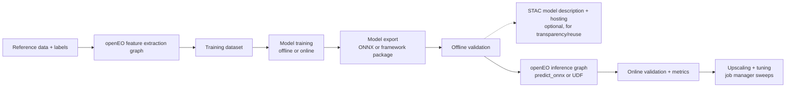

---
title: "Geospatial AI Playbook"
toc: true
---

::: {.content-visible when-format="llms-txt"}

## Summary

A hands-on guide to incorporating machine-learning projects with openEO end to end, from reference data and feature
extraction to training, model packaging, inference, validation, and upscaling.

:::

This playbook focuses on what works in real projects and where teams usually lose time.

It complements [Machine Learning](cube_operations/machine_learning.qmd), [User Defined Functions](cube_operations/udf.qmd),
[User Defined Processes](cube_operations/udp.qmd), and [Execute openEO Jobs](cube_operations/execute_jobs.qmd).

## Where openEO helps most in an ML workflow

openEO is strongest at consistent, reproducible EO data access and processing at scale. In practice, a robust setup uses
openEO for feature extraction and operational inference, while heavy training often stays in external GPU environments.
Once trained, the model is brought back into openEO as a reusable inference block.

This split is usually a strength: extraction and inference stay reproducible, while model development stays flexible. By
keeping openEO constraints in mind from the start, many later operational hurdles can be avoided.

This playbook shares the working patterns we have learned from real projects. Its scope covers organising reference data
with STAC, extracting EO features, training models, converting them to ONNX, describing models with STAC, running inference
and validation pipelines in openEO, and upscaling with performance tuning. Each of those stages maps to a section below.

## End-to-end story



## 1. Data extraction and feature engineering in openEO

If your goal is an ML model that is eventually operationalized through openEO, start with openEO constraints in mind from
day one. The biggest failures we see are not model or openEO failures; they are data-distribution failures: training on
data that is not available on target backends, or training on a product variant that differs from what operations will use
(for example, processing-baseline differences).

That is why the first real step is backend discovery, not model design. Before you write a single line of model code, check
which collections are actually available on the backend you intend to use in production, whether their temporal coverage is
good enough for your use case, and whether the backend processing level matches your planned production workflow. A model
trained on Sentinel-2 L2A data from one backend may not behave the same way when the operational backend serves a different
processing baseline, a different cloud-masking approach, or a different atmospheric correction. These differences are often
subtle in isolation but compound across a full inference run.

No single backend has everything. When a needed source is missing, openEO's `load_stac` is often the clean fallback path
for integrating external, open, STAC-compliant assets: [load_stac process
reference](https://open-eo.github.io/openeo-python-client/api-processes.html#openeo.processes.load_stac). This lets you
pull in data from other catalogs without leaving the openEO graph, which keeps the extraction logic in one place rather
than splitting it across systems.

The practical goal is simple: make feature extraction an openEO-native graph from day one so that the model trained on
those features still behaves correctly during openEO inference. Once extraction is reproducible and composable, you can
turn it into integration and regression checks (for example, in ESA APEx: https://apex.esa.int/algorithm-support). That
gives you a clear 'MLOps' path and a way to share preprocessing pipelines with the community.

In this way you maintain an explicit data-input pipeline that is transparent about input bands and source collections,
physical units and scaling (for example, reflectance in $[0,1]$, DN, SAR dB vs. linear), CRS and resolution, temporal
compositing, cloud/no-data handling, and feature-engineering steps. Each of these choices affects what the model sees, and
making them explicit rather than implicit is what allows anyone to reproduce a data extraction.

When moving toward the training step, freeze the extraction graph and treat it as part of the model definition. This means
versioning the graph alongside the model weights, so that when you later load the model for inference, you can verify that
the input features are being generated by the exact same logic that produced the training data.

Example patch extraction graph:

```python
import openeo

connection = openeo.connect("https://openeo.dataspace.copernicus.eu").authenticate_oidc()

cube = connection.load_collection(
  "SENTINEL2_L2A",
  spatial_extent={"west": 5.08, "south": 51.20, "east": 5.22, "north": 51.31},
  temporal_extent=["2024-04-01", "2024-09-30"],
  bands=["B02", "B03", "B04", "B08", "SCL"],
)

features = (
  cube.filter_bands(["B02", "B03", "B04", "B08"])
  .resample_spatial(resolution=10, projection=32631)
  .aggregate_temporal_period(period="dekad", reducer="median")
)

job = features.execute_batch(
  out_format="NetCDF",
  title="features_s2_dekad_v1",
  job_options={},
)
```

In the next section we will go deeper in how to optimally arrange the data extraction.

## 2. Organising and extracting reference data for machine learning

Training a machine-learning model on Earth observation data starts with high-quality reference data: a set of locations for
which the target variable (for example, a crop type, land-cover class, or biophysical measurement) is known. This section
describes how to organise such reference data and how to extract the corresponding satellite observations with openEO,
either as points (tabular time series per sample) or as patches (small raster chips per sample).

### 2.1 Extraction modes

The first decision you make is whether your model needs per-pixel time series or spatial patches, dictated by the
architecture of the model you intend to train. A random forest or gradient-boosted tree expects a table of features per
sample, while a convolutional neural network expects a small image chip around each sample.
openEO supports both, but the extraction process, the output format, and the job-sizing considerations are different enough
that it is worth deciding early.

- Point extraction
  Process: `aggregate_spatial`
  Typical model: models operating on per-pixel time-series inputs, such as random forests,
  gradient boosting, or time-series deep-learning models (for example, LSTM, transformers)
  Output: a vector cube, exported as tabular data (Parquet/CSV) with one row per sample and
  observation date
- Patch extraction
  Process: `filter_spatial`
  Typical model: models requiring spatial context, such as convolutional neural networks or
  vision transformers
  Output: a sparse raster cube, exported as one netCDF or GeoTIFF file per sample polygon

For process details and parameters, see
[`aggregate_spatial`](https://openeo-python-client.readthedocs.io/en/latest/api/openeo.rest.datacube.html#openeo.rest.datacube.DataCube.aggregate_spatial)
and
[`filter_spatial`](https://openeo-python-client.readthedocs.io/en/latest/api/openeo.rest.datacube.html#openeo.rest.datacube.DataCube.filter_spatial).

### 2.2 Organising your reference data

#### Format and structure

Reference data is best managed as a vector dataset, with one feature per sample. The structure you choose here determines
how smoothly the rest of the pipeline runs, because every downstream step (extraction, training, validation) inherits the
decisions you make at this stage.

- **Geometry**: a point for point extractions, or a polygon (the patch outline) for patch extractions. For patch
  extractions, keep patches small, for example 64x64 up to 512x512 pixels; larger areas are better handled as a separate
  job per sample. The reason for this limit is practical: a single large polygon forces the backend to materialize a large
  raster cube for that one sample, which can dominate job cost and memory even when the rest of the samples are tiny.
- **Target attribute(s)**: the label or value that your model will learn to predict. If you have multiple target variables,
  keep them as separate columns rather than encoding them into a single field; this makes it easier to train different
  models from the same reference dataset without re-extracting.
- **Sample identifier**: a unique ID per sample, so extracted pixels can be traced back to the original reference data.
  This becomes essential during validation, when you need to compare predictions against reference labels sample by sample.
- **Temporal information (recommended)**: a validity date or period per sample, so you can define the correct temporal
  extent when extracting satellite data. Without this, you either extract a fixed window for all samples (which may be
  wrong for samples collected in different seasons) or you manually split the reference data into temporal groups, which is
  error-prone at scale.

The recommended file formats are GeoParquet and GeoJSON. GeoParquet is preferred for larger datasets, as it is compressed,
columnar, and faster to read. GeoJSON is fine for small datasets and for cases where you need to inspect the file by hand,
but it becomes unwieldy beyond a few thousand features.

> **Tip**
>
> The WorldCereal Reference Data Module (RDM) is a good example of how reference data can be curated and harmonised at
> scale: samples are stored with a unique ID, a harmonised label, a validity time, and quality attributes, and are exported
> as GeoParquet for extraction.

#### Cataloguing with STAC

When your reference data grows beyond a handful of files, the STAC specification can help keep it organised and
discoverable. Describe each GeoParquet/GeoJSON file as a STAC item, with its spatial and temporal extent as item metadata
and the file itself as an asset, and group the items in a STAC collection. The label extension can additionally document
the classes and tasks of your labels. This makes it easy to search reference data by region or period, and the asset URLs
can be passed directly to `load_url` for extraction.

The practical benefit is that you stop tracking reference data in a spreadsheet or a folder tree. Instead, you can query a
catalog for "all reference data covering this region and this time period" and get back a list of URLs that feed directly
into the extraction pipeline. This is especially valuable when reference data is contributed by multiple partners or
collected over several years.

#### Hosting the data at a URL

Sending many geometries inline as GeoJSON quickly makes openEO requests too large. Instead, upload your reference data to a
(publicly) accessible URL, for example object storage (S3), Artifactory, or a GitHub repository, and load it into openEO
with the `load_url` process
([`Connection.load_url()`](https://openeo-python-client.readthedocs.io/en/latest/api/openeo.rest.connection.html#openeo.rest.connection.Connection.load_url)):

```python
import openeo

connection = openeo.connect("openeofed.dataspace.copernicus.eu").authenticate_oidc()

reference_data = connection.load_url(
    "https://example.com/my_reference_data.parquet",
    format="Parquet",
)
```

For GeoJSON files, use `format="GeoJSON"` instead.

If you do not have your own hosting, the openEO Python client provides an [artifact helper](../api-artifacts.rst) that
temporarily stores files on S3 storage offered by the backend and returns a presigned URL that can be passed straight to
`load_url`:

```python
from openeo.extra.artifacts import build_artifact_helper

artifact_helper = build_artifact_helper(connection)
storage_uri = artifact_helper.upload_file("my_reference_data.parquet")
reference_data_url = artifact_helper.get_presigned_url(storage_uri)

reference_data = connection.load_url(reference_data_url, format="Parquet")
```

> **Note**
>
> Artifact storage is backend-specific functionality and the uploaded files are only kept temporarily, so it is well suited
> for one-off extractions, but not as a long-term home for your reference dataset. If you rely on it for a multi-week
> training campaign, you may find that your reference data has expired between runs.

#### Splitting into spatial groups

For large-scale (for example, continental or global) reference datasets, do not extract everything in a single batch job. A
single job that covers a continent will typically fail for one of two reasons: either it runs out of memory because the
backend tries to materialize too many input assets at once, or it runs for so long that any transient failure forces you to
start over. Instead, split your samples into spatial groups, resulting in one GeoParquet/GeoJSON file and one openEO batch
job per group. The Sentinel-2 tiling grid (MGRS, roughly 110x110 km tiles) is a good unit for this: one job per Sentinel-2
tile keeps the job size manageable, aligns with how the input data is stored, and guarantees that each group stays within a
single UTM zone.

The openEO Python client offers a [job splitting
utility](https://open-eo.github.io/openeo-python-client/cookbook/job_manager.html#splitting-an-area-into-tiles)
(`split_area` in `openeo.extra.job_management`) that partitions your area or samples over a tile grid, such as a
pre-computed Sentinel-2 tile grid, and returns a GeoDataFrame with one row per tile — a ready-made starting point for a job
database. The openEO [MultiBackendJobManager](https://open-eo.github.io/openeo-python-client/cookbook/job_manager.html) can
then run and track the resulting list of extraction jobs.

> **Important**
>
> Not only the spatial extent of a group, but also its spatial density (how many reference observations fall within that
> extent) determines how large a job can be. A tile with thousands of samples may need to be split further, while sparsely
> sampled tiles could be merged into a single job. Finding the right job size may require some trial-and-error fine-tuning.
> A good starting point is to aim for a few hundred to a few thousand samples per job, then adjust based on observed
> runtime and memory usage.

### 2.3 Loading satellite data

Load the satellite collections that provide the input features of your model, restricting the spatial and temporal extent
to what is needed for your samples. A typical multi-sensor example with Sentinel-2 optical data and Sentinel-1 SAR data:

```python
temporal_extent = ["2024-01-01", "2024-12-31"]

s2 = connection.load_collection(
    "SENTINEL2_L2A",
    temporal_extent=temporal_extent,
    bands=["B02", "B03", "B04", "B08", "B11", "B12", "SCL"],
    max_cloud_cover=80,
)

s1 = connection.load_collection(
    "SENTINEL1_GRD",
    temporal_extent=temporal_extent,
    bands=["VV", "VH"],
)
```

At this point, there is no need to specify a `spatial_extent`: the extraction processes (`aggregate_spatial` or `filter_spatial`) which
were referenced above; come into play at the end of the process graph and restrict the computation to the sample locations.
This is a deliberate design choice in openEO: the extraction process knows which pixels it needs, so it can push that constraint down
to the data loading step rather than reading the entire scene and then filtering.

### 2.4 Preprocessing

Whether and where to preprocess is a design choice of your ML pipeline, and it is worth making it explicitly rather than
letting it emerge by accident. The two options have different trade-offs:

- **Preprocess in openEO**: apply cloud masking (for example, based on the Sentinel-2 SCL band with
  `mask_scl_dilation`/`to_scl_dilation_mask`), compute backscatter with `sar_backscatter`, composite to regular time steps
  with `aggregate_temporal_period`, resample with `resample_cube_spatial`, and merge sensors with `merge_cubes`. This
  yields analysis-ready training data and keeps the ML code simple. The advantage is that the preprocessing is visible in
  the openEO graph, versioned alongside the extraction logic, and applied identically to training and inference.
- **Preprocess in the model**: extract (nearly) raw observations and perform normalisation, compositing, or feature
  engineering inside the model itself, for example as part of an ONNX model that is later used for inference in openEO.
  This guarantees that training and inference apply identical preprocessing, but it pushes complexity into the model export
  and makes the preprocessing harder to inspect or modify without retraining.

Whichever option you choose, make sure the extraction produces exactly the inputs your model expects at inference time. The
most common source of silent accuracy loss in production is a mismatch between the preprocessing applied during training
and the preprocessing applied during inference; for example, training on reflectance scaled to $[0,1]$ and inferring on DN
values, or training with cloud-masked composites and inferring on raw scenes.

```python
# Example: monthly compositing and merging into a single feature cube
s2_masked = s2.process(
    "mask_scl_dilation",
    data=s2,
    scl_band_name="SCL",
)
s2_monthly = s2_masked.aggregate_temporal_period(period="month", reducer="median")
s1_monthly = s1.aggregate_temporal_period(period="month", reducer="mean")

features = s2_monthly.merge_cubes(s1_monthly.resample_cube_spatial(s2_monthly))
```

### 2.5 Point extraction with `aggregate_spatial`

For point-based models, use
[`aggregate_spatial`](https://openeo-python-client.readthedocs.io/en/latest/api/openeo.rest.datacube.html#openeo.rest.datacube.DataCube.aggregate_spatial)
to sample the feature cube at your reference locations. The reducer receives the pixel values intersecting each geometry.
For point geometries this is typically a single pixel, so the choice of reducer barely matters: any reducer (`mean`,
`median`, `first`, ...) will simply return that pixel's value.

`aggregate_spatial` can also be used with polygon geometries, for example to extract one aggregated time series per parcel
instead of per pixel. In that case the reducer does matter, as it determines how the pixels within each polygon are
combined (for example, `mean` or `median`).

```python
samples = features.aggregate_spatial(
    geometries=reference_data,
    reducer="mean",
)

job = samples.execute_batch(
    out_format="Parquet",
    title="ML point extraction",
)
```

In contrast to `filter_spatial`, which produces raster output, `aggregate_spatial` produces vector output: a table with one
value per sample, band, and timestep, which can be exported to GeoParquet or CSV and used directly for model training. This
tabular structure is what makes point extraction a natural fit for classical ML models, which expect a fixed-length feature
vector per sample.

#### Attribute propagation

All attributes (properties) of the features in your reference data (labels, sample identifiers,
validity dates) are propagated to the extracted output. For `aggregate_spatial`, these
properties are carried into the vector result. For `filter_spatial`, the feature metadata is
retained in per-feature outputs when using `sample_by_feature` together with a stable
`feature_id_property`. In the common workflow, there is no need to join extractions back to the
reference data afterwards: labels and metadata travel with the extracted values. This saves a
surprising amount of error-prone bookkeeping, especially when reference data is split across
multiple files and extraction jobs.

### 2.6 Patch extraction with `filter_spatial`

For models that need spatial context, use
[`filter_spatial`](https://openeo-python-client.readthedocs.io/en/latest/api/openeo.rest.datacube.html#openeo.rest.datacube.DataCube.filter_spatial)
with polygon geometries describing the patch outlines. The backend then only computes the data cube for those polygons,
producing a sparse raster output cube. Combine this with the `sample_by_feature` output option
to write one file per sample (see
[`DataCube.create_job`](https://openeo-python-client.readthedocs.io/en/latest/api/openeo.rest.datacube.html#openeo.rest.datacube.DataCube.create_job)):

```python
patches = features.filter_spatial(geometries=reference_data)

job = patches.create_job(
    title="ML patch extraction",
    out_format="netCDF",
    sample_by_feature=True,
    feature_id_property="sample_id",
)
job.start_and_wait()
job.get_results().download_files("patches/")
```

Each resulting netCDF file contains the full time series of all bands for one patch, named after the `sample_id` property
of the corresponding feature. These files can be converted into training tensors for your deep learning framework of
choice.

> **Warning**
>
> Extraction only works as a batch job, since it produces multiple output files that cannot be transferred in a synchronous
> call.

### 2.7 Performance considerations

Extraction is not necessarily cheap: even a sparse output may require reading a large number of raw EO assets. The input
data volume, not the output size, usually determines cost and duration. A patch extraction that produces a few megabytes of
netCDF output may still read gigabytes of Sentinel-2 imagery to compute those patches, because the backend has to load and
process the full scenes that intersect the sample locations.

- Group samples spatially (see [Splitting into spatial groups](#splitting-into-spatial-groups)) and run one job per
  Sentinel-2 tile.
- Restrict the temporal extent and band selection to what your model actually needs. Every extra band and every extra month
  of data adds to the input volume, even if the model ignores it.
- Consider caching extractions: store the extracted training data (for example, as GeoParquet in object storage) so that
  model iterations do not require re-extraction. This is especially valuable during the experimentation phase, when you may
  retrain a model dozens of times with different hyperparameters but the same input features.

## 3. Training strategy: where openEO fits

### 3.1 Training outside openEO (common path)

Deep learning training usually runs outside openEO on GPU-capable environments. European initiatives such as
[EOTDL](https://www.eotdl.com/) (Earth Observation Training Data Lab) are a good option if you want cloud-based training on
EU infrastructure. EOTDL is worth considering for three distinct reasons, and it helps to be clear about which one you
actually need:

- **A curated dataset repository.** EOTDL hosts a catalogue of EO training datasets that you can stage and reuse instead of
  rebuilding from scratch. If your task overlaps with an existing dataset, this can remove a large part of the
  reference-data work described in [Section 2](#2-organising-and-extracting-reference-data-for-machine-learning).
- **A staging mechanism.** Datasets can be staged into your own environment in a reproducible way, which matters when you
  want to pin a training run to a specific dataset version rather than a snapshot you copied by hand.
- **Cloud workspaces with GPU machines.** For the actual training step, EOTDL provides cloud workspaces suitable for GPU
  workloads, which is the piece openEO deliberately does not try to cover.

The reason training typically happens outside openEO is not a limitation of the platform but a matter of fit: openEO is
optimized for scalable EO data processing, not for GPU-accelerated gradient descent, and the tooling around model
development (experiment tracking, hyperparameter search, GPU scheduling) is more mature elsewhere.

The important part for this playbook is not where training runs, but that training sees exactly the same feature semantics
as operational inference. If you train on a laptop with locally downloaded data and then deploy to openEO, you are
implicitly trusting that the local data and the openEO data are equivalent. That trust is often misplaced, because the two
paths may differ in cloud masking, atmospheric correction, resampling, or compositing. Using EOTDL for training does not
change that requirement: whatever dataset you train on, the features must match what your openEO
inference graph will produce. For practical examples, see the EOTDL openEO use-case tutorials:
https://github.com/earthpulse/eotdl/tree/main/tutorials/usecases/openEO

### 3.2 Training in openEO for lightweight models

Reference implementation used here: [random-forest forest-fire
example](https://github.com/Open-EO/openeo-community-examples/tree/main/python/40_machine-learning/random-forest-forest-fire).

For tree-based models, openEO does support native training and inference, given that it is genuinely CPU-friendly:
`fit_class_random_forest` trains server-side on the backend's regular compute nodes. You send openEO a cube
of input features (predictors) and a set of labelled points (y_train), and the backend fits the
trees.

In that reference workflow, `training_cube` is built by merging Sentinel-1 features
(`s1_features`) and Sentinel-2 features (`s2_features`) before calling
`aggregate_spatial`. This keeps training and inference aligned because the same feature-building
logic is reused for prediction:

```python
training_cube = s2_features.merge_cubes(s1_features)
```

```python
# Train the model and DOWNLOAD THE IMAGE USED FOR TRAINING THE MODEL
target = json.loads(y_train.to_json())
predictors = training_cube.aggregate_spatial(
    target, reducer="median"
)
model = predictors.fit_class_random_forest(
    target=target,
    num_trees=200,
    seed=2082,
)
# Save the model as a batch job result asset
# so that we can load it in another job.
model = model.save_ml_model()
```

`fit_class_random_forest`  trains directly on the backend against those aggregated predictors and the `target` labels.

When saving the model, it does not return to your laptop; instead, it tells the backend to persist the fitted model as a
batch job result asset, alongside the usual STAC metadata.

### 3.3 Using the trained model at inference time

The companion notebook, `random-forest-inference-udp.ipynb`, picks the model up purely by URL:

```python
# link to the trained model
model = "https://s3.waw3-1.cloudferro.com/swift/v1/apex-examples/RF-ForestFire/RandomForest-ForestFire-model.json"
```

We can then reuse the same `s1_features` / `s2_features` helper functions to build the inference cube; there is no risk of
training/serving skew from re-implementing feature logic twice:

```python
# Load s1 and s2 features
s1_feature_cube = s1_features(connection, temporal_extent, spatial_extent, "median")
s2_feature_cube = s2_features(connection, temporal_extent, spatial_extent, "median", padding_window_size)
# Merge the two feature cubes
inference_cube = s2_feature_cube.merge_cubes(s1_feature_cube)

# predict on new data
inference = inference_cube.predict_random_forest(
    model=model,
    dimension="bands",
)
```

If your model cannot be expressed as a random forest (or another `predict_*` process openEO ships natively), fall back to
the ONNX/UDF path described below.

### 3.4 Embedding-first strategy

While at first glance CPU-friendly support seems limiting, it opens interesting alternative options in today's new paradigm with
embeddings.

Embeddings are "general" features learned from multi-modal satellite data. Such pre-computed or on-demand computed
features, based on advanced ML architectures, can already provide the heavy lifting for many applications. Instead of
training a large model from scratch for each new task, you can use an embedding model to convert raw imagery into a compact
representation, then train a small, task-specific model on top of that representation. This is often both cheaper and more
accurate than training a task-specific model end-to-end, because the embedding model has already learned to capture
relevant spatial and spectral patterns from a much larger and more diverse dataset.

Hence, in combination with such embeddings, CPU-friendly training methodologies become a cost-efficient way of getting to
specific insights. A random forest or logistic regression on top of embeddings can be trained in minutes on a laptop, while
still benefiting from the representational power of a large backbone.

Within openEO it is perfectly possible to generate embeddings on the fly as part of the feature-extraction pipeline. This
means you do not need to pre-compute and store embeddings for your entire area of interest; instead, the embedding model
runs as part of the same graph that produces your training features and your inference outputs, which guarantees
consistency between the two.

A practical pattern is:

1. Compute embeddings once in openEO.
2. Train small downstream models on top.
3. Deploy those light models back into openEO.

In the next few sections we detail how more heavyweight models such as embedders can be converted and integrated into openEO.
While the reference material focuses on embeddings, similar methods have been used to integrate alternative AI model
workflows into openEO.

Reference: [geospatial embeddings
examples](https://github.com/Open-EO/openeo-community-examples/tree/main/python/60_geospatial-embeddings). This folder is
the practical starting point for the embedding-first pattern. It contains several worked examples that cover different
points on the spectrum from classical dimensionality reduction to foundation-model-style embeddings:

- **Dimensionality reduction** examples showing how a compact representation can be derived without a heavy backbone,
  useful as a baseline before committing to a large model.
- **TESSERA** and **TerraMind** examples, which demonstrate foundation-model-style embeddings, including how the input
  calibration the network depends on is baked into the exported ONNX graph (see [Section
  4.3](#43-calibration-lives-inside-the-model)).

Each example is a runnable notebook rather than a fragment, so it doubles as a template for your own pipeline.

## 4. Packaging (embedding) models for openEO inference

### 4.1 User-Defined Functions: the integration point

The most common way to run an ML model inside openEO is a [User-Defined Function
(UDF)](https://open-eo.github.io/openeo-python-client/udf.html), simply because it offers incredible flexibility: a UDF
lets you import arbitrary Python code into your process graph instead of being limited to what the backend ships natively.
This is what makes it possible to run a custom neural network, a specialized embedding model, or any other Python-based
inference logic inside an openEO job.

That flexibility comes with a catch: UDF runtimes in the cloud are intentionally minimal. They ship with a small set of
pre-installed packages, and they are designed to be lightweight so that jobs can start quickly and run
efficiently on shared infrastructure. You can inspect what is available with the [runtime
docs](https://openeo.dataspace.copernicus.eu/openeo/1.2/udf_runtimes) or, on an established connection, with:

```python
connection.list_udf_runtimes()
```

> **Note**
>
> UDF runtimes and package support are backend-specific. Always check
> `connection.list_udf_runtimes()` (or the backend runtime endpoint) before pinning dependency
> archives, and retest when runtime versions change.

However there are two ways to extend what a UDF can use:

1. **Small packages**: install them inline inside the UDF itself via the [PEP 723 "inline script metadata"
   standard](https://open-eo.github.io/openeo-python-client/udf.html#declaration-of-udf-dependencies). This is the lightest
   option and works well for pure-Python dependencies. It is best suited for small utilities that do not have compiled
   extensions or complex transitive dependencies.
2. **Heavier packages** (the common case for ML): ship a prebuilt dependency archive and attach it through [job
   options](https://documentation.dataspace.copernicus.eu/APIs/openEO/job_config.html). Building and maintaining such
   archives requires dedicated tooling and solid openEO/runtime knowledge, so we build and maintain ready-to-use archives
   ourselves for the common ML formats (ONNX, PyTorch). The archive is downloaded once per worker and unpacked into the UDF
   runtime, which is why keeping it small matters for cold-start time.

A good strategy order is: start with pre-built dependency archives, then use small runtime additions for tiny extras, and
keep heavy runtime installation as a last resort.

Our strong default recommendation, for which we provide standard dependency archives, is ONNX.
ONNX (Open Neural Network Exchange) is an open model format for representing ML graphs across
frameworks (https://onnx.ai/onnx/intro/). For inference in openEO UDF jobs, ONNX Runtime is a
good fit because it is cross-platform, optimized for inference, and applies graph optimizations
at runtime (https://onnxruntime.ai/docs/). In practice this gives a strong operational
trade-off: smaller dependency bundles, faster cold starts, lower memory pressure, and fewer
runtime compatibility issues than shipping a full training framework archive.

For ONNX specifically, we for instance provide ONNX Runtime dependency archives such as:

```text
https://s3.waw3-1.cloudferro.com/swift/v1/project_dependencies/onnx_deps_python311.zip#onnx_deps
```

Example of wiring a dependency archive through job options:

```python
job = pred.execute_batch(
  out_format="NetCDF",
  title="udf_inference_with_deps",
  job_options={
    "udf-dependency-archives": [
      "https://example.org/archives/onnxruntime_deps.zip#deps"
    ],
    "executor-memory": "3g",
    "max-executors": 12,
  },
)
```

The syntax matters here, because the archive is mounted into the UDF runtime at a specific path and the `#` fragment in the
URL is what names that path. A model file and its runtime dependencies are typically passed as separate archives with
separate mount points, so the UDF can refer to them by a stable path regardless of the worker it happens to run on:

```python
job_options={
    "udf-dependency-archives": [
        "https://example.org/archives/onnxruntime_deps.zip#deps",
        "https://example.org/archives/model_files.zip#model",
    ],
}
```

Inside the UDF, those archives are then available as `deps/` and `model/` relative to the UDF's working directory.

Using a ready-made archive like this is exactly the "start with pre-built dependency archives" strategy recommended above:
it removes the build step from your critical path and lets you focus on the model itself.

### 4.2 Prefer ONNX when feasible

Default to ONNX export for stable inference models.

In practice this usually wins because it is lighter and simpler to operate. You generally get faster startup and less
dependency pain than shipping a full deep-learning framework. An ONNX Runtime archive is on the order of tens of megabytes,
while a full PyTorch archive can be hundreds of megabytes, and that difference translates directly into cold-start time and
memory overhead for every worker that loads the archive.

Use full-framework deployment only when you really need it: custom operators that do not export, highly dynamic model
logic, or models that are still changing every week.

### 4.3 Calibration lives inside the model

An added benefit of ONNX is that the framework provides more than a CPU-friendly transition: it is flexible enough to embed
the input calibration the network depends on (for example, z-score normalization), so the exported graph stays
self-contained instead of relying on the UDF to reproduce preprocessing exactly.

```python
class EncoderONNX(nn.Module):
    def __init__(self, backbone, mean, std):
        super().__init__()
        self.backbone = backbone
        self.register_buffer("mean", torch.tensor(mean).view(1, -1, 1, 1))
        self.register_buffer("std", torch.tensor(std).view(1, -1, 1, 1))

    def forward(self, data):
        return self.backbone((data - self.mean) / (self.std + 1e-9))
```

In this way you can be certain that the correct data distribution enters the model at runtime.

### 4.4 Tips for the ONNX conversion

Using ONNX is a strong choice when all of these are true:

1. The architecture is mostly fixed.
2. You can define one stable input/output contract (shape, dtype, layout).
3. You can pass source-vs-ONNX parity on representative data.
4. The target backend/runtime can run the exported opset with acceptable latency.

When exporting a model, treat export as an interface contract and lock the following parameters
explicitly:

1. **Input signature**: names, dtypes, rank, layout (`NCHW`/`NHWC`), dynamic axes. Dynamic axes can be a great asset for
   openEO, because optimization often means making the model run over as large an area as possible in one go. If the batch
   dimension is dynamic, the same exported model can process one tile or many tiles without re-export.
2. **Opset version**: explicit and pinned, never implicit defaults. Different opset versions support different operators,
   and an opset that works on your local ONNX Runtime may not be supported by the runtime available in the openEO backend.
3. **Output semantics**: logits/probabilities/embeddings and exact expected shape. This matters most when the output is
   consumed by downstream code that assumes a particular interpretation; a model that outputs logits but is treated as
   probabilities will produce subtly wrong results.
4. **Runtime target**: test on the runtime you will actually use in production (usually ONNX Runtime CPU in openEO UDF
   jobs). Testing on a different runtime, or on a GPU, can hide issues that only appear on the production runtime.

#### Reference export pipeline (PyTorch)

```python
import torch

# 1) Build a realistic dummy input in the exact layout your runtime will receive.
dummy = torch.randn(1, 4, 224, 224, dtype=torch.float32)

# 2) Export with explicit names, dynamic axes, and pinned opset.
torch.onnx.export(
  wrapped.eval().cpu(),
  dummy,
  "encoder.onnx",
  input_names=["data"],
  output_names=["embedding"],
  dynamic_axes={"data": {0: "batch"}, "embedding": {0: "batch"}},
  opset_version=17,
)
```

#### Sanity checks

Once the model is ported to ONNX and you want to incorporate the inference into an openEO UDF, there are a few safety
checks one has to build in. As openEO passes the input cube to the UDF, it is not guaranteed that the order of bands,
dimensions, or dtype of the cube is as you expected.

Therefore, within the UDF implementation it is good practice to ensure there is no:

1. **Layout mismatch**: trained with `NCHW`, inferred with `NHWC`. This is the most common mistake, because your
   conventions and openEO cube conventions are not the same, and the transpose may be implicit in one path but not the
   other.

2. **Implicit preprocessing**: training normalized input but exported graph assumes raw data. If normalization is not baked
   into e.g. the exported onnx graph, the UDF must reproduce it exactly, and any deviation will degrade accuracy without raising an
   error.

3. **dtype drift**: training path used `uint16`, runtime standardizes on float32.

4. **Dynamic-axis mismatch**: batch dynamic but spatial dimensions accidentally fixed (or vice versa). A model exported
   with a fixed spatial size will fail when during runtime you provide a different tile size.

## 5. ML models and STAC

In many projects we have seen that a single global model rarely works equally well everywhere, so the metadata
around a model matters almost as much as the model itself: it tells a future user, including future you, where the model is
expected to work and under which exact input contract.

The STAC community originally proposes the [Machine Learning Model (MLM) extension](https://github.com/stac-extensions/mlm), which
adds rich support for things like multiple model inputs, hyperparameters, and accelerator requirements.

At minimum, capture the spatiotemporal relevance, input band order, expected units and value ranges, tensor layout, expected tile shape and window
semantics, the normalization policy, output semantics, runtime requirements, and links to all sidecar
artifacts. This kind of information is especially relevant during deployment.

```json
{
  "stac_extensions": [
    "https://stac-extensions.github.io/mlm/v1.4.0/schema.json"
  ],
  "properties": {
    "mlm:name": "crop-encoder-v3",
    "mlm:architecture": "resnet-encoder",
    "mlm:tasks": ["classification"],
    "apex:input_bands": ["B02", "B03", "B04", "B08"],
    "apex:input_units": "surface_reflectance_0_1",
    "apex:input_layout": "NCHW",
    "apex:tile_shape": [224, 224],
    "apex:normalization": "embedded_in_onnx",
    "apex:output": {"name": "embedding", "dimensions": ["batch", 768]},
    "apex:onnx_opset": 17
  },
  "assets": {
    "model": {"href": "https://example.org/model.onnx", "type": "application/onnx"},
    "weights": {"href": "https://example.org/model.onnx.data", "roles": ["data"]}
  }
}
```

## 6. Emerging: a standardized ML API in openEO

Everything in this playbook currently relies on two mechanisms for getting a trained model into openEO: a `predict_*`
process that the backend ships natively (as in the forest-fire example), or a UDF that loads the model itself. Both work
today, and both are what you should build on for production right now.

There is, however, ongoing work to standardize how models are described and loaded in openEO, and it is worth being aware
of it so you can follow the direction of travel rather than being surprised by it later. The idea is to treat a trained
model as a first-class, discoverable object rather than as a file behind a URL:

- Models are described as STAC Items using the [MLM extension](https://github.com/stac-extensions/mlm), which is the same
  metadata layer discussed in [Section 5](#5-ml-models-and-stac).
- A dedicated process retrieves such a model directly from a STAC catalog, so the model URL, its input contract, and its
  provenance travel together.
- Inference then runs against that loaded model, without the user having to wire up a dependency archive or a UDF by hand
  for the common case.

This is a natural extension of the STAC description work already recommended in Section 5: if you have gone to the trouble
of describing your model with MLM metadata, a standardized loader is what makes that metadata pay off by letting other jobs
find and use the model directly. It does not change any of the practical advice in this playbook — keep using UDFs and
dependency archives for anything non-standard — but it is the direction the ecosystem is moving, and describing your models
with MLM metadata now positions them to take advantage of it when it lands.

## 7. Running inference inside the UDF

With the model packaged and described, the remaining work happens inside the UDF itself: deciding how the datacube is
chunked for the model, keeping sessions and sockets alive across invocations, and making sure a window of pixels is handled
consistently from training all the way through to a large-scale production run. The next few sections walk through the
patterns that tend to make this reliable in practice.

### 7.1 Choosing between `apply`, `apply_dimension`, and `apply_neighborhood`

openEO offers several ways of applying your custom script along a datacube, and the one you want depends mainly on the
input your ML network actually needs. Choosing the wrong one is not just inefficient; it can produce incorrect results if
the model expects spatial context that the process does not provide.

Quick rule of thumb:

1. Use [`apply`](https://openeo.org/documentation/1.0/processes.html#apply) when each pixel can be handled independently
   and there is no neighborhood context. This is the simplest and cheapest option, and it is appropriate for per-pixel
   operations like scaling or thresholding.
2. Use [`apply_dimension`](https://openeo.org/documentation/1.0/processes.html#apply_dimension) when logic runs along one
   dimension (most often time, `t`) for each pixel location. This is the natural choice for time-series models that consume
   a full temporal profile per pixel.
3. Use [`apply_neighborhood`](https://openeo.org/documentation/1.0/processes.html#apply_neighborhood) when your model needs
   a spatial patch (for example, CNN-style inference). This is the most expensive option, because it requires the backend
   to assemble overlapping spatial windows, but it is the only correct choice for models that use spatial context.

Minimal patterns:

```python
# 1) Per-pixel operation: no spatial context needed.
scaled = prediction.apply(lambda x: x * 100.0)
```

```python
# 2) Per-pixel time-series logic along one dimension.
udf_temporal = openeo.UDF.from_file("udf_temporal.py")

temporal_out = cube.apply_dimension(
  dimension="t",
  process=udf_temporal,
)
```

```python
# 3) Spatial patch inference with overlap.
udf_spatial = openeo.UDF.from_file("udf_spatial.py")

pred = features.apply_neighborhood(
  process=udf_spatial,
  size=[
    {"dimension": "x", "value": 224, "unit": "px"},
    {"dimension": "y", "value": 224, "unit": "px"},
  ],
  overlap=[
    {"dimension": "x", "value": 32, "unit": "px"},
    {"dimension": "y", "value": 32, "unit": "px"},
  ],
)
```

### 7.2 Spatial context and chunk semantics

For patch-based models that go through `apply_neighborhood`, the window size and overlap you choose at inference time need
to match what the model actually learned during training. The official process guidance is a useful anchor here: spatial
window sizes typically range from 64 to 512 pixels, with overlaps of 8 to 32 pixels being common, and openEO will stitch
the kept centers of neighboring chunks back together once processing finishes. A larger overlap reduces edge artifacts but
also increases memory pressure, since every extra pixel of overlap is recomputed in both of its neighboring chunks.

If the entire AOI is not an exact multiple of the apply window, center padding with NaNs is applied during the UDF runtime.
Therefore it is paramount that the UDF implementation knows how to work with NaN inputs. A UDF that assumes all input
pixels are valid will either crash or produce garbage at the edges of the AOI, and those errors can be difficult to trace
back to the padding behavior.

### 7.3 Caching and concurrency

A single batch job can spin up many workers, and each of those workers may process several chunks over its lifetime.
Loading a model and spinning up an inference session is comparatively expensive, so it pays off to cache the loaded
artifact at the module level instead of re-creating it for every chunk.

The thread settings on the inference session can also strongly impact performance. ONNX Runtime distinguishes between
intra-op threads, which parallelize work inside a single operator, and inter-op threads, which run independent branches of
the graph in parallel. Increasing the number of thread whilst avoiding oversubscription can pay off during runtime.
The number of optimal threads is again backend-specific; in our experience 2 works great.

> **Note**
>
> When benchmarking locally against openEO, set the same ONNX Runtime thread limits you use in the UDF. In our experience
> `intra_op_num_threads=2` and `inter_op_num_threads=2` is a good starting point. Comparing a local run with default
> all-core settings to a 2-thread UDF run will give misleading timings.

```python
def get_session(model_path, num_threads=2):
    options = ort.SessionOptions()
    options.intra_op_num_threads = num_threads
    options.inter_op_num_threads = num_threads
    options.execution_mode = ort.ExecutionMode.ORT_SEQUENTIAL
    options.graph_optimization_level = ort.GraphOptimizationLevel.ORT_ENABLE_ALL
    return ort.InferenceSession(model_path, options, providers=["CPUExecutionProvider"])
```

More threads is not automatically faster, and this is one of the more counter-intuitive things to tune. ONNX Runtime, BLAS,
and PyTorch each try to parallelize across all available cores by default, and when several of these libraries are active
in the same process, or when several worker processes share a node, their thread pools end up competing for the same
physical cores. The practical fix is to tune thread limits together with the executor configuration rather than in
isolation, generally keeping `intra_op_num_threads` close to the number of cores actually allocated to each executor.

## 8. Validation pipelines in openEO

Validation is only informative if it follows the same path as production. It is tempting to validate a model against a
convenient local dataset and call it done, but the goal here is to catch exactly the kinds of drift described above, so the
validation path has to go through the same UDF, the same context object, and ultimately the same backend that will run in
production. A validation that uses a different data path is not really validating the production system; it is validating a
related but distinct system.

A three-stage validation loop tends to catch problems early and cheaply, before they become expensive to debug on a large
job. The first stage checks tensor parity between the original model and the exported model, as already shown in
[4.3](#43-calibration-lives-inside-the-model). The second stage runs the UDF locally against a representative NetCDF tile,
which is fast to iterate on and catches most shape, dtype, and band-order mistakes. The third stage runs the same UDF
through the actual backend on a tiny, held-out area of interest, which is the only stage that can catch backend-specific
surprises. Each stage is cheap relative to the next, so a problem caught early saves both time and compute.

```python
inputs = xr.open_dataset("results/representative_input.nc")
inputs = inputs.drop_vars("crs", errors="ignore")
cube = inputs.to_array(dim="bands").astype("float32")
cube = cube.transpose("bands", "t", "y", "x")
tile = cube.isel(y=slice(0, 1024), x=slice(0, 1024))
result = apply_datacube(XarrayDataCube(tile), context)
```

Example 1: source-vs-ONNX parity check.

```python
with torch.inference_mode():
  source = wrapped(data).detach().cpu().numpy()

session = ort.InferenceSession("encoder.onnx", providers=["CPUExecutionProvider"])
exported = session.run(None, {"data": data.numpy()})[0]

assert source.shape == exported.shape
assert np.allclose(source, exported, rtol=1e-4, atol=1e-5)
```

Example 2: local UDF test on an openEO-generated cube.

```python
from udf import apply_datacube

inputs = xr.open_dataset("results/representative_input.nc")
cube = inputs.to_array(dim="bands").astype("float32").transpose("bands", "t", "y", "x")
tile = cube.isel(y=slice(0, 1024), x=slice(0, 1024))

result = apply_datacube(tile, context)
```

Example 3: tiny CDSE smoke run before scaling.

Start with a very small area (around 1x1 km), verify the output, and then scale up in small steps.

During this phase, add enough logging inside the UDF. You can retrieve these logs in the openEO
Web Editor (https://editor.openeo.org/) and quickly see what worked and what failed. Logging is
especially valuable here because the UDF runs remotely and you cannot attach a debugger;
the logs are your only window into what the code actually did.

Once the model runs reliably, expand the extent gradually. At some point you will likely hit OOM issues. When that happens,
increasing Python memory or executor memory overhead is usually the first thing to try. If that is
not enough, reach out through the Copernicus Data Space Ecosystem forum
(https://forum.dataspace.copernicus.eu/) for upscaling support, or get in touch with ESA APEx,
which provides algorithm support services (https://apex.esa.int/algorithm-support).

See [4.1](#41-user-defined-functions-the-integration-point) for how UDF runtimes, inline dependencies, and dependency
archives work.

## 9. Upscaling and performance tuning

### 9.1 Incremental scaling strategy

Scaling up is best done in phases rather than in one jump from a tiny test to the full operational extent. Start with a
tiny area of interest and a short time period, keep that area fixed while you tune job options, and only then start
increasing area and time range gradually. After each step, check coverage, output quality, and runtime before moving to the
next one.

In practice, this incremental approach pairs well with the
[`MultiBackendJobManager`](https://open-eo.github.io/openeo-python-client/cookbook/job_manager.html), which is built
specifically for running and tracking large numbers of batch jobs rather than babysitting them one at a time. Instead of
manually looping over areas or job options and keeping track of what succeeded, you describe the work as a small table, one row per job,
and let the manager submit, poll, retry, and download results for you. For a scaling sweep, describe the areas and memory settings as rows and let the manager run them:

```python
import pandas as pd
from openeo.extra.job_management import MultiBackendJobManager, create_job_db


def square_extent(km: float) -> dict:
    """Rough degree-based AOI for small scaling tests. Use a projected grid in production."""
    d = km / 111.0
    return {
        "west": 5.00,
        "south": 51.00,
        "east": 5.00 + d,
        "north": 51.00 + d,
        "crs": "EPSG:4326",
    }


scales = [
    {"label": "1km",  "spatial_extent": square_extent(1),  "executor-memoryOverhead": "1g"},
    {"label": "2km",  "spatial_extent": square_extent(2),  "executor-memoryOverhead": "1g"},
    {"label": "5km",  "spatial_extent": square_extent(5),  "executor-memoryOverhead": "2g"},
    {"label": "10km", "spatial_extent": square_extent(10), "executor-memoryOverhead": "2g"},
]

job_db = create_job_db("scaling_jobs.csv", df=pd.DataFrame(scales))


def start_job(row, connection, **kwargs):
    return connection.load_collection(
        "SENTINEL2_L2A",
        spatial_extent=row["spatial_extent"],
        temporal_extent=["2024-04-01", "2024-09-30"],
        bands=["B02", "B03", "B04", "B08"],
    ).execute_batch(
        out_format="GTiff",
        title=f"scale_{row['label']}",
        job_options={
            "executor-memoryOverhead": row["executor-memoryOverhead"],
        },
    )


manager = MultiBackendJobManager()
manager.add_backend("cdse", connection=connection, parallel_jobs=4)
manager.run_jobs(job_db=job_db, start_job=start_job)
```

Because the job database is persisted to disk (as CSV or Parquet), the whole run can be interrupted and resumed later with
`get_job_db()` without losing track of which tiles already finished, which is exactly the kind of bookkeeping that becomes
tedious to do by hand once you are past a handful of jobs.

### 9.2 Tune job options empirically

Job options rarely have one obviously correct setting, so it helps to start from a conservative baseline and vary one
parameter at a time rather than guessing at a large combination upfront. Changing multiple parameters at once makes it
impossible to attribute a change in runtime or success rate to any particular setting, which turns tuning into guesswork.

```python
base_job_options = {
    "driver-memory": "2g",
    "driver-memoryOverhead": "2g",
    "executor-memory": "3g",
    "executor-memoryOverhead": "2g",
    "python-memory": "3g",
    "max-executors": 15,
    "executor-cores": "1",
    "executor-task-cpus": "1",
    "udf-dependency-archives": [f"{ONNX_DEPS_URL}#onnx_deps"],
}

parameter_variations = [
    {"driver-memory": "1g"},
    {"driver-memory": "3g"},
    {"executor-memory": "2g"},
    {"max-executors": 10},
    {"max-executors": 20},
]
```

### 9.3 Use a job manager for variation sweeps

Once you are comparing more than a couple of variations, a job manager is worth the setup over ad-hoc manual runs, since it
makes the comparison reproducible: the same area of interest and time range stay constant, and only one option changes per
run. For each sweep run it is worth tracking the variation label, the resolved options, the job id and status, runtime and
backend metrics such as CPU or memory billing indicators, and basic output sanity checks like coverage, no-data share, and
value range. Failed runs are not wasted effort here either; they are useful evidence of lower bounds and deserve to stay in
the comparison table rather than being discarded.

The sweep below is written as a plain loop to keep the idea visible, but it is really a miniature version of what the
[`MultiBackendJobManager`](#91-incremental-scaling-strategy) does for you: a dataframe of variations, a `start_job`
callback, and a column of resulting job ids. For anything beyond a handful of variations, running it through the actual job
manager gets you retries, resumability, and parallel submission for free instead of having to add them by hand.

```python
from copy import deepcopy

results = []
for i, variation in enumerate(parameter_variations, start=1):
  opts = deepcopy(base_job_options)
  opts.update(variation)

  job = pred.execute_batch(
    out_format="GTiff",
    title=f"sweep_{i:02d}",
    job_options=opts,
  )
  results.append({
    "label": f"sweep_{i:02d}",
    "variation": variation,
    "job_id": job.job_id,
  })
```

```python
import pandas as pd

pd.DataFrame(results).to_csv("sweep_runs.csv", index=False)
```

### 9.4 UDF profiling before infrastructure changes

Before reaching for bigger executors or more memory, it is worth checking whether the UDF itself is the bottleneck.
Useful tools include:

- `time.perf_counter()` plus `logging` for coarse stage timing.
- `cProfile` + `pstats` for function-level CPU profiling.
- `line_profiler` (`kernprof -l -v`) for line-level hotspots.
- `memory_profiler` (`@profile`) for peak memory and per-line allocations.
- `tracemalloc` for Python allocation snapshots.
- `py-spy` for sampling remote or long-running processes where instrumentation is awkward.

In a UDF, keep profiling opt-in via an environment variable or job option, and log timings for model load,
preprocessing, inference, and postprocessing separately.

## Related references

- [Machine Learning](cube_operations/machine_learning.qmd)
- [User Defined Functions](cube_operations/udf.qmd)
- [User Defined Processes](cube_operations/udp.qmd)
- [Execute openEO Jobs](cube_operations/execute_jobs.qmd)
- [Data Discovery](data_discovery.qmd)
- [openEO community examples: geospatial
  embeddings](https://github.com/Open-EO/openeo-community-examples/tree/main/python/60_geospatial-embeddings)
- [EOTDL](https://www.eotdl.com/)
