---
title: "Geospatial AI Playbook"
toc: true
---

::: {.content-visible when-format="llms-txt"}

## Summary

A hands-on guide to running machine-learning projects with openEO end to end, from feature extraction and training to model packaging, inference, validation, and upscaling.

:::

This playbook focuses on what works in real projects and where teams usually lose time.

It complements [Machine Learning](cube_operations/machine_learning.qmd), [User Defined Functions](cube_operations/udf.qmd), [User Defined Processes](cube_operations/udp.qmd), and [Execute openEO Jobs](cube_operations/execute_jobs.qmd).

## Where openEO helps most in an ML workflow

openEO is strongest at consistent, reproducible EO data access and processing at scale. In practice, a robust setup uses openEO for feature extraction and operational inference, while heavy training often stays in external GPU environments. Once trained, the model is brought back into openEO as a reusable inference block.

This split is usually a strength: extraction and inference stay reproducible, while model development stays flexible.
By keeping openEO constraints in mind from the start, many later operational hurdles can be avoided.


This playbook shares the working patterns we therefore learned from real projects.

## End-to-end story

```mermaid
flowchart LR
  A[Reference data + labels] --> B[openEO feature extraction graph]
  B --> C[Training dataset]
  C --> D[Model training<br/>offline or online]
  D --> E[Model export<br/>ONNX or framework package]
  E --> F[Offline validation]
  F --> G[STAC model description + hosting]
  G --> H[openEO inference graph<br/>predict_onnx or UDF]
  H --> I[Online validation + metrics]
  I --> J[Upscaling + tuning<br/>job manager sweeps]
```



## 1. Data extraction and feature engineering in openEO

If your goal is an ML model that is eventually operationalized through openEO, start with openEO constraints in mind from the first day. The biggest failures we see are not model or openEO failures, they are data-distribution failures: training on data that is not available on target backends, or training on a product variant that differs from what operations will use (for example processing baseline differences).

That is why the first real step is backend discovery, not model design. Check which collections are available, whether temporal coverage is good enough, and whether the backend processing level matches your planned production workflow.

No single backend has everything. When a needed source is missing, openEO's `load_stac` is often the clean fallback path for integrating external, open, STAC-compliant assets: [load_stac process reference](https://open-eo.github.io/openeo-python-client/api-processes.html#openeo.processes.load_stac).

The practical goal is simple: make feature extraction an openEO-native graph from day one so that the model trained on those features still behaves correctly during openEO inference. Once extraction is reproducible and composable, you can turn it into integration and regression checks (for example in ESA APEx project environments and algorithm support workflows: https://apex.esa.int/project-environments and https://apex.esa.int/algorithm-support). That gives you a clear MLOps path and a way to share preprocessing recipes with the community.

In this way you maintain an exmplicit data-input pipeline which is transparant on the input bands and source collections, physical units and scaling (for example reflectance in $[0,1]$, DN, SAR dB vs linear), CRS and resolution, temporal compositing, cloud/no-data handling, and feature engineering steps.


When moving towards the  training step, freeze the extraction graph revision and treat it as part of the model definition.

Example extraction graph and feature export:

```python
import openeo

connection = openeo.connect("https://openeo.dataspace.copernicus.eu").authenticate_oidc()

cube = connection.load_collection(
  "SENTINEL2_L2A",
  spatial_extent={"west": 5.08, "south": 51.20, "east": 5.22, "north": 51.31},
  temporal_extent=["2024-04-01", "2024-09-30"],
  bands=["B02", "B03", "B04", "B08", "SCL"],
)

features = (
  cube.filter_bands(["B02", "B03", "B04", "B08"])
  .resample_spatial(resolution=10, projection=32631)
  .aggregate_temporal_period(period="dekad", reducer="median")
)

job = features.execute_batch(
  out_format="NetCDF",
  title="features_s2_dekad_v1",
  job_options={"executor-memory": "2g", "max-executors": 8},
)
```

Example sampling over training polygons:

```python
samples = features.aggregate_spatial(
  geometries=label_polygons,
  reducer="mean",
)
samples.download("training_features.geojson")
```


## 2. Training strategy: where openEO fits

### 2.1 Training outside openEO (common path)

Deep learning training usually runs outside openEO on GPU-capable environments. European initiatives such as [EOTDL](https://www.eotdl.com/) are a good option if you want cloud-based training on EU infrastructure.

The important part for this playbook is not where training runs, but that training sees exactly the same feature semantics as operational inference.

Reference implementation used here: [random-forest forest-fire example](https://github.com/Open-EO/openeo-community-examples/tree/main/python/40_machine-learning/random-forest-forest-fire).

In that example, the workflow is split in a way that maps well to production:
- EO feature engineering is handled in openEO (`eo_extractor.py` and a feature UDF).
- The model is trained as a lightweight random forest.
- Inference is executed as an openEO process graph (`fire_using_RF.json`) using `load_ml_model` and `predict_random_forest`.


### 2.2 Training in openEO for lightweight models: the forest-fire example, cell by cell

For tree-based models, openEO-native training and inference is a strong option, and it's genuinely CPU-friendly: `fit_class_random_forest` trains server-side on the backend's regular compute nodes, not on a GPU.  You send openEO a cube of infut features, e.g. determined in the previous step,  and a set of labelled points, and the backend fits the trees.

Here's the actual training call from `random-forest-training.ipynb`. By this point in the notebook, Sentinel-1 (`s1_features`) and Sentinel-2 (`s2_features`, including the GLCM texture UDF) cubes have already been merged into a single `training_cube`, and `y_train` is a GeoDataFrame of labelled points (fire / no-fire):

```python
# Train the model and DOWNLOAD THE IMAGE USED FOR TRAINING THE MODEL
predictors = training_cube.aggregate_spatial(
    json.loads(y_train.to_json()), reducer="median"
)
model = predictors.fit_class_random_forest(
    target=json.loads(y_train.to_json()),
    num_trees=200,
    seed=2082,
)
# Save the model as a batch job result asset
# so that we can load it in another job.
model = model.save_ml_model()
```

`fit_class_random_forest` then trains directly on the backend against those aggregated predictors and the `target` labels. 

When saving the model, it does not return to your laptop but it tells the backend to persist the fitted model as a batch job result asset, alongside the usual STAC metadata.
In this manner meta data is added to inform the user on the spatio temporal information of the training data; thereby making the application area of the model transparant. 
When you `execute_batch()` this graph, the job's results include an `ml_model_metadata.json` asset that any other openEO job can reference directly by URL. 


### 2.3 Using the trained model at inference time

The companion notebook, `random-forest-inference-udp.ipynb`, picks the model up purely by URL:

```python
# link to the trained model
model = "https://s3.waw3-1.cloudferro.com/swift/v1/apex-examples/RF-ForestFire/RandomForest-ForestFire-model.json"
```

Because the same `s1_features` / `s2_features` helper functions are reused to build the inference cube, there's no risk of training/serving skew from re-implementing feature logic twice:

```python
# Load s1 and s2 features
s1_feature_cube = s1_features(connection, temporal_extent, spatial_extent, "median")
s2_feature_cube = s2_features(connection, temporal_extent, spatial_extent, "median", padding_window_size)
# Merge the two feature cubes
inference_cube = s2_feature_cube.merge_cubes(s1_feature_cube)

# predict on new data
inference = inference_cube.predict_random_forest(
    model=model,
    dimension="bands",
)
```


If your model can't be expressed as a random forest (or another `predict_*` process openEO ships natively), fall back to the ONNX/UDF path described in the section below.


### 2.5 Embedding-first strategy

While at a first glance this support seems limiting, it opens interasting alternative options in todays's new paradime with embeddings. 

Embeddings are 'general' features learned based on multi model sattelite data. Such pre-computed or on demand computed features based on advanced ML architectures can already provide the heavy lifting for many applications.

Hence In combination with such embeddings, CPU friendly training methodologies becomes a cost efficient way for getting to specific insights.

Within openEO it is perfectly possible to generate embeddings on the fly as part of the 'feature extraction' pipeline.


A practical pattern is:

1. compute embeddings once in openEO,
2. train small downstream models on top,
3. deploy those light models back into openEO.


In the next few sections we detail how such heavy weight (embedding) models can be converted and integrated into openEO.
While the reference material focusses on embeddings; similar methods have been used to integrate alternative AI model workflows into openEO 
(https://github.com/Lavreniuk/Delineate-Anything/tree/main/openeo_udp, https://github.com/ray-climate/solar_openEO/tree/main/openeo_udp)

Reference: [geospatial embeddings examples](https://github.com/Open-EO/openeo-community-examples/tree/main/python/60_geospatial-embeddings).


## 3. Packaging (embedding) models for openEO inference

### 3.1 User-Defined Functions: the integration point

The most common way to run an ML model inside openEO is a [User-Defined Function (UDF)](https://open-eo.github.io/openeo-python-client/udf.html), simply because it offers incredible flexibility: a UDF lets you import arbitrary Python code into your process graph instead of being limited to what the backend ships natively.

That flexibility comes with a catch: UDF runtimes in the cloud are intentionally minimal. You can inspect what's available with the [runtime docs](https://openeo.dataspace.copernicus.eu/openeo/1.2/udf_runtimes) or, on an established connection, with:

```python
connection.list_udf_runtimes()
```

At first glance this looks very limiting, but there are two ways to extend what a UDF can use:

1. **Small packages**: install them inline inside the UDF itself via the [PEP 723 "inline script metadata" standard](https://open-eo.github.io/openeo-python-client/udf.html#declaration-of-udf-dependencies). This is the lightest option and works well for pure-Python dependencies.
2. **Heavier packages** (the common case for ML): ship a prebuilt dependency archive and attach it through [job options](https://documentation.dataspace.copernicus.eu/APIs/openEO/job_config.html). Building and maintaining such archives requires dedicated tooling and solid openEO/runtime knowledge, so we build and maintain ready-to-use archives ourselves for the common ML formats (ONNX, PyTorch).

A good strategy order is: start with pre-built dependency archives, then use small runtime additions for tiny extras, and keep heavy runtime installation as a last resort.

Our strong default recommendation is ONNX: it's a much lighter dependency than a full framework archive, which directly lowers the cost of the job (smaller archive to ship, faster cold start, less memory/time spent on imports).

A local import-path hack can accelerate prototyping, but production should use explicit deployable artifacts.

Example of wiring a dependency archive through job options:

```python
job = pred.execute_batch(
  out_format="NetCDF",
  title="udf_inference_with_deps",
  job_options={
    "udf-dependency-archives": [
      "https://example.org/archives/onnxruntime_deps.zip#deps"
    ],
    "executor-memory": "3g",
    "max-executors": 12,
  },
)
```

### 3.2 Prefer ONNX when feasible

Default to ONNX export for stable inference models.

In practice this usually wins because it is lighter and simpler to operate.
You generally get faster startup and less dependency pain than shipping a full deep-learning framework.

Use full-framework deployment only when you really need it: custom operators that do not export, highly dynamic model logic, or models that are still changing every week.

#### Fast decision rule 

Pick ONNX when all of these are true:

1. The architecture is mostly fixed.
2. You can define one stable input/output contract (shape, dtype, layout).
3. You can pass source-vs-ONNX parity on representative data.
4. The target backend/runtime can run the exported opset with acceptable latency.

Stay on full-framework packaging for now when at least one is true:

1. The model does not export cleanly.
2. You still change architecture/training code every week.
3. Runtime behavior depends on framework features that ONNX does not capture.

#### Treat export as an interface contract

Export is not just "run one command and done". Before publishing a model, lock these fields explicitly:

1. **Input signature**: names, dtypes, rank, layout (`NCHW`/`NHWC`), dynamic axes. Dynamic axes can be a great asset for openEO, because optimization often means making the model run over as large an area as possible in one go.
2. **Opset version**: explicit and pinned, never implicit defaults.
3. **Output semantics**: logits/probabilities/embeddings and exact expected shape.
4. **Runtime target**: test on the runtime you will actually use in production (usually ONNX Runtime CPU in openEO UDF jobs).

If any of these are fuzzy, you're not done packaging.

#### Reference export pipeline (PyTorch)

```python
import torch

# 1) Build a realistic dummy input in the exact layout your runtime will receive.
dummy = torch.randn(1, 4, 224, 224, dtype=torch.float32)

# 2) Export with explicit names, dynamic axes, and pinned opset.
torch.onnx.export(
  wrapped.eval().cpu(),
  dummy,
  "encoder.onnx",
  input_names=["data"],
  output_names=["embedding"],
  dynamic_axes={"data": {0: "batch"}, "embedding": {0: "batch"}},
  opset_version=17,
)
```

#### Sanity Checks

Once the model is ported to e.g. onnx and you want to incorperate the inference into an openEO UDF there are a few safety check one has to build in.
As openEO passes the input cube to the UDF, its not warrented that the order of bands, dimensions or dtype of the cube is as expected. This might even differe per back-end.

Therefore within the UDF implementation it is good practice to ensure there is no:

1. **Layout mismatch**: trained with `NCHW`, inferred with `NHWC`.
2. **Band-order mismatch**: model expects `B02,B03,B04,B08`, runtime sends different order.
3. **Implicit preprocessing**: training normalized input but exported graph assumes raw data.
4. **dtype drift**: training path used `float32`, runtime path silently casts/feeds another dtype.
5. **Dynamic axis mismatch**: batch dynamic but spatial dimensions accidentally fixed (or vice versa).

Most of these do not crash. They just give wrong outputs quietly, which is even worse.


### 3.3 Calibration lives inside the model

An added benefit of the use of onnx is that the framework provides more than a CPU friendly transition,  it's flexible enough to embed the input calibration the network depends on (e.g. z-score normalization), so the exported graph stays self-contained instead of relying on the UDF to reproduce preprocessing exactly. The [TerraMind](https://github.com/Open-EO/openeo-community-examples/tree/main/python/60_geospatial-embeddings/terramind) and [Tessera](https://github.com/Open-EO/openeo-community-examples/tree/main/python/60_geospatial-embeddings/tessera) embedding examples both bake this calibration step into the exported ONNX graph.

Given than most wrong output comes from silent failures due to data drift. If possible, bake normalization into the exported graph itself:

```python
class EncoderONNX(nn.Module):
    def __init__(self, backbone, mean, std):
        super().__init__()
        self.backbone = backbone
        self.register_buffer("mean", torch.tensor(mean).view(1, -1, 1, 1))
        self.register_buffer("std", torch.tensor(std).view(1, -1, 1, 1))

    def forward(self, data):
        return self.backbone((data - self.mean) / (self.std + 1e-9))
```

#### Validity check

The flow that works well in practice is:

1. First test parity between the original model runtime and the exported ONNX runtime.
2. Then generate a realistic input cube with openEO and run the UDF locally on that cube.
3. Only after those pass, run a tiny CDSE job (small AOI and short time window).
4. Then scale up gradually.

Example 1: source-vs-ONNX parity check.

```python
with torch.inference_mode():
  source = wrapped(data).detach().cpu().numpy()

session = ort.InferenceSession("encoder.onnx", providers=["CPUExecutionProvider"])
exported = session.run(None, {"data": data.numpy()})[0]

assert source.shape == exported.shape
assert np.allclose(source, exported, rtol=1e-4, atol=1e-5)
```

Example 2: local UDF test on an openEO-generated cube.

```python
from udf.py import apply_datacube

inputs = xr.open_dataset("results/representative_input.nc")
cube = inputs.to_array(dim="bands").astype("float32").transpose("bands", "t", "y", "x")
tile = cube.isel(y=slice(0, 1024), x=slice(0, 1024))

result = apply_datacube(tile, context)
```

Example 3: tiny CDSE smoke run before scaling.

Start with a very small area (around 1x1 km), verify the output, and then scale up in small steps.

During this phase, add enough logging inside the UDF. You can retrieve these logs in the web client and quickly see what worked and what failed.

Once the model runs reliably, expand the extent gradually. At some point you will likely hit OOM issues. When that happens, increasing Python memory or executor memory overhead is usually the first thing to try. If that is not enough, reach out through APEx or the CDSE forum for upscaling support.

See [3.1](#31-user-defined-functions-the-integration-point) for how UDF runtimes, inline dependencies, and dependency archives work.

### 5.2 Choosing between `apply`, `apply_dimension`, and `apply_neighborhood`

OpenEO offers varrious ways of applying your custom script along a datacube; the way you want to use mainly dependes on the required input for your ML network.


Quick rule of thumb:

1. Use `apply` when each pixel can be handled independently and there is no neighborhood context.
2. Use `apply_dimension` when logic runs along one dimension (most often time, `t`) for each pixel location.
3. Use `apply_neighborhood` when your model needs a spatial patch (for example CNN-style inference).

Minimal patterns:

```python
# 1) Per-pixel operation: no spatial context needed.
scaled = prediction.apply(lambda x: x * 100.0)
```

```python
# 2) Per-pixel time-series logic along one dimension.
udf_temporal = openeo.UDF.from_file("udf_temporal.py")

temporal_out = cube.apply_dimension(
  dimension="t",
  process=udf_temporal,
)
```

```python
# 3) Spatial patch inference with overlap.
udf_spatial = openeo.UDF.from_file("udf_spatial.py")

pred = features.apply_neighborhood(
  process=udf_spatial,
  size=[
    {"dimension": "x", "value": 224, "unit": "px"},
    {"dimension": "y", "value": 224, "unit": "px"},
  ],
  overlap=[
    {"dimension": "x", "value": 32, "unit": "px"},
    {"dimension": "y", "value": 32, "unit": "px"},
  ],
)
```

Its important to discuss how the overlap exactly works, as it may lead to the idea that we apply the UDF as a convolution kernel.
In reality the overlap works differently:

- openEO runs the UDF on overlapping patches.
- For each processed patch, the border area is dropped.
- Only the center part is kept and stitched with neighboring center parts.

That "center-keep" behavior is exactly what reduces tiling artifacts at patch boundaries.

Example intuition: with a $224 \times 224$ patch and $32$ px overlap on each side, the reliable center is
$$(224 - 2 \cdot 32) \times (224 - 2 \cdot 32) = 160 \times 160.$$ 

So every patch contributes mainly its $160 \times 160$ center, while the noisy borders are discarded.

If the entire AOI is not an exact multitude of the apply window; center padding with nans is applied during the UDF runtime. Therefore its paramount that the UDF implementation knows how to 
work with nan inputs. 

### 5.3 Caching and concurrency

Workers may process several chunks. Cache loaded artifacts/sessions and guard shared downloads with locks.

```python
def get_session(model_path, num_threads=2):
    options = ort.SessionOptions()
    options.intra_op_num_threads = num_threads
    options.inter_op_num_threads = num_threads
    options.execution_mode = ort.ExecutionMode.ORT_SEQUENTIAL
    options.graph_optimization_level = ort.GraphOptimizationLevel.ORT_ENABLE_ALL
    return ort.InferenceSession(model_path, options, providers=["CPUExecutionProvider"])
```

### 5.4 Spatial context and chunk semantics

For patch models using `apply_neighborhood`, make sure window size and overlap match what the model learned during training. Overlap helps reduce edge artifacts but increases memory pressure, and openEO will stitch chunk centers after parallel processing.

A common failure mode is using a generic tile/window size that does not match the model’s training assumptions.

Another common failure mode is silent metadata drift between training and inference. Keep model path, expected bands, and normalization policy together in one versioned context object.

Example UDF context contract:

```python
context = {
  "model": {
    "url": "https://example.org/models/encoder.onnx",
    "checksum": "sha256:...",
    "input_layout": "NCHW",
    "input_bands": ["B02", "B03", "B04", "B08"],
  },
  "normalization": {
    "kind": "zscore",
    "mean": [0.10, 0.12, 0.11, 0.28],
    "std": [0.05, 0.06, 0.07, 0.08],
  },
}
```

### 5.5 Embeddings as reusable products

Embeddings are often the most expensive stage. Export once and reuse when multiple downstream tasks need the same representation.

If embeddings are not a final deliverable, skip serializing them by default.

Example embedding export only when requested:

```python
if context.get("emit_embeddings", False):
  emb_cube.execute_batch(out_format="NetCDF", title="embeddings_export")
else:
  downstream_scores.execute_batch(out_format="GTiff", title="scores_only")
```

## 6. Validation pipelines in openEO

Validation must follow the same path as production.

Use a three-stage validation loop:

1. tensor parity: source vs exported model,
2. local UDF parity on representative NetCDF tile,
3. backend parity on tiny held-out AOI.

```python
inputs = xr.open_dataset("results/representative_input.nc")
inputs = inputs.drop_vars("crs", errors="ignore")
cube = inputs.to_array(dim="bands").astype("float32")
cube = cube.transpose("bands", "t", "y", "x")
tile = cube.isel(y=slice(0, 1024), x=slice(0, 1024))
result = apply_datacube(XarrayDataCube(tile), context)
```

Reference local-testing style: [THOR local UDF test](https://github.com/Open-EO/openeo-community-examples/tree/main/python/60_geospatial-embeddings/thor/tests).

Example tiny-area backend validation run:

```python
tiny = pred.filter_bbox(west=5.12, south=51.25, east=5.14, north=51.27)
job = tiny.execute_batch(out_format="NetCDF", title="tiny_validation_run")
tiny.download("pred_tiny.nc")
```

Example metric check from prediction and label arrays:

```python
import numpy as np
from sklearn.metrics import f1_score

pred = np.load("pred_labels.npy")
ref = np.load("reference_labels.npy")
valid = ref != 255

macro_f1 = f1_score(ref[valid], pred[valid], average="macro")
print({"macro_f1": float(macro_f1)})
```

When computing metrics, align predictions with independent references, guard against spatial or temporal leakage, and inspect output maps in addition to aggregate scores.

Persist experiment metadata: model STAC/checksum, UDF revision, dependencies, process graph, backend, split rule, job options, and metrics.

For scaling, move to large AOIs only when the validation bundle above is complete and reproducible.

## 7. Upscaling and performance tuning

### 7.1 Incremental scaling strategy

Scale in phases: start with a tiny AOI and short period, keep AOI fixed while tuning job options, then increase area and time range gradually. After each step, verify coverage, quality, and runtime before moving on. Only launch full operational extent once the setup is stable.

Keep one known-good local NetCDF benchmark tile for regression checks.

### 7.2 Threading and oversubscription

More threads is not automatically faster. ONNX Runtime, BLAS, and PyTorch can over-subscribe shared executors. Tune thread limits together with executor configuration.

### 7.3 Tune job options empirically

Use a conservative base and single-parameter variations.

```python
base_job_options = {
    "driver-memory": "2g",
    "driver-memoryOverhead": "2g",
    "executor-memory": "3g",
    "executor-memoryOverhead": "2g",
    "python-memory": "3g",
    "max-executors": 15,
    "executor-cores": "1",
    "executor-task-cpus": "1",
    "udf-dependency-archives": [f"{ONNX_DEPS_URL}#onnx_deps"],
}

parameter_variations = [
    {"driver-memory": "1g"},
    {"driver-memory": "3g"},
    {"executor-memory": "2g"},
    {"max-executors": 10},
    {"max-executors": 20},
]
```

### 7.4 Use a job manager for variation sweeps

For many experiments, use a job manager rather than ad-hoc manual runs. It ensures reproducible comparison over constant AOI/time range with one controlled change per run.

Track each sweep run with a variation label, resolved options, job id and status, runtime and backend metrics (for example CPU or memory billing indicators), and output sanity checks such as coverage, no-data share, and value range.

Failed runs are useful evidence of lower bounds and should stay in the comparison table.

Example manual sweep runner:

```python
from copy import deepcopy

results = []
for i, variation in enumerate(parameter_variations, start=1):
  opts = deepcopy(base_job_options)
  opts.update(variation)

  job = pred.execute_batch(
    out_format="GTiff",
    title=f"sweep_{i:02d}",
    job_options=opts,
  )
  results.append({
    "label": f"sweep_{i:02d}",
    "variation": variation,
    "job_id": job.job_id,
  })
```

Example tracking table export:

```python
import pandas as pd

pd.DataFrame(results).to_csv("sweep_runs.csv", index=False)
```

### 7.5 UDF profiling before infrastructure changes

Add opt-in stage timing and memory checks. Avoid diagnostic methods that materialize full arrays when sampling is enough.

```python
def diagnostic_sample(values, maximum=500_000):
    flat = np.asarray(values).reshape(-1)
    stride = max(1, flat.size // maximum)
    return flat[::stride][:maximum]
```

For PyTorch-based UDFs:

```python
torch.set_grad_enabled(False)
pieces = []
for batch in batches:
    with torch.inference_mode():
        pieces.append(model(batch).detach())

result = torch.cat(pieces, dim=0).cpu()
pieces.clear()
gc.collect()
```

Do not call garbage collection in hot loops without measured benefit.

## Model release checklist

Before moving beyond smoke tests, verify:

contract fields (bands, units, scale, temporal semantics, no-data policy) are explicit, source and exported model parity passes on representative fixtures, artifact and sidecars resolve in runtime paths, local and backend outputs agree on representative tests, held-out validation is reproducible, and job options are tuned on fixed small benchmarks before large-scale runs.


## 4. STAC model description and hosting

In many projects we see that it is difficult to have a single model which works well across the entire world; often the more accurate results.


Use STAC `ml-model` plus project-level metadata for operational details not enforced by base fields.

At minimum, capture input band order, expected units/ranges, tensor layout, expected tile shape/window semantics, normalization policy, output semantics, runtime requirements with checksums, and links to all sidecar artifacts.

```json
{
  "stac_extensions": [
    "https://stac-extensions.github.io/ml-model/v1.0.0/schema.json"
  ],
  "properties": {
    "ml-model:type": "ml-model",
    "apex:input_bands": ["B02", "B03", "B04", "B08"],
    "apex:input_units": "surface_reflectance_0_1",
    "apex:input_layout": "NCHW",
    "apex:tile_shape": [224, 224],
    "apex:normalization": "embedded_in_onnx",
    "apex:output": {"name": "embedding", "dimensions": ["batch", 768]},
    "apex:onnx_opset": 17
  },
  "assets": {
    "model": {"href": "https://example.org/model.onnx", "type": "application/onnx"},
    "weights": {"href": "https://example.org/model.onnx.data", "roles": ["data"]}
  }
}
```

Reference model collection: [World Agricultural Commodities model catalog](https://browser.moregeo.it/external/stac.openeo.vito.be/collections/world-agri-commodities-models).

Related process interfaces: [openEO Python client process definitions](https://github.com/Open-EO/openeo-python-client/blob/bc035cc74c1460e6d170fcfac8b0182254f6f19c/openeo/processes.py#L2138).

Example STAC generation with `pystac`:

```python
import pystac

item = pystac.Item(
  id="crop-encoder-v3",
  geometry=None,
  bbox=None,
  datetime=None,
  properties={
    "ml-model:type": "ml-model",
    "apex:input_bands": ["B02", "B03", "B04", "B08"],
    "apex:input_layout": "NCHW",
    "apex:normalization": "embedded_in_onnx",
  },
)

item.add_asset(
  "model",
  pystac.Asset(href="https://example.org/model.onnx", media_type="application/onnx"),
)
item.add_asset(
  "weights",
  pystac.Asset(href="https://example.org/model.onnx.data", roles=["data"]),
)

item.save_object(dest_href="stac/model-item.json")
```


## Related references

- [Machine Learning](cube_operations/machine_learning.qmd)
- [User Defined Functions](cube_operations/udf.qmd)
- [User Defined Processes](cube_operations/udp.qmd)
- [Execute openEO Jobs](cube_operations/execute_jobs.qmd)
- [Data Discovery](data_discovery.qmd)
- [openEO community examples: geospatial embeddings](https://github.com/Open-EO/openeo-community-examples/tree/main/python/60_geospatial-embeddings)
- [EOTDL](https://www.eotdl.com/)
