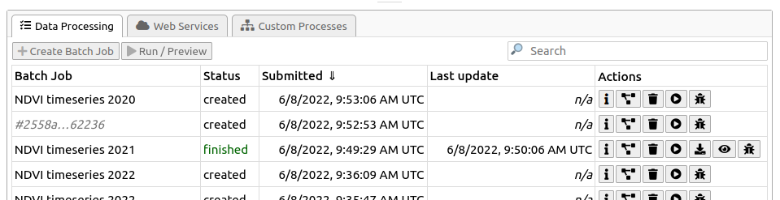

In openEO, when processes are applied to a datacube, a process graph is created to represent the sequence of operations. However, no actual computation occurs until the process graph is explicitly executed. There are two main ways to execute a process graph: synchronous requests for quick results and batch jobs for longer-running and advanced workflows with descriptive logging.

On this page, we will demonstrate how to execute openEO process graphs using both synchronous requests and batch jobs, and highlight key processes used within openEO.  


```{=html}
<div class="tag-filter-ui" id="tag-filter-ui">
</div>
```

::: {.callout-note collapse="true"}
## Backend support overview

The buttons above let you filter processes supported by different backends. Selecting or deselecting a backend will show or hide the relevant sections in the documentation. However, please note that it is based on the latest documentation rendering. Thus, please refer to the [openEO Hub](https://hub.openeo.org/) for the most up-to-date information.

:::


Once the process graph is ready, you need to decide how to execute it based on your requirements. It is important to understand the differences between synchronous requests and batch jobs.

* Use a synchronous request only for small, quick experiments that complete in a couple of minutes. 
* Use a batch job for larger areas, longer time ranges, UDFs, or advanced processing. A batch job runs on the backend after your script disconnects, and its result files and logs remain available afterwards.

Irrelevant of the method of execution you choose, you can save the result in any supported output format. See [Export Formats](../export_formats.qmd) to choose a format supported by the connected backend.


::: {.tag-filter-item data-process="save_result"}

## Execute synchronous requests

Most of the simple, basic openEO usage examples show synchronous downloading of results: you submit a process graph with an (HTTP POST) request and receive the result as a direct response to that same request. This only works properly if the processing doesn’t take too long (on the order of seconds or a couple of minutes at most).

A synchronous request executes the process graph and returns the result in the same request, useful for small areas, short time ranges, and quick checks. The request remains open until the backend finishes, so there is no job ID, status monitoring, or later result retrieval. If the request takes too long, it may result in timeouts or errors. In such cases, consider using a batch job instead.

::: {.panel-tabset}

### Python

```python
# DataCube.download() uses the connection's synchronous
cube.download(outputfile="./output/preview.tif")

# The connection method accepts a DataCube or another process graph directly.
connection.download(cube, "./output/preview.tif")
```

If outputfile is provided, the result is downloaded to that path. Otherwise, a bytes object containing the raw data is returned.

### R

```r
# Execute the graph synchronously and write the response to a local file.
compute_result(
  graph = p$save_result(data = cube, format = "GTiff"),
  output_file = "./output/preview.tif"
)
```

### JavaScript

```js
const result = builder.save_result(cube, "GTiff");

// Execute the graph synchronously and download the response.
await con.downloadResult(result, "./output/preview.tif");
```

:::

The `download` operation sends the complete process graph to the backend. It does not create a reusable batch job. Ensure the graph ends in an output that the requested format can store, and use only formats advertised by the backend. 

:::


## Execute a batch job

For the heavier work (larger regions of interest, larger time series, more intensive processing, ...), you have to use **batch jobs**, which are supported in the openEO API through separate HTTP requests, corresponding to these steps:

- you create a job (providing a process graph and some other metadata like title, description, ...)
- You start the job
- you wait for the job to finish, periodically polling its status
- When the job finishes successfully, get the listing of result assets
- you download the result assets (or use them in another way)


::: {.callout-tip collapse="true"}

## GUI for Batch Jobs

This documentation mainly discusses how to **programmatically** create and interact with batch jobs using the openEO client library. The openEO API, however, does not enforce the use of the same tool for each step in the batch job life cycle. For example: if you prefer a graphical, web-based **interactive environment** to manage and monitor your batch jobs, feel free to *switch to an openEO web editor* like `[openeo.dataspace.copernicus.eu](https://openeo.dataspace.copernicus.eu/)` at any time. After logging in, you will see your batch jobs listed under the "Data Processing" tab in this specific backend.



With the "action" buttons on the right, you can inspect batch job details, start/stop/delete jobs,
download their results, get batch job logs, etc.

:::

When using the openEO client library, if you have a (raster) datacube, you can easily create a batch job with the `DataCube.create_job()` method. It is important to specify the format in which the result should be stored, which can be done with an explicit `DataCube.save_result()` call before creating the job. Alternatively, you can specify the output format directly when creating the job using the `out_format` parameter.

Additionally, while not necessary, it is also recommended to give your batch job a descriptive title so it’s easier to identify in your job listing, especially when you have multiple jobs running concurrently.

::: {.panel-tabset}

### Python

```python
result = cube.save_result(format="GTiff")

job = result.create_job(
    title="Monthly NDVI composite",
    description="A monthly median NDVI workflow",
)
print(job.job_id)

job.start_and_wait()
job.get_results().download_files("./output")
```

### R

```r
result <- p$save_result(data = cube, format = "GTiff")

job <- create_job(
  graph = result,
  title = "Monthly NDVI composite",
  description = "A monthly median NDVI workflow"
)
print(job$id)

start_job(job = job)
download_results(job = job, folder = "./output")
```

### JavaScript

```js
const result = builder.save_result(cube, "GTiff");

const job = await con.createJob(
  result,
  "Monthly NDVI composite",
  "A monthly median NDVI workflow"
);
console.log(job.id);

await job.startJob();
```

:::

`cube.execute_batch(out_format="GTiff", title="Monthly NDVI composite") is a shortcut that creates, starts, and waits for a job in one call.

:::


::: {.tag-filter-item data-process="list_jobs"}

### List existing batch jobs

There is a `list_jobs()` method to find earlier work, along with its status and job ID. You can use `Connection.list_jobs()`, which returns a list of job metadata. 

::: {.panel-tabset}

#### Python

```python
for job_info in connection.list_jobs():
  print(job_info["id"], job_info["status"], job_info.get("title"))
```

#### R

```r
jobs <- list_jobs()
print(jobs)
```

#### JavaScript

```js
const jobs = await con.listJobs();
jobs.forEach(job => console.log(job.id, job.status, job.title));
```

:::

You can also open the same backend and account in an [openEO Web Editor](https://openeo.dataspace.copernicus.eu) to inspect process graphs, start, stop, or delete jobs, download results, and
view logs. 

:::


### Monitor a batch job

The job ID is the stable reference for reconnecting to the job later to check its status, retrieve results, or manage it from a different script or client. 

::: {.panel-tabset}

#### Python

```python
job = connection.job("job_id")
job.status()
```

#### R

```r
job_status <- describe_job(job = job)$status
print(job_status)
```

#### JavaScript

```js
console.log(job.status);
```

:::

Batch jobs progress through `created`, `queued`, `running`, and finally `finished`, `error`, or `cancelled`. Retrieve final result assets only after the job has finished.

When using '"job.start_and_wait() "or cube.execute_batch() to run a batch job and it fails, the openEO Python client library will print (by default) the batch job's error logs and instructions to help with further investigation.

::: {.panel-tabset}

#### Python

```python
# start_and_wait() starts the job and polls until it finishes or fails.
job.start_and_wait()
print(job.status())

# Logs are particularly useful when the status is "error".
for a log-in job.logs():
    print(log["level"], log["message"])
```

#### R

```r
start_job(job = job)

# Check the job details and status while it is running.
print(describe_job(job = job))

# Retrieve backend messages when troubleshooting a failed job.
print(list_job_logs(job = job))
```

#### JavaScript

```js
const stopMonitoring = job.monitorJob(async (job, logs) => {
  console.log(`Status: ${job.status}`);
  logs.forEach(log => console.log(`${log.level}: ${log.message}`));

  if (["finished", "error", "canceled"].includes(job.status)) {
    stopMonitoring();
  }
});
```

:::


### Retrieve job results

Once a batch job is finished, you can get a handle to the results (which can be a single file or multiple files) and metadata with `get_results()`.

A successful job can produce one or more result assets. The backend provides their metadata as-is, in fact, a valid STAC item, and download links as STAC metadata. 


In the general case, when you have one or more result files (also called “assets”), the easiest way to download them is to use download_files() (plural), where you specify a download folder (otherwise the current working directory will be used by default). Download all assets when you do not know how many files the result contains; select an individual asset only when the expected output is known.

::: {.panel-tabset}

#### Python

```python
results = job.get_results()
print(results.get_metadata())

# Download every result asset into a local folder.
results.download_files("./output")
```

#### R

```r
# List result metadata and download all result files.
print(list_results(job = job))
download_results(job = job, folder = "./output")
```

#### JavaScript

```js
const results = await job.listResults();

results.forEach(asset => {
  console.log(`${asset.title || asset.href}: ${asset.href}`);
});
```

:::


If you know that there is just a single result file, you can also download it directly with `download_file()` (singular) with the desired file name:

::: {.panel-tabset}

#### Python

```python
results = job.get_results()
results.download_file("./output/single_result_file.tif")
```

#### R

```r
download_results(job = job, folder = "./output", file = "single_result_file.tif")
```

#### JavaScript

```js
const results = await job.listResults();
const singleAsset = results[0];
await connection.downloadFile(singleAsset.href, "./output/single_result_file.tif");
```

:::

This will fail, however, if there are multiple assets in the job result (like in the metadata example above). In that case, you can still download a single asset by specifying which one you want to download with the `key` argument. 

If you need a bit more control over which asset to download and how, you can iterate over the result assets explicitly and download these `ResultAsset` instances with `download()`, like this:

::: {.panel-tabset}
#### Python

```python
for asset in results.get_assets():
    if asset.media_type.startswith("image/tiff"):
 asset.download("data/out/result-v2-" + asset.key)
```

#### R

```r
assets <- list_results(job = job)
for (asset in assets) {
  print(asset)
 download_results(job = job, folder = "./output", file = asset$key)
}
```

#### JavaScript

```js
const results = await job.listResults();
for (const asset of results) {
  console.log(`${asset.title || asset.href}: ${asset.href}`);
  await connection.downloadFile(asset.href, `./output/${asset.key}`);
}
```

:::

::: {.callout-tip collapse="true"}

# Asset Key as Filename

The `key` of an asset is not guaranteed to be directly usable as a filename safe, so while the snippet above glosses over that aspect, make sure to properly sanitise the filename or at least check the behaviour of the backend you are working with.

:::


### Directly load batch job results
  
If you want to skip downloading an asset to disk, you can also load it directly. For example, load a JSON asset with load_json():

::: {.panel-tabset}

#### Python

```python
asset.metadata
{"type": "application/json", "href": "https://openeo.example/download/432f3b3ef3a.json"}
data = asset.load_json()
data
{"2021-02-24T10:59:23Z": [[3, 2, 5], [3, 4, 5]], ....}
```
#### R

```r
asset$metadata
{"type": "application/json", "href": "https://openeo.example/download/432f3b3ef3a.json"}
data <- load_json(job = job, asset = asset$key)
data
{"2021-02-24T10:59:23Z": [[3, 2, 5], [3, 4, 5]], ....}
```
#### JavaScript
```js
asset.metadata
{"type": "application/json", "href": "https://openeo.example/download/432f3b3ef3a.json"}
const data = await connection.loadJson(asset.href);
data
{"2021-02-24T10:59:23Z": [[3, 2, 5], [3, 4, 5]], ....}
```

:::

### Stop or delete a job

Save the job ID printed when the job is created. It lets you reconnect from a later session or another client, inspect the job, and manage it without having to recreate the process graph. Stop a job that is no longer needed; delete it only when you no longer need its metadata or results.

::: {.panel-tabset}

#### Python

```python
job = connection.job("<job-id>")
print(job.status())

# Use only when required:
job.stop()
job.delete()
```

#### R

```r
job <- get_job(job_id = "<job-id>")
print(describe_job(job = job))

# Use only when required:
cancel_job(job = job)
delete_job(job = job)
```

#### JavaScript

```js
const job = await con.getJob("<job-id>");
console.log(job.status);

// Use only when required:
await job.cancelJob();
await job.deleteJob();
```

:::

::: {.callout-tip}
## Make jobs efficient

Filter space, time, and bands before computationally intensive processes. Test
a small area first, then submit the final workflow as a batch job. Inspect job
logs when a backend reports an error.

:::
