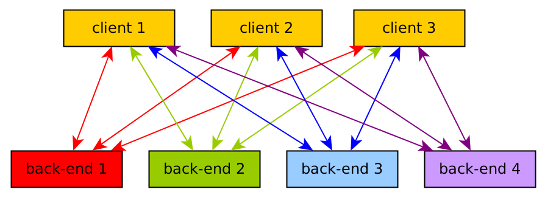
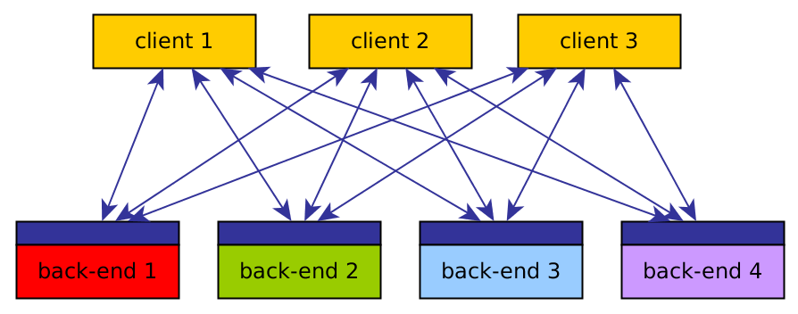

An **openEO backend** is a server-side implementation of the openEO API. It exposes Earth Observation data, processing capabilities, authentication, and execution infrastructure through a standard interface so that the client-side workflow can run against different providers with minimal changes.

In practice, a backend is the system that receives your process graph, validates it, executes it near the data, and returns results or job metadata. This is what makes openEO workflow interoperable.



## What a backend provides

Most openEO backends provide some or all of the following:

* **Collection discovery** so users can inspect available datasets and metadata.
* **Process discovery** so users can see which predefined processes are supported.
* **Data processing** through synchronous requests for smaller jobs and batch jobs for larger workloads with the available set of processes in the sepecific backend.
* **Result export** in one or more output formats such as GeoTIFF, NetCDF, or PNG.
* **Optional advanced features** such as user-defined functions (UDFs), user-defined processes (UDPs), file storage, etc.

## What differs between backends

Backends all speak the same API, but they do not all offer the same data, performance characteristics, or optional features. Typical differences include:

* **Available collections**: each provider exposes its own data holdings and curated products.
* **Process support**: a backend may support the core process set plus additional processes or specific profiles.
* **Execution modes**: some support only batch jobs, while others also support synchronous processing.
* **Formats and runtimes**: support for export formats, UDF runtimes, or web services can vary.
* **Access conditions**: authentication, quotas, billing, and free-tier options differ per provider.

For users, this means that openEO offers a common way of working, while backend choice determines which data and capabilities are actually available for a given workflow.

## Discover available backends

Backend availability evolves over time. Always use the hub as the current source of truth for supported services and their exact capabilities.


The authoritative live overview of publicly indexed openEO services is the [openEO Hub](https://hub.openeo.org/). The hub crawls backend metadata and lets you compare services based on what they expose.


openEO Hub is especially useful when you want to answer practical questions such as:

* Which backends support **basic functionality**, **synchronous processing**, or **batch processing**?
* Which backends expose a specific **collection** or **process**?
* Which services support certain **input formats**, **output formats**, or **UDF runtimes**?
* Which providers offer **file storage**, **additional web services**, **UDPs**, or **cost estimation**?
* Which backends have a **free plan** or meet other operational constraints?

You can explore the live catalogue directly here:

```{=html}
<iframe
	src="https://hub.openeo.org/"
	title="openEO Hub"
	loading="lazy"
	style="width: 100%; min-height: 950px; border: 1px solid #d9d9d9; border-radius: 8px; background: #fff;"
></iframe>
```

If the embedded view does not load in your browser, open the hub directly at [https://hub.openeo.org/](https://hub.openeo.org/).



::: {.callout-note}
## Note

The hub data shown in the embedded view is updated on each crawl, which may take a few days. For the most up-to-date information, always check the hub directly.
:::

## Choosing a backend

When selecting a backend for your work, start with these checks:

1. Does it provide the **collections** you need?
2. Does it support the **processes** and **execution mode** your workflow requires?
3. Does it offer the right **export formats**, **authentication model**, and **quota or billing model**?
4. Does it support advanced features you rely on, such as **UDFs**, **web services**, or **federated access**?

For a hands-on example of connecting to a backend and exploring its capabilities, see the [Setup](../setup.qmd) and [Cookbook](../cookbook.qmd) sections.

## For backend providers

If you want to offer your own service through openEO, do not start by writing everything from scratch. A good first step is to review the existing implementations and check whether one already matches your technology stack or operational model.

In practice, there are two common paths:

* **Reuse an existing driver** when one already suits your stack. In that case, your main work is usually data ingestion, process support, deployment, and operations.
* **Implement a new driver** when no existing backend architecture fits your environment. If you take this route, follow the openEO API and software development guidance closely from the start.

### Reuse before building

Before implementing a new backend, review the [Open-EO GitHub organization](https://github.com/Open-EO) for existing drivers and reusable components. Reusing an existing implementation is usually the fastest path to a production-capable service.

If you are implementing in Python, shared components such as [Python Driver Commons](https://github.com/Open-EO/openeo-python-driver) can reduce the amount of infrastructure code you need to maintain yourself.

If your preferred technology does not yet have an existing driver, you can also bootstrap an implementation from the [openEO API specification](https://api.openeo.org/) using OpenAPI-based tooling such as [OpenAPI Generator](https://github.com/OpenAPITools/openapi-generator).

### Concepts to understand first

Before you expose endpoints, make sure the conceptual model is clear. At minimum, a backend implementer should be familiar with:

* the [openEO glossary](../glossary.qmd),
* the overall architecture of openEO,
* the concepts behind processes and process graphs,
* the [openEO API specification](https://api.openeo.org/), and
* the [API and Processes profiles](https://openeo.org/documentation/1.0/developers/profiles/).

It is also worth reviewing cross-cutting API concerns such as authentication, error handling, and CORS behavior early in the design process.

### Implement in iterations

An incremental implementation strategy is recommended. A backend does not need to support every openEO feature in its first release.

Start with the discovery and capability surfaces that allow client libraries to understand what your service provides. In practice, that means implementing the **Capabilities**, **EO Data Discovery**, and **Process Discovery** building blocks first, and then adding **Batch Job Management** or **synchronous data processing** depending on your execution model.

Your capabilities document can already communicate which endpoints and features are supported, so partial but well-described implementations are perfectly valid during early iterations.

### Useful first iteration

A practical minimal first iteration is to implement:

* `GET /.well-known/openeo`
* `GET /`
* `GET /file_formats`
* `GET /collections`
* `GET /collections/{collection_id}`
* `GET /processes`
* `POST /result`
* `GET /credentials/basic` when authentication is required

With those pieces in place, client libraries can already discover capabilities, inspect data and process support, and execute simple workflows. Additional microservices can then be added progressively.

### What to add next

After the initial discovery and processing endpoints are working, the next additions typically include:

* broader process support,
* batch job lifecycle improvements,
* richer authentication and authorization models,
* advanced exports or secondary service types,
* UDF or UDP support, and
* compliance and interoperability testing.

The core principle is to ship a backend that is explicit about what it supports, then expand capabilities in manageable increments instead of trying to implement the entire ecosystem at once.
