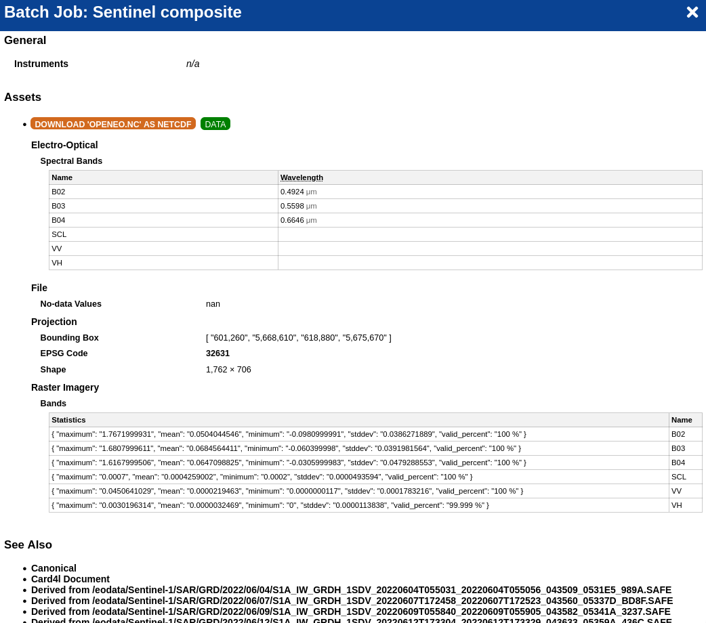
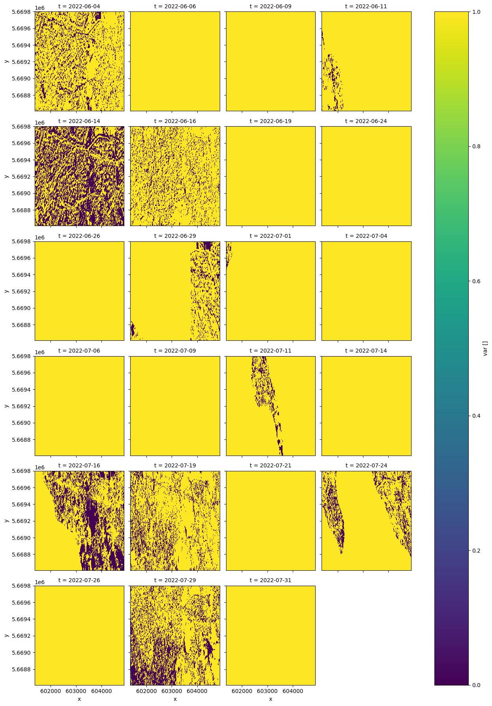

```{=html}
<!-- ANNOUNCE BAR -->
<div class="announce-bar">
  🎉 openEO API  released — <a href="">read the release notes →</a>
</div>

<!-- HERO -->
<section class="hero">
  <div class="hero-content">
    <div class="hero-badge">🌍  now available</div>
    <h1>Open-<span class="highlight">EO</span> Standard<br>for <em>Earth Observation Analysis</em></h1>
    <p><b>The openEO API</b> allows users to connect to Earth observation cloud back-ends in a simple and unified way.</p>
    <div class="hero-actions">
      <a href="documentation/cookbook.qmd" class="btn-primary">Get Started →</a>
    </div>
  </div>
</section>

<!-- STATS BAR -->
<div class="stats-bar">
  <div class="stat"><div class="stat-num">100+</div><div class="stat-label">EO Collections</div></div>
  <div class="stat"><div class="stat-num">+</div><div class="stat-label">Processes</div></div>
  <div class="stat"><div class="stat-num">+</div><div class="stat-label">Backends</div></div>
</div>

<!-- WHAT IS OPENEO -->
<section>
  <span class="section-eyebrow">What is openEO</span>
  <div class="what-grid">
    <div>
      <h2 class="section-title">One API.<br>Any cloud. Any language.</h2>
      <p class="section-sub">Whether you're using Python, R , JavaScript or Julia - <b>openEO</b> lets you write your analysis once and run it on any compatible back-end. No vendor lock-in. No rewriting code.</p>
      <div class="feature-list">
        <div class="feature-item">
          <div class="feature-check">✓</div>
          <div>
            <strong>Standardised processes</strong>
            <span>Use the same process names across different openEO back-ends </span>
          </div>
        </div>
        <div class="feature-item">
          <div class="feature-check">✓</div>
          <div>
            <strong>Datacube concept</strong>
            <span>Work with spatiotemporal datacubes natively</span>
          </div>
        </div>
        <div class="feature-item">
          <div class="feature-check">✓</div>
          <div>
            <strong>Reusable</strong>
            <span>Share and reuse EO workflows as processes</span>
          </div>
        </div>
        <div class="feature-item">
          <div class="feature-check">✓</div>
          <div>
            <strong>Open source</strong>
            <span>Apache 2.0: inspect, extend, contribute</span>
          </div>
        </div>
      </div>
    </div>
    <div class="code-block">
      <div class="code-header">s
        <div style="display:flex;align-items:center;gap:12px;">
          <div class="code-dots"><span class="red"></span><span class="yellow"></span><span class="green"></span></div>
          <span class="code-file">example.py</span>
        </div>
        <button class="copy-btn" onclick="copyCode(this)">copy</button>
      </div>
      <div class="code-body"><span class="kw">import</span> openeo

<span class="cm"># Connect to any openEO back-end</span>
conn = openeo.<span class="fn">connect</span>(<span class="str">"BACKEND_URL"</span>)
conn.<span class="fn">authenticate_oidc</span>()

<span class="cm"># Load Sentinel-2 data as a datacube</span>
cube = conn.<span class="fn">load_collection</span>(
    <span class="str">"SENTINEL2_L2A"</span>,
    spatial_extent={<span class="str">"west"</span>: <span class="num">4.0</span>, <span class="str">"east"</span>: <span class="num">4.5</span>,
                    <span class="str">"south"</span>: <span class="num">51.0</span>, <span class="str">"north"</span>: <span class="num">51.5</span>},
    temporal_extent=[<span class="str">"2024-06-01"</span>, <span class="str">"2024-08-31"</span>],
    bands=[<span class="str">"B04"</span>, <span class="str">"B08"</span>]
)

<span class="cm"># Compute NDVI</span>
ndvi = cube.<span class="fn">ndvi</span>(nir=<span class="str">"B08"</span>, red=<span class="str">"B04"</span>)
ndvi.<span class="fn">download</span>(<span class="str">"ndvi.nc"</span>)
</div>
    </div>
  </div>

```
::: {.callout-caution}

openEO is not to be confused with independant services that implement the specifications such as [CDSE](https://dataspace.copernicus.eu/).
For a list of services built on top of openEO, please visit the [openEO Hub](https://hub.openeo.org/).

:::

```{=html}
</section>
```


<!-- GET STARTED CARDS -->

::: {.alt .interest-section}
<span class="section-eyebrow">With openEO</span>
<h2 class="section-title">Are you interested in...</h2>
<p class="section-sub">openEO can be used to process and analyze Earth observation data from diverse sources in a unified and efficient manner.</p>

::: {.panel-tabset .interest-tabset}

## Downloading RGB image

::: {.interest-detail}
Quickly build true-color composites from Sentinel-2 and export clean visuals for maps, reports, and monitoring dashboards.

::: {.interest-preview}

<p>True-color Sentinel-2 composite output.</p>
:::

**Best for:** EO quicklooks, change communication, report-ready imagery  
**Data used:** Sentinel-2 L2A  
**Outcome:** RGB composite image

[Explore recipe →](documentation/cookbook.html#load-sentinel2-rgb-composite)
:::

## Performing Band Math

::: {.interest-detail}
Combine spectral bands to derive vegetation and environmental indicators with reusable, cloud-executed openEO pipelines.

::: {.interest-preview}

<p>Spectral index style output from band combinations.</p>
:::

**Best for:** index workflows and environmental monitoring  
**Data used:** Sentinel-2 L2A  
**Outcome:** EVI Geotiff image

[Run band math →](documentation/cookbook.html#evi-calculation)
:::

## Bringing your own functions

::: {.interest-detail}
Inject your domain logic with UDFs to extend standard processes while keeping your workflow portable across back-ends.

::: {.interest-preview}

<p>Workflow extension pattern for custom UDF logic.</p>
:::

**Best for:** custom algorithms and domain-specific logic  
**Data used:** Sentinel-2 L2A  
**Outcome:** custom UDF process

[Build your UDF →](documentation/cookbook.html#cookbook-udfs)
:::

## Share EO workflow as a service

::: {.interest-detail}
Package your workflow as a user-defined process so teams can execute the same analysis at scale with one endpoint.

::: {.interest-preview}

<p>API-oriented publishing view for reusable services.</p>
:::

**Best for:** operational teams and repeatable workflows  
**Data used:** Sentinel-2 L2A 
**Outcome:** reusable UDP service

[Publish workflow →](client_examples/openeo-community-examples/python/RandomForest-ForestFire/RandomForestModelInference_AsUDP.ipynb)
:::

## Large-scale Processing

::: {.interest-detail}
Orchestrate many jobs over large regions and time ranges while preserving reproducibility and runtime efficiency.

::: {.interest-preview}

<p>Batch processing view for multi-job execution.</p>
:::

**Best for:** regional to continental scale analysis  
**Data used:** Sentinel-2 L2A 
**Outcome:** batch job results and summaries

[Scale workloads →](client_examples/openeo-community-examples/python/ManagingMultipleLargeScaleJobs/ManagingMultipleLargeScaleJobs.ipynb)
:::

## Using Random Forest

::: {.interest-detail}
Train and apply machine-learning classifiers directly in your EO workflow to create reproducible land-cover intelligence.

::: {.interest-preview}

<p>Model training output with classification-ready features.</p>
:::

**Best for:** classification and model-driven EO analysis  
**Data used:** Sentinel-2 L2A and Sentinel-1 GRD
**Outcome:** trained model and inference maps

[View notebook →](client_examples/openeo-community-examples/python/RandomForest-ForestFire/RandomForestModelTraining.ipynb)  
[Run notebook (experimental) →](jupyterlite/lab/index.html?path=notebooks/RandomForest-ForestFire/RandomForestModelTraining.ipynb){target="_blank" rel="noopener"}
:::

:::
:::

```{=html}

<section class="alt" id="get-started-section">
  <span class="section-eyebrow">Get started</span>
  <h2 class="section-title">Choose your path</h2>
  <p class="section-sub">New to openEO? Start with a guide for your preferred language or tool.</p>
  <div class="cards-grid">
    <a href="https://hub.openeo.org/" class="card" target="_blank" rel="noopener">
      <div class="card-icon">&#127760;</div>
      <h3>Explore the openEO Hub</h3>
      <p>Find an openEO service and start working with Earth observation data.</p>
      <div class="card-arrow">&#8594; Open the Hub</div>
    </a>
    <a href="documentation/glossary.qmd" class="card">
      <div class="card-icon">📖</div>
      <h3>Concepts & Glossary</h3>
      <p>Understand datacubes, processes, UDFs, and the openEO data model before writing any code.</p>
      <div class="card-arrow">Glossary</div>
    </a>
    <a href="software.qmd" class="card">
      <div class="card-icon">🔧</div>
      <h3>Cookbook</h3>
      <p>Get started with practical examples and step-by-step guides to use openEO effectively for a specific usecase.</p>
      <div class="card-arrow">→ Step-by-step guide</div>
    </a>
    <a href="software.qmd" class="card">
      <div class="card-icon">🔧</div>
      <h3>Built-in openEO Processes</h3>
      <p>Learn how to use different openEO processes to analyze Earth observation data efficiently using either 🐍 Python, 📊 R or ⚡ JavaScript clients.</p>
      <div class="card-arrow">→ software list</div>
    </a>
    <a href="#" class="card">
      <div class="card-icon">🗺️</div>
      <h3>QGIS Plugin</h3>
      <p>Access openEO back-ends directly from QGIS with a graphical interface  to visualize openEO outputs.</p>
      <div class="card-arrow">→ QGIS guide</div>
    </a>
    <a href="#" class="card">
      <div class="card-icon">🔧</div>
      <h3>For Developers</h3>
      <p>Build a back-end or client library. API reference, profiles, and implementation guidelines.</p>
      <div class="card-arrow">→ developer docs</div>
    </a>
  </div>
</section>

```

<!-- NEWS (native Quarto block) -->
<section class="alt">
  <span class="section-eyebrow">Latest news</span>
  <h2 class="section-title">What's new</h2>

::: {#latest-news}
:::

</section>

```{=html}

<!-- FOOTER -->
<footer>
  <div class="footer-brand">
    <div class="footer-logo">
      <svg width="16" height="16" viewBox="0 0 22 22" fill="none" style="vertical-align:middle;margin-right:6px;"><circle cx="11" cy="11" r="10" stroke="#7dd9e8" stroke-width="1.5"/><path d="M6 11 Q11 5 16 11 Q11 17 6 11Z" fill="#7dd9e8" opacity="0.7"/></svg>
      openEO
    </div>
    <p>The project maintains the API and process specifications, and an open-source ecosystem with clients and server implementations.</p>
  </div>
  <div>
    <h4>Documentation</h4>
    <ul>
      <li><a href="#">Introduction</a></li>
      <li><a href="#">Datacubes</a></li>
      <li><a href="#">Processes</a></li>
      <li><a href="#">Cookbook</a></li>
      <li><a href="#">Authentication</a></li>
    </ul>
  </div>

  <div>
    <h4>Clients</h4>
    <ul>
      <li><a href="https://cran.r-project.org/package=openeo">CRAN / R</a></li>
      <li><a href="https://www.npmjs.com/search?q=%40openeo%2F">npm / JS</a></li>
      <li><a href="https://pypi.org/project/openeo/">PyPI / Python</a></li>
      <li><a href="https://anaconda.org/conda-forge/openeo">Conda Forge</a></li>
      <li><a href="https://github.com/Open-EO/openeo-julia-client">Julia</a></li>
      <li><a href="https://plugins.qgis.org/plugins/openeo_plugin/">QGIS</a></li>
    </ul>
  </div>
</footer>
<div class="footer-bottom">© 2026 openEO — Apache 2.0 License &nbsp;·&nbsp; Built with Quarto</div>
```
