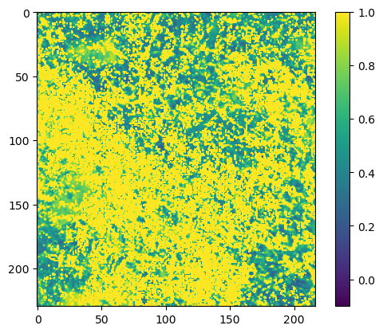
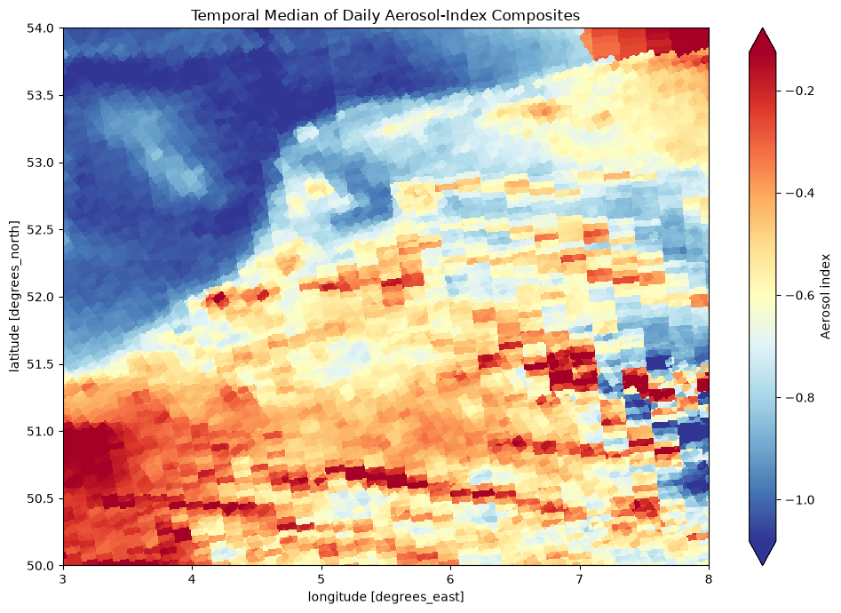
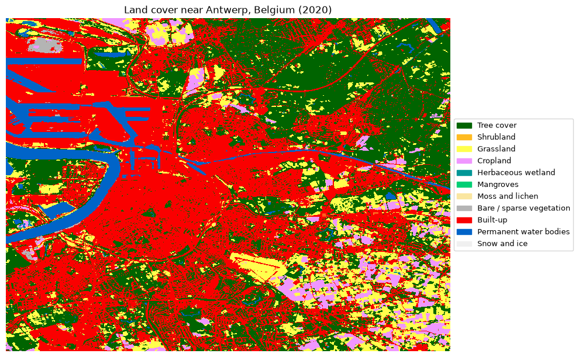
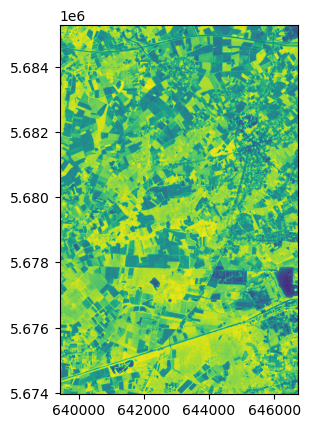
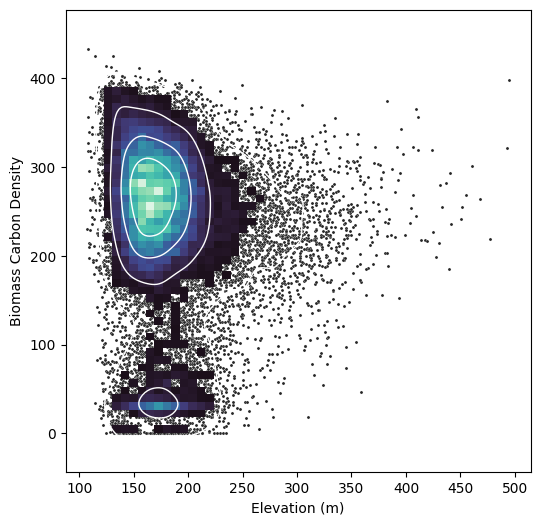
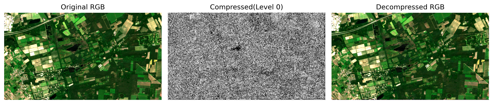

# Explore openEO Sample Notebooks

These sample notebooks are maintained in the [openEO community examples](https://github.com/Open-EO/openeo-community-examples/tree/main/python) repository. Use the category filters below to browse by topic, or the search box to find a specific use case.

##### Getting Started with openEO

##### Access PROBA-V Collection

##### Accessing and Analysing Sentinel-5P Products

##### Exploring CLMS Datasets with openEO

##### Explore Sentinel-5P Products with openEO

##### Advanced Use of Federated Processing

##### Loading a Single STAC Item

##### Using load_stac for External Datasets (Landsat 8)

##### Using load_stac for External Datasets (Biomass)

##### Access MODIS Data using openEO

##### Creating a Multi-Mission, Multi-Temporal Datacube

##### CORSA: Near-Lossless Image Compression for Sentinel-2

##### Hillshade from Copernicus 30 m DEM

##### Rank Composites

##### Best Available Pixel Composite

##### Sentinel-2 SCL Dilation Mask

##### Filling Missing Time Series Data with Lowess Regression

##### Using the BioPAR openEO Service

##### Exploring Carbon Dynamics from MODIS Products

##### Analyse Vegetation Productivity from MODIS Products

##### Parcel Delineation using openEO API

##### WorldCereal Product Download

##### Dynamic Land Cover Mapping

##### Land Cover Statistics Extraction (LCFM)

##### Regional Benchmarking Service for Anomaly Identification

##### Heatwave in the Netherlands

##### Comparing the Summer Drought in Serbia

##### Identifying Flooded Areas with Sentinel-1 Data

##### Before/After Flash Flood Comparison using NDWI

##### openEO Flood Monitoring: Pakistan Flooding of 2022

##### NDVI-based Approach to Study Landslide Areas

##### Oil Spill Mapping using Sentinel-1

##### Burnt Area Mapping using apply_polygon on a UDF

##### Forest Fire Analysis: Saving Multiple Results in One Job

##### Calculate Radar Vegetation Index (RVI)

##### Analysing openEO-Generated Interferograms for Surface Deformation

##### Analysing Coherence Output for Harvest-Day Detection

##### Publishing an openEO Workflow as a User-Defined Process

##### Soil Surface Moisture using openEO API

##### Dimensionality Reduction using Sentinel-2 (PCA)

##### ML-Ready Data Preparation using openEO

##### Running ML Inference with an ONNX Model

##### Forest Fire Mapping using Random Forest

##### Reusing openEO Workflows Saved as UDPs

##### TESSERA Pixel Embeddings from Sentinel-1/2

##### Geospatial Job Management and Visualisation

##### EO Data Processing with the openEO MultiBackendJobManager

[Go to community examples repository](https://github.com/Open-EO/openeo-community-examples/tree/main/python)

Back to top
