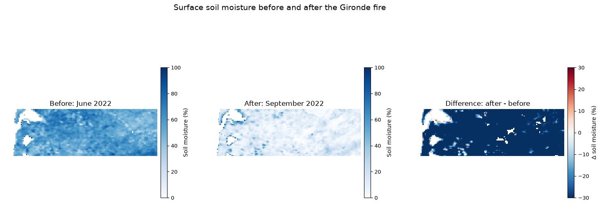

# Exploring Copernicus Land Monitoring Service (CLMS) Datasets with openEO in CDSE

This notebook demonstrates how to access and process Copernicus Land Monitoring Service (CLMS) datasets using the openEO API in the Copernicus Data Space Ecosystem (CDSE). Here, we walk you through the main steps of connecting to the ecosystem, discovering available collections, selecting suitable products for a specific region and temporal extent, and creating cloud-based processing workflows for further analysis and visualisation.

The examples cover land-cover mapping for Belgium and a wildfire-focused case study in Gironde, France, where burnt-area and soil-moisture products are compared before and after a fire event.

*Please note that this notebook is designed as a beginner-friendly introduction to working with CLMS products using openEO and not a comprehensive scientific analysis.*

``` python
# import the necessary packages

import openeo
from openeo import MultiResult
import pandas as pd
import numpy as np
import rasterio
import matplotlib
import matplotlib.pyplot as plt
```

``` python
# connect to the openEO backend and authenticate using OIDC
connection = openeo.connect("openeo.dataspace.copernicus.eu").authenticate_oidc()
```

    Authenticated using refresh token.

Let us have a quick overview of the CLMS datasets that are available in CDSE that we can access using openEO. The CLMS datasets are organized into different collections, each containing specific products related to land monitoring. For more information on the CLMS datasets, please refer to the [Copernicus Land Monitoring Service website](https://land.copernicus.eu/).

``` python
# use `list_collections()` to get an overview of the available collections in the backend
collections = connection.list_collections()
collection_overview = []
# Filter collections with "CLMS" in their title
for collection in collections:
    if "title" in collection and "CLMS" in collection["title"]:
        gsd = collection.get('summaries', {}).get('gsd', [None])[0]
        collection_overview.append(
            {
                "Collection ID": collection.get('id'),
                "Title": collection.get('title'),
                "Description": collection.get('description')
            }
        )

collection_overview_df = pd.DataFrame(collection_overview)
print(f"Found {len(collection_overview_df)} collections with 'CLMS' in the title.")
# Let us have a clean view of the collection
with pd.option_context('display.max_colwidth', None):
    display(collection_overview_df[:5])
```

    Found 109 collections with 'CLMS' in the title.

|  | Collection ID | Title | Description |
|----|----|----|----|
| 0 | CLMS_LCM_GLOBAL_10M_YEARLY_V1 | CLMS Land Cover Map (LCM) Global 10m yearly V1 (COG) | Provides at global level information on different types (classes) of physical coverage of the Earth's surface, e.g. tree cover, grasslands, croplands, permanent water bodies, wetlands at 10 m spatial resolution for the 2020 base year. The data are updated annually and will be available for the 2020-2026 years. This dataset builds upon initiatives like the 100 m Copernicus Global Land Cover layers (2015-2019) and offers enhanced spatial detail that facilitates more effective monitoring of global land cover changes, including deforestation, urbanization, and other environmental transformations. |
| 1 | CLMS_TCD_PANTROPICAL_10M_YEARLY_V1 | CLMS Tree Cover Density (TCD) Pantropical 10m yearly V1 (COG) | Provides pantropical tree cover density as projective tree cover in percent per pixel at 10 m resolution for the 2020 base year. The product belongs to the Copernicus Global Land Cover and Tropical Forest Mapping and Monitoring Service (LCFM) and builds upon initiatives like the REDDCopernicus, EO4SD Forest Monitoring and pan-European Vegetated Land Cover Characteristics. It advances tropical forest monitoring capabilities, ensuring alignment with international sustainability initiatives and providing critical information for analysis and monitoring of deforestation and forest degradation. |
| 2 | CLMS_BA_GLOBAL_300M_DAILY_V4 | CLMS Burnt Area (BA) Global 300m daily V4 (COG) | Maps burn scars, surfaces which have been sufficiently affected by fire to display significant changes in the vegetation cover (destruction of dry material, reduction or loss of green material) and in the ground surface (temporarily darker because of ash). Daily datasets are available at global scale, in the spatial resolution of 300 m, and within 24 hours after the satellite acquisition. They cover the period from January 2025 to present. |
| 3 | CLMS_NDVI_GLOBAL_300M_10DAILY_V3 | CLMS Normalized Difference Vegetation Index (NDVI) Global 300m 10-daily v3 (COG) | NDVI is an indicator of the greenness of the biomes. Every 10-days estimates are available in near real time at global scale in the spatial resolution of about 300 m from January 2014 to the present. |
| 4 | CLMS_ETA_GLOBAL_300M_10DAILY_V1 | CLMS Evapotranspiration (ETA) Global 300m 10-daily V1 (COG) | Provides actual evapotranspiration, soil evaporation and canopy transpiration with some quality indicators. Estimates are provided for two evapotranspiration schemes and an Ensemble of models. The 10-daily estimates are available at global scale in the spatial resolution of 300 m from November 2025 to present, derived from Sentinel-3 OLCI and SLSTR data. |

``` python
connection.describe_collection("CLMS_LCM_GLOBAL_10M_YEARLY_V1")
```

The collection listing above indicates the CLMS catalogue available in CDSE through the openEO API. This step is helpful when you are not yet sure which product best fits your use case. You can browse the available collections, inspect metadata, and then select the most relevant dataset for your region and analysis period.

#### Access Land cover over Belgium

As a simple example, let us explore the land-cover dataset for Belgium. With the `load_collection` process, we can select a collection, define the spatial extent, set a time range, and choose the relevant band. In this example, the `map` band contains the land-cover class information used to classify each pixel.

``` python
# around Antwerp
landcover_cube = connection.load_collection(
    "CLMS_LCM_GLOBAL_10M_YEARLY_V1",
    spatial_extent={"west": 4.35, "south": 51.15, "east": 4.55, "north": 51.30},
    temporal_extent=["2020-01-01", "2021-01-01"],
    bands=["map"],
)
```

Next, to download the data, we create a batch job in openEO that will fetch the data and perform clipping and filtering operations in the cloud. The resulting data will be downloaded to your local environment for further analysis and visualisation. For more information on openEO batch jobs, please refer to the [openEO documentation](https://open-eo.github.io/openeo-python-client/batch_jobs.html)

``` python
landcover_job = landcover_cube.create_job(title= "Landcover Antwerp 2024")
landcover_job.start_and_wait()
```

    0:00:00 Job 'j-2609081240114b5d82a43570b2a5d436': send 'start'
    0:00:06 Job 'j-2609081240114b5d82a43570b2a5d436': queued (progress 0%)
    0:00:11 Job 'j-2609081240114b5d82a43570b2a5d436': queued (progress 0%)
    0:00:18 Job 'j-2609081240114b5d82a43570b2a5d436': queued (progress 0%)
    0:00:26 Job 'j-2609081240114b5d82a43570b2a5d436': queued (progress 0%)
    0:00:36 Job 'j-2609081240114b5d82a43570b2a5d436': running (progress N/A)
    0:00:48 Job 'j-2609081240114b5d82a43570b2a5d436': running (progress N/A)
    0:01:04 Job 'j-2609081240114b5d82a43570b2a5d436': running (progress N/A)
    0:01:23 Job 'j-2609081240114b5d82a43570b2a5d436': running (progress N/A)
    0:01:47 Job 'j-2609081240114b5d82a43570b2a5d436': running (progress N/A)
    0:02:17 Job 'j-2609081240114b5d82a43570b2a5d436': finished (progress 100%)

``` python
result = landcover_job.get_results()
result_2024 = landcover_job.get_results()
```

``` python
# classes from https://stac.dataspace.copernicus.eu/v1/collections/clms_lcm_global_10m_yearly_v1_cog
LCM_LEGEND = {
    10: ("Tree cover", "#006400"),
    20: ("Shrubland", "#FFBB22"),
    30: ("Grassland", "#FFFF4C"),
    40: ("Cropland", "#F096FF"),
    50: ("Herbaceous wetland", "#009696"),
    60: ("Mangroves", "#00CF75"),
    70: ("Moss and lichen", "#FAE6A0"),
    80: ("Bare / sparse vegetation", "#B4B4B4"),
    90: ("Built-up", "#FA0000"),
    100: ("Permanent water bodies", "#0064C8"),
    110: ("Snow and ice", "#F0F0F0"),
}

img = rasterio.open("landcover_2020/openEO_2020-01-01Z.tif").read(1, masked=True)
img = np.ma.masked_invalid(img)

cmap = matplotlib.colors.ListedColormap([color for _, color in LCM_LEGEND.values()])
bounds = list(LCM_LEGEND.keys()) + [255]
norm = matplotlib.colors.BoundaryNorm(bounds, cmap.N)

fig, ax = plt.subplots(figsize=(10, 10))
im = ax.imshow(
    img,
    cmap=cmap,
    norm=norm,
    interpolation="nearest",
    aspect="equal",
)
ax.set_title("Land cover near Antwerp, Belgium (2020)")
ax.set_axis_off()

legend_patches = [
    plt.Rectangle((0, 0), 1, 1, color=color) for _, color in LCM_LEGEND.values()
]
ax.legend(
    legend_patches,
    [name for name, _ in LCM_LEGEND.values()],
    loc="center left",
    bbox_to_anchor=(1.0, 0.5),
    fontsize=9,
    frameon=True,
)
plt.tight_layout()
plt.show()
```


#### Explore Burnt area and soil moisture product in France

The first example shows how to access a single CLMS product for a small area. In the next section we want to use additional processes of openEO to further analyse the data.

This section uses the CLMS burnt-area product together with the surface-soil-moisture product for the Gironde/Landes region in France. The area was affected by severe wildfires in July 2022, which makes it a useful case study for comparing conditions before and after the event.

**Datasets used**

- `CLMS_BA_GLOBAL_300M_MONTHLY_V4` – monthly burnt-area product at 300 m resolution
- `CLMS_SSM_EUROPE_1KM_DAILY_V1` – daily surface soil-moisture product at 1 km resolution

``` python
# quick inspection of the burnt area product
connection.describe_collection("CLMS_BA_GLOBAL_300M_MONTHLY_V4")
```

``` python
# Landes/Gironde forest fires, France (fire occurred July 2022)
# bf_ntc: fraction of the pixel actually burned: it directly gives the fraction of each pixel actually burned, which is the most intuitive band for mapping burn extent/severity.

fire_extent = {"west": -1.35, "south": 44.35, "east": -0.05, "north": 44.75}
burnt_area_cube = connection.load_collection(
    "CLMS_BA_GLOBAL_300M_MONTHLY_V4",
    spatial_extent=fire_extent,
    temporal_extent=["2022-07-01", "2022-07-31"],
    bands=["bf_ntc"],
).reduce_dimension(dimension="t", reducer="first")

burnt_area_cube.download("burnt_area_gironde_2022_07.tiff")
```

In the cell above, we used two new openEO processes: `reduce_dimension` and `download`. The `reduce_dimension` process allows us to aggregate the data’s time dimension. For a detailed description of the process, you can execute the code `connection.describe_process("reduce_dimension")` to get more information about the process and its parameters.

Additionally, the [`download`](https://open-eo.github.io/openeo-python-client/api.html#openeo.rest.connection.Connection.download) process executes the workflow as a `batch job`, but it is recommended when you are interested in a smaller subset of the data. However, please note that the `download` process is not suitable for large datasets or long time series and does not provide the same level of logging and monitoring as a batch job.

Let us visualise the burnt area product for the Gironde/Landes region in France. The following code snippet demonstrates how to load the CLMS burnt-area product:

``` python
# Interactive burnt-area map using the existing fire_extent bbox.
import folium


def plot_burnt_area_interactive(raster_path, extent):
    with rasterio.open(raster_path) as src:
        arr = src.read(1, masked=True)
        arr = np.ma.masked_invalid(arr)

    burn_mask = np.ma.where(arr > 0.1, arr, 0.0)
    burn_mask = np.ma.filled(burn_mask, 0.0)

    minx, miny, maxx, maxy = extent["west"], extent["south"], extent["east"], extent["north"]
    center = [(miny + maxy) / 2, (minx + maxx) / 2]

    m = folium.Map(location=center, zoom_start=9, tiles="OpenStreetMap")
    folium.TileLayer(
        tiles="https://server.arcgisonline.com/ArcGIS/rest/services/World_Imagery/MapServer/tile/{z}/{y}/{x}",
        attr="Esri",
        name="Esri Satellite",
        overlay=False,
    ).add_to(m)

    folium.raster_layers.ImageOverlay(
        image=burn_mask,
        bounds=[[miny, minx], [maxy, maxx]],
        colormap=lambda x: (1, 0, 0, min(max(x, 0), 1)),
        opacity=0.8,
    ).add_to(m)

    folium.LayerControl().add_to(m)
    return m


plot_burnt_area_interactive("burnt_area_gironde_2022_07.tiff", fire_extent)
```

Make this Notebook Trusted to load map: File -\> Trust Notebook

``` python
# sanity check: the "hot" colormap renders NaN/nodata pixels as white, which can look like burnt patches
ba_img = rasterio.open("burnt_area_gironde_2022_07.tiff").read(1, masked=True)
ba_img = np.ma.masked_invalid(ba_img)
# 300m resultion to heactares 
pixel_area_ha = 300 * 300 / 10_000  
burnt_pixels = (ba_img > 0.1).sum()
estimated_burnt_area_ha = ba_img[ba_img > 0.1].sum() * pixel_area_ha

print(f"AOI size: {ba_img.shape[0]} x {ba_img.shape[1]} pixels ({ba_img.size * pixel_area_ha:.0f} ha)")
print(f"Pixels with burned fraction > 0.1: {burnt_pixels}")
print(f"Estimated burnt area: {estimated_burnt_area_ha:.1f} ha")
```

    AOI size: 135 x 438 pixels (532170 ha)
    Pixels with burned fraction > 0.1: 2511
    Estimated burnt area: 11813.5 ha

Next, making use of the several interesting products offered in CLMS, let us explore the soil-moisture product for the same region. The soil-moisture product is available at a daily temporal resolution, which allows us to compare the mean soil moisture before and after the fire event.

``` python
connection.describe_collection("CLMS_SSM_EUROPE_1KM_DAILY_V1")
```

In the cell below, we are calculating the difference between the mean soil moisture for a pre-fire period and a post-fire period. This will generate a simple spatial summary of how the soil-moisture signal changed after the fire event.

``` python
ssm_before = connection.load_collection(
    "CLMS_SSM_EUROPE_1KM_DAILY_V1",
    spatial_extent=fire_extent,
    temporal_extent=["2022-06-01", "2022-06-30"],
    bands=["ssm"],
).reduce_dimension(dimension="t", reducer="mean")

# fire was still actively burning in August (see year-scan above) -> use September for "after" instead
ssm_after = connection.load_collection(
    "CLMS_SSM_EUROPE_1KM_DAILY_V1",
    spatial_extent=fire_extent,
    temporal_extent=["2022-09-01", "2022-09-30"],
    bands=["ssm"],
).reduce_dimension(dimension="t", reducer="mean")

ssm_diff = ssm_after - ssm_before
ssm_diff
```

``` python
# first result
ssm_before_result = ssm_before.save_result(format="GTiff", options={"filename_prefix": "SSM_Before"})
# second result
ssm_after_result = ssm_after.save_result(format="GTiff", options={"filename_prefix": "SSM_After"})
# save SSM difference for comparison as third result
ssm_diff_result = ssm_diff.save_result(format="GTiff", options={"filename_prefix": "SSM_Difference"})
```

``` python
multi_result_nbr = MultiResult([ssm_before_result, ssm_after_result, ssm_diff_result])
ssm_job = multi_result_nbr.create_job(title="Multiple save result SSM")
ssm_job.start_and_wait()
```

    0:00:00 Job 'j-260908125354494faf613f0327f81cce': send 'start'
    0:00:05 Job 'j-260908125354494faf613f0327f81cce': created (progress 0%)
    0:00:11 Job 'j-260908125354494faf613f0327f81cce': queued (progress 0%)
    0:00:17 Job 'j-260908125354494faf613f0327f81cce': queued (progress 0%)
    0:00:25 Job 'j-260908125354494faf613f0327f81cce': queued (progress 0%)
    0:00:35 Job 'j-260908125354494faf613f0327f81cce': queued (progress 0%)
    0:00:47 Job 'j-260908125354494faf613f0327f81cce': running (progress N/A)
    0:01:03 Job 'j-260908125354494faf613f0327f81cce': running (progress N/A)
    0:01:22 Job 'j-260908125354494faf613f0327f81cce': running (progress N/A)
    0:01:46 Job 'j-260908125354494faf613f0327f81cce': running (progress N/A)
    0:02:17 Job 'j-260908125354494faf613f0327f81cce': finished (progress 100%)

``` python
results = ssm_job.get_results()
results.download_files("ssm")
```

    [WindowsPath('ssm/SSM_After.tif'),
     WindowsPath('ssm/SSM_Before.tif'),
     WindowsPath('ssm/SSM_Difference.tif'),
     WindowsPath('ssm/job-results.json')]

``` python
ssm_before_img = rasterio.open("ssm/SSM_Before.tif").read(1, masked=True)
ssm_after_img = rasterio.open("ssm/SSM_After.tif").read(1, masked=True)
ssm_diff_img = rasterio.open("ssm/SSM_Difference.tif").read(1, masked=True)

# let us mask the invalid values (NaN/nodata) to avoid plotting them
ssm_before_img = np.ma.masked_invalid(ssm_before_img)
ssm_after_img = np.ma.masked_invalid(ssm_after_img)
ssm_diff_img = np.ma.masked_invalid(ssm_diff_img)

# using a scale to keep nodata transparent
vmin, vmax = 0, 100
diff_vmin, diff_vmax = -30, 30

fig, axarr = plt.subplots(1, 3, figsize=(18, 6), gridspec_kw={"wspace": 0.25})

im0 = axarr[0].imshow(ssm_before_img, cmap="Blues", vmin=vmin, vmax=vmax, interpolation="nearest")
axarr[0].set_title("Before: June 2022", fontsize=12)
axarr[0].set_axis_off()
cbar0 = fig.colorbar(im0, ax=axarr[0], fraction=0.04, pad=0.02, shrink=0.9)
cbar0.set_label("Soil moisture (%)", fontsize=10)
cbar0.ax.tick_params(labelsize=9)

im1 = axarr[1].imshow(ssm_after_img, cmap="Blues", vmin=vmin, vmax=vmax, interpolation="nearest")
axarr[1].set_title("After: September 2022", fontsize=12)
axarr[1].set_axis_off()
cbar1 = fig.colorbar(im1, ax=axarr[1], fraction=0.04, pad=0.02, shrink=0.9)
cbar1.set_label("Soil moisture (%)", fontsize=10)
cbar1.ax.tick_params(labelsize=9)

im2 = axarr[2].imshow(ssm_diff_img, cmap="RdBu_r", vmin=diff_vmin, vmax=diff_vmax, interpolation="nearest")
axarr[2].set_title("Difference: after - before", fontsize=12)
axarr[2].set_axis_off()
cbar2 = fig.colorbar(im2, ax=axarr[2], fraction=0.04, pad=0.02, shrink=0.9)
cbar2.set_label("Δ soil moisture (%)", fontsize=10)
cbar2.ax.tick_params(labelsize=9)

fig.suptitle("Surface soil moisture before and after the Gironde fire", fontsize=14, y=1.02)
plt.tight_layout()
plt.show()
```

    C:\Users\SHARMAP\AppData\Local\Temp\ipykernel_29524\235117952.py:37: UserWarning: This figure includes Axes that are not compatible with tight_layout, so results might be incorrect.
      plt.tight_layout()



Hence, in this notebook we illustrated a simple workflow for using the openEO API to access CLMS datasets, combine them with built-in processes and save the results for further visualisation. The examples highlight two key strengths of the openEO framework: its ability to work with standardized geospatial collections and its built-in processes.

Back to top
