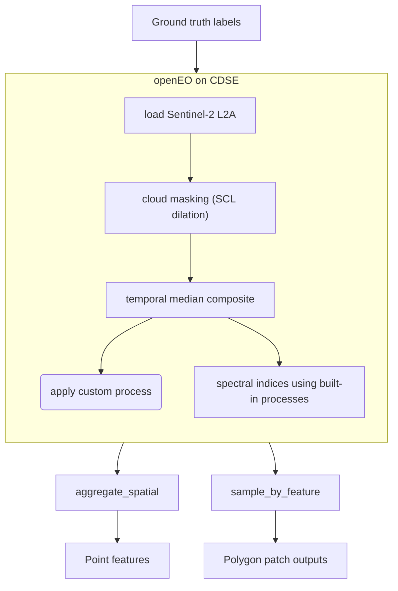
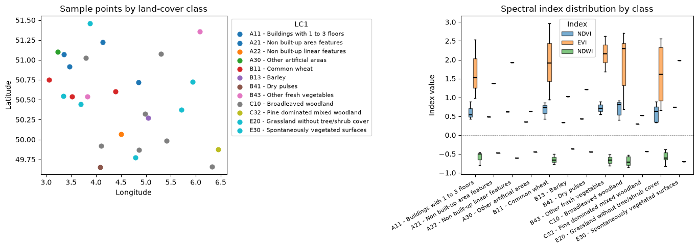
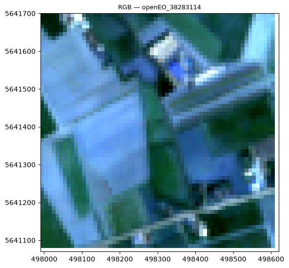
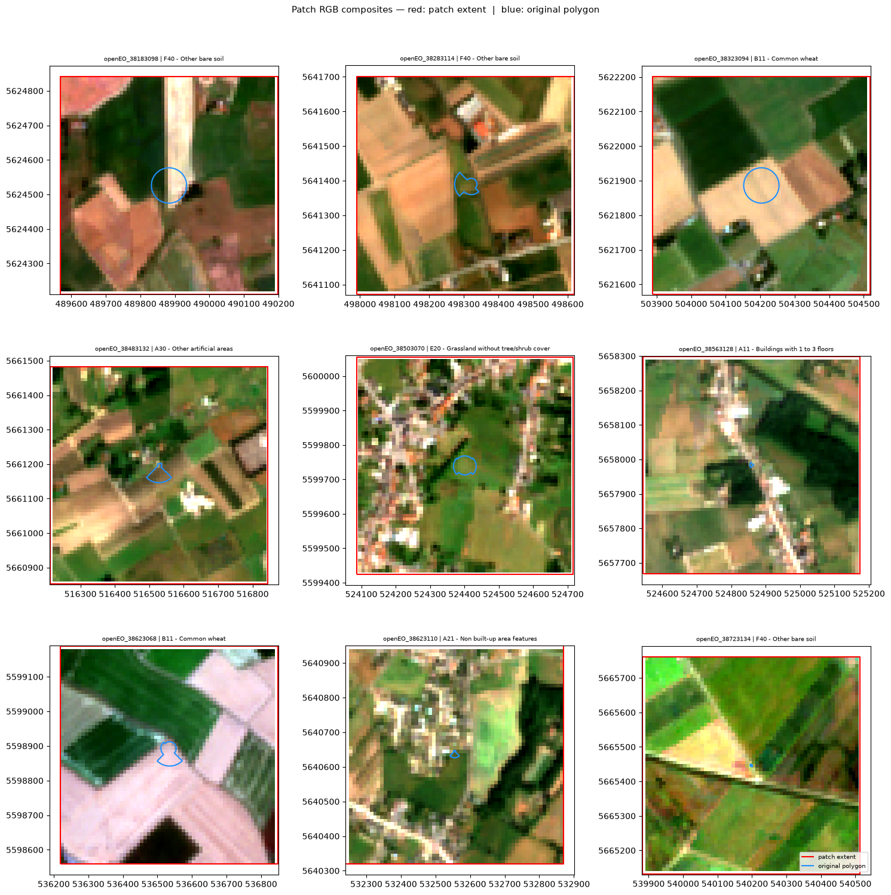

# ML-Ready Data Preparation using openEO

Training machine learning models on Earth Observation data requires large volumes of samples with meaningful spectral features. Traditionally, this involves downloading raw satellite images, running preprocessing pipelines locally, and managing large intermediate files, a significant barrier for many users.

**openEO** tries to address this barrier by running heavy computation in the cloud. You can define a process graph, openEO executes it server-side, and you can then download only the compact feature table or image patches you need for training your model.

Therefore, in this notebook we want to demonstrate how openEO on the Copernicus Data Space Ecosystem (CDSE) can handle EO data preparation for machine learning workflow, without downloading raw imagery.

------------------------------------------------------------------------

## Workflow



------------------------------------------------------------------------

## Notebook structure

| Part  | Approach               | Output                 | ML use                 |
|-------|------------------------|------------------------|------------------------|
| **A** | Point extraction       | Feature table (CSV)    | Random Forest, XGBoost |
| **B** | Polygon-based sampling | One raster per polygon | CNN, ViT, U-Net        |

------------------------------------------------------------------------

## Prerequisites

- Free [CDSE account](https://dataspace.copernicus.eu)
- Python: `openeo`, `geopandas`, `scikit-image`, `scikit-learn`
- Ground truth: https://data.jrc.ec.europa.eu/dataset/e3fe3cd0-44db-470e-8769-172a8b9e8874

``` python
# import necessary libraries
import openeo
import geopandas as gpd
import numpy as np
import pandas as pd
import json
import os
from pathlib import Path
from shapely.geometry import box
from openeo.extra.spectral_indices import compute_indices
from sklearn.model_selection import train_test_split
```

``` python
# connect to the cdse backend
conn = openeo.connect("openeo.dataspace.copernicus.eu").authenticate_oidc()
conn
```

    Authenticated using refresh token.

    <Connection to 'https://openeo.dataspace.copernicus.eu/openeo/1.2/' with OidcBearerAuth>

## 2 · Ground Truth: LUCAS 2022

In this example, we will use the [LUCAS Copernicus 2022](https://data.jrc.ec.europa.eu/dataset/e3fe3cd0-44db-470e-8769-172a8b9e8874) survey as labelled ground truth.   The notebook uses the GeoParquet file, filters it to **Belgium**, and splits it into a balanced train/ test dataset from the same source data for the classes with at least 50 samples

``` python
LUCAS_PQ_PATH = Path("LUCAS_2022_4326.parquet")
BELGIUM_BBOX = (2.5, 49.4, 6.5, 51.6)  # west, south, east, north

lucas = gpd.read_parquet(LUCAS_PQ_PATH)
west_b, south_b, east_b, north_b = BELGIUM_BBOX
lucas = lucas.cx[west_b:east_b, south_b:north_b].copy()

print(f"Loaded {len(lucas)} LUCAS polygons in Belgium  |  CRS: {lucas.crs.to_epsg()}")
lucas.head(3)
```

    Loaded 5567 LUCAS polygons in Belgium  |  CRS: 4326

|  | point_id | user_id | point_nuts0 | pi_extension | point_ex_ante | point_lat | point_long | point_altitude | point_copernicus | point_grassland | ... | lu1_code | poly_area_sqm | surveycprncando | surveycprnlc1n | surveycprnclc1e | surveycprnclc1w | surveycprnclc1s | surveycprnlc | col_hex | geometry |
|----|----|----|----|----|----|----|----|----|----|----|----|----|----|----|----|----|----|----|----|----|----|
| 765 | 38082954 | FRSU236 | FR | 0 | 0 | 49.47599 | 2.910148 | 39 | 1 | 0 | ... | U120 | 3901.746495 | 1 | 17 | 21 | 40 | 51 | C10 | 80ff00 | POLYGON ((2.90979 49.47575, 2.90978 49.47575, ... |
| 767 | 37883044 | FRSU209 | FR | 0 | 0 | 50.26284 | 2.510591 | 141 | 1 | 0 | ... | U111 | 953.396090 | 1 | 32 | 6 | 10 | 6 | B16 | ffff00 | POLYGON ((2.51221 50.26185, 2.51221 50.26185, ... |
| 792 | 37943010 | FRSU215 | FR | 0 | 0 | 49.96439 | 2.641608 | 80 | 1 | 0 | ... | U111 | 8208.436826 | 1 | 51 | 51 | 51 | 51 | B11 | ffd300 | POLYGON ((2.64112 49.96471, 2.64114 49.96472, ... |

3 rows × 121 columns

``` python
# LUCAS 2022 uses 'survey_lc1' to map the classes
lc1_col = next((c for c in lucas.columns if c.lower() in ("lc1", "survey_lc1")), None)

# get the groundtruth data and convert geometry to centroid points
groundtruth = lucas[["point_id", lc1_col, "geometry"]].copy()
groundtruth["geometry"] = groundtruth["geometry"].apply(lambda x: x.centroid)
# get the target class as an integer (A=0, B=1, C=2, ...)
groundtruth["target"]   = groundtruth[lc1_col].apply(lambda x: ord(x[0]) - 65)

# work on a subset
counts = groundtruth["target"].value_counts()

# but I want to keep only the classes with at least 50 samples, and take the top 10 classes
top10_classes = counts[counts >= 50].head().index

# get the balanced groundtruth dataset with 10 samples per class
groundtruth_balanced = (
    groundtruth[groundtruth["target"].isin(top10_classes)]
    .groupby("target")
    .sample(n=10, random_state=42)
    .reset_index(drop=True)
)

groundtruth_train, groundtruth_test = train_test_split(groundtruth_balanced, test_size=0.25, random_state=333)
print(f"Train: {len(groundtruth_train)}  |  Test: {len(groundtruth_test)}")
print(f"{len(groundtruth_balanced)}, {groundtruth_balanced['target'].nunique()}, {groundtruth_balanced['target'].value_counts()}")
```

    Train: 37  |  Test: 13
    50, 5, target
    0    10
    1    10
    2    10
    4    10
    5    10
    Name: count, dtype: int64

## 3 · Part A: Point Feature Extraction

As a first task, let us try to extract vector features per sample point using `aggregate_spatial`.   The result is a JSON file that maps each sample to its feature values and can be loaded directly as a pandas DataFrame for model training.

``` python
BANDS   = ["B02", "B03", "B04", "B05", "B06", "B07", "B08", "B8A", "B11", "B12"]
INDICES = ["NDVI", "EVI", "NDWI"]
TEXTURE_BANDS = ["contrast", "variance", "NDFI", "brightness"]

# get the AOI and temporal extent from the groundtruth training data
west, south, east, north = groundtruth_train.total_bounds
aoi = {"west": float(west), "south": float(south), "east": float(east), "north": float(north)}
temporal_extent = ["2022-06-01", "2022-10-31"]
```

``` python
# Load + cloud-mask Sentinel-2
s2 = conn.load_collection("SENTINEL2_L2A", temporal_extent=temporal_extent,
                            spatial_extent=aoi, bands=BANDS, max_cloud_cover=80)
scl = conn.load_collection("SENTINEL2_L2A", temporal_extent=temporal_extent,
                            spatial_extent=aoi, bands=["SCL"], max_cloud_cover=80)
cloud_mask = scl.process("to_scl_dilation_mask", data=scl,
                          kernel1_size=17, kernel2_size=77,
                          mask1_values=[2, 4, 5, 6, 7],
                          mask2_values=[3, 8, 9, 10, 11],
                          erosion_kernel_size=3)
s2_masked = s2.mask(cloud_mask)
```

``` python
# Temporal median composite 
composite = s2_masked.reduce_dimension(reducer="median", dimension="t")
```

``` python
indices_cube = compute_indices(composite, INDICES)

# udf to define custom  python processes
texture_udf = openeo.UDF.from_file("udf.py")
texture_cube = composite.apply_neighborhood(
    process=texture_udf,
    size=[
        {"dimension": "x", "value": 128, "unit": "px"},
        {"dimension": "y", "value": 128, "unit": "px"},
    ],
    overlap=[
        {"dimension": "x", "value": 32, "unit": "px"},
        {"dimension": "y", "value": 32, "unit": "px"},
    ],
    context={"padding_window_size": 33},
)
# merge the texture and indices cubes into a single feature cube
feature_cube = composite.merge_cubes(texture_cube).merge_cubes(indices_cube)
```

``` python
# aggregate_spatial: one feature vector per sample point
point_geojson = json.loads(groundtruth_train.set_geometry("geometry").to_json())
agg_cube = feature_cube.aggregate_spatial(point_geojson, reducer="median")
```

``` python
OUTPUT_POINTS = "point_based_features.csv"

# Submit batch job to CDSE 
agg_cube.execute_batch(title="point extraction", outputfile=OUTPUT_POINTS)
print(f"Saved → {OUTPUT_POINTS}")
```

    0:00:00 Job 'j-260812104220440991adcecd77477e02': send 'start'
    0:00:02 Job 'j-260812104220440991adcecd77477e02': queued (progress 0%)
    0:00:07 Job 'j-260812104220440991adcecd77477e02': queued (progress 0%)
    0:00:13 Job 'j-260812104220440991adcecd77477e02': queued (progress 0%)
    0:00:22 Job 'j-260812104220440991adcecd77477e02': queued (progress 0%)
    0:00:31 Job 'j-260812104220440991adcecd77477e02': queued (progress 0%)
    0:00:44 Job 'j-260812104220440991adcecd77477e02': queued (progress 0%)
    0:00:59 Job 'j-260812104220440991adcecd77477e02': running (progress N/A)
    0:01:19 Job 'j-260812104220440991adcecd77477e02': running (progress N/A)
    0:01:43 Job 'j-260812104220440991adcecd77477e02': running (progress N/A)
    0:02:13 Job 'j-260812104220440991adcecd77477e02': running (progress N/A)
    0:02:50 Job 'j-260812104220440991adcecd77477e02': running (progress N/A)
    0:03:37 Job 'j-260812104220440991adcecd77477e02': running (progress N/A)
    0:04:35 Job 'j-260812104220440991adcecd77477e02': running (progress N/A)
    0:05:35 Job 'j-260812104220440991adcecd77477e02': running (progress N/A)
    0:06:35 Job 'j-260812104220440991adcecd77477e02': running (progress N/A)
    0:07:35 Job 'j-260812104220440991adcecd77477e02': running (progress N/A)
    0:08:36 Job 'j-260812104220440991adcecd77477e02': running (progress N/A)
    0:09:36 Job 'j-260812104220440991adcecd77477e02': running (progress N/A)
    0:10:36 Job 'j-260812104220440991adcecd77477e02': running (progress N/A)
    0:11:36 Job 'j-260812104220440991adcecd77477e02': running (progress N/A)
    0:12:36 Job 'j-260812104220440991adcecd77477e02': running (progress N/A)
    0:13:36 Job 'j-260812104220440991adcecd77477e02': running (progress N/A)
    0:14:37 Job 'j-260812104220440991adcecd77477e02': running (progress N/A)
    0:15:37 Job 'j-260812104220440991adcecd77477e02': finished (progress 100%)
    Saved → point_based_features.csv

``` python
from plot_func import plot_point_features_stats
plot_point_features_stats("point_based_features.csv", groundtruth_train, lc1_col)
```



    Feature table shape: (37, 21)  |  classes: 12

## 4 · Part B: Patch Feature Extraction

In some cases, users might be interested in extracting raster features; in such cases, let us focus on a usecase that produce a single image output per training polygon by setting `sample_by_feature=True`.   This version reuses the polygon split prepared in Section 2, so there is no second data-loading block here.

``` python
# define the patch size and buffer size in meters (for 10 m/px Sentinel-2)
PATCH_SIZE_PX = 64
BUFFER_M = ((PATCH_SIZE_PX * 10) / 2)-5

patches = groundtruth_train.to_crs(32631).copy()

# create square patches around the centroid points
patches["geometry"] = patches.geometry.centroid.buffer(BUFFER_M, cap_style=3)
patches = patches.to_crs(4326)

# create a patch_id column for each patch as identifier for the patch
patches["patch_id"] = patches["point_id"].astype(str)
patches.head(3)
```

|  | point_id | survey_lc1 | geometry | target | patch_id |
|----|----|----|----|----|----|
| 10 | 38623068 | B11 - Common wheat | POLYGON ((3.52006 50.54348, 3.52 50.53781, 3.5... | 1 | 38623068 |
| 47 | 38183098 | F40 - Other bare soil | POLYGON ((2.86098 50.77525, 2.861 50.76958, 2.... | 5 | 38183098 |
| 1 | 38563128 | A11 - Buildings with 1 to 3 floors | POLYGON ((3.35934 51.07565, 3.35929 51.06998, ... | 0 | 38563128 |

``` python
west_p, south_p, east_p, north_p = patches.total_bounds
patch_aoi = {"west": float(west_p), "south": float(south_p),
             "east": float(east_p),  "north": float(north_p)}
```

``` python
s2_p = conn.load_collection("SENTINEL2_L2A", temporal_extent=temporal_extent,
                              spatial_extent=patch_aoi, bands=BANDS, max_cloud_cover=80)
scl_p = conn.load_collection("SENTINEL2_L2A", temporal_extent=temporal_extent,
                              spatial_extent=patch_aoi, bands=["SCL"], max_cloud_cover=80)
cm_p = scl_p.process("to_scl_dilation_mask", data=scl_p,
                        kernel1_size=17, kernel2_size=77,
                        mask1_values=[2, 4, 5, 6, 7],
                        mask2_values=[3, 8, 9, 10, 11],
                        erosion_kernel_size=3)

composite_p = s2_p.mask(cm_p).reduce_dimension(reducer="median", dimension="t")
```

``` python
texture_p = composite_p.apply_neighborhood(
    process=openeo.UDF.from_file("udf.py"),
    size=[{"dimension": "x", "value": 128, "unit": "px"},
          {"dimension": "y", "value": 128, "unit": "px"}],
    overlap=[{"dimension": "x", "value": 32, "unit": "px"},
             {"dimension": "y", "value": 32, "unit": "px"}],
    context={"padding_window_size": 33},
)
feature_patch = composite_p.merge_cubes(texture_p).merge_cubes(
    compute_indices(composite_p, INDICES)
)
```

``` python
patch_cube = feature_patch.filter_spatial(json.loads(patches.to_json()))
```

``` python
OUTPUT_PATCH_DIR = "patch_extracted"
os.makedirs(OUTPUT_PATCH_DIR, exist_ok=True)

# Export one GeoTIFF per training polygon.
job = patch_cube.create_job(
    out_format="GTiff",
    title="Patch Extraction",
    sample_by_feature=True,
    feature_id_property="patch_id",
    job_options={"driver-memory": "2G", "executor-memory": "2G", "max-executors": 10},
)
job.start_and_wait()
job.get_results().download_files(OUTPUT_PATCH_DIR)

print(f"Saved polygon-based patch outputs in {OUTPUT_PATCH_DIR}")
```

    0:00:00 Job 'j-2608121256424988b0a701f946757e49': send 'start'
    0:00:02 Job 'j-2608121256424988b0a701f946757e49': created (progress 0%)
    0:00:07 Job 'j-2608121256424988b0a701f946757e49': queued (progress 0%)
    0:00:13 Job 'j-2608121256424988b0a701f946757e49': queued (progress 0%)
    0:00:21 Job 'j-2608121256424988b0a701f946757e49': queued (progress 0%)
    0:00:31 Job 'j-2608121256424988b0a701f946757e49': running (progress N/A)
    0:00:44 Job 'j-2608121256424988b0a701f946757e49': running (progress N/A)
    0:00:59 Job 'j-2608121256424988b0a701f946757e49': running (progress N/A)
    0:01:18 Job 'j-2608121256424988b0a701f946757e49': running (progress N/A)
    0:01:42 Job 'j-2608121256424988b0a701f946757e49': running (progress N/A)
    0:02:12 Job 'j-2608121256424988b0a701f946757e49': running (progress N/A)
    0:02:50 Job 'j-2608121256424988b0a701f946757e49': running (progress N/A)
    0:03:36 Job 'j-2608121256424988b0a701f946757e49': running (progress N/A)
    0:04:35 Job 'j-2608121256424988b0a701f946757e49': running (progress N/A)
    0:05:35 Job 'j-2608121256424988b0a701f946757e49': running (progress N/A)
    0:06:35 Job 'j-2608121256424988b0a701f946757e49': running (progress N/A)
    0:07:35 Job 'j-2608121256424988b0a701f946757e49': running (progress N/A)
    0:08:35 Job 'j-2608121256424988b0a701f946757e49': running (progress N/A)
    0:09:36 Job 'j-2608121256424988b0a701f946757e49': running (progress N/A)
    0:10:36 Job 'j-2608121256424988b0a701f946757e49': running (progress N/A)
    0:11:36 Job 'j-2608121256424988b0a701f946757e49': running (progress N/A)
    0:12:36 Job 'j-2608121256424988b0a701f946757e49': running (progress N/A)
    0:13:36 Job 'j-2608121256424988b0a701f946757e49': running (progress N/A)
    0:14:36 Job 'j-2608121256424988b0a701f946757e49': running (progress N/A)
    0:15:37 Job 'j-2608121256424988b0a701f946757e49': running (progress N/A)
    0:16:37 Job 'j-2608121256424988b0a701f946757e49': running (progress N/A)
    0:17:37 Job 'j-2608121256424988b0a701f946757e49': running (progress N/A)
    0:18:37 Job 'j-2608121256424988b0a701f946757e49': running (progress N/A)
    0:19:37 Job 'j-2608121256424988b0a701f946757e49': running (progress N/A)
    0:20:37 Job 'j-2608121256424988b0a701f946757e49': running (progress N/A)
    0:21:38 Job 'j-2608121256424988b0a701f946757e49': running (progress N/A)
    0:22:38 Job 'j-2608121256424988b0a701f946757e49': running (progress N/A)
    0:23:38 Job 'j-2608121256424988b0a701f946757e49': running (progress N/A)
    0:24:38 Job 'j-2608121256424988b0a701f946757e49': running (progress N/A)
    0:25:38 Job 'j-2608121256424988b0a701f946757e49': running (progress N/A)
    0:26:39 Job 'j-2608121256424988b0a701f946757e49': running (progress N/A)
    0:27:39 Job 'j-2608121256424988b0a701f946757e49': running (progress N/A)
    0:28:39 Job 'j-2608121256424988b0a701f946757e49': running (progress N/A)
    0:29:39 Job 'j-2608121256424988b0a701f946757e49': finished (progress 100%)
    Saved polygon-based patch outputs in patch_extracted

``` python
from plot_func import plot_single_patch_as_rgb, plot_patches_with_polygons
```

``` python
plot_single_patch_as_rgb("patch_extracted_s2/openEO_38283114.tif")
```



``` python
plot_patches_with_polygons(OUTPUT_PATCH_DIR, patches, lucas, lc1_col)
```



Back to top
