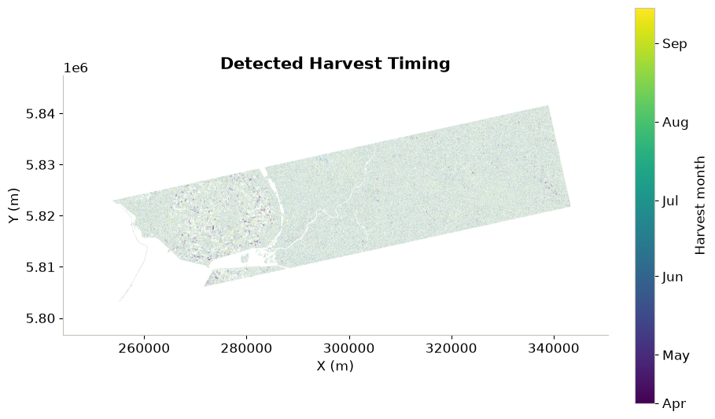
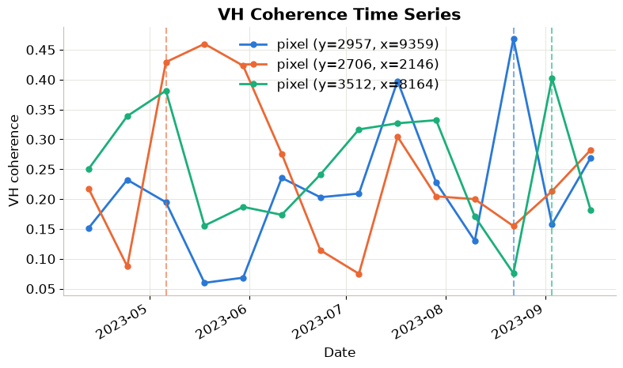

# Analysing Coherence output generated using openEO for harvest time detection

The main goal of this notebook is to demonstrate how to use openEO to generate Sentinel-1 SAR coherence, and then use Python/xarray to further analyse the resulting coherence time series outside the openEO environment. The notebook is structured as follows:

1.  **openEO processing**: We will use openEO to generate a coherence time series from Sentinel-1 SAR data.
2.  **Python/xarray analysis**: We will then use Python and xarray to analyse the generated coherence time series, focusing on detecting harvest times.

The workflow is designed to leverage the strengths of both openEO and local Python analysis by letting openEO handle access to large EO data and the expensive SAR-coherence processing close to the data. And then, using the local Python environment for more flexible and interactive analysis of the results.

Let us start by importing the necessary libraries for the analysis.

``` python
import numpy as np
import pandas as pd
import xarray as xr
import openeo
from utils import (
    set_plot_defaults,
    plot_harvest_timing_map,
    plot_coherence_samples,
    plot_interactive_harvest_map,
)
```

### Connect to an openEO back end

The connection below provides the notebook with access to openEO’s CDSE backend, where we can run the coherence processing workflow.

``` python
connection = openeo.connect("openeo.dataspace.copernicus.eu").authenticate_oidc()
```

    Authenticated using refresh token.

### Fetching the coherence time series

Now that we have a connection to the openEO backend, we can call the [`sentinel1_sar_coherence`](https://algorithm-catalogue.apex.esa.int/apps/sentinel1_sar_coherence) User-Defined-Process (UDP) to compute the coherence between pairs of Sentinel-1 SAR images.

#### CWL in openEO

The `sentinel1_sar_coherence` UDP used below does not reimplement the SAR coherence algorithm in openEO itself. Instead, it wraps an existing [Common Workflow Language (CWL)](https://github.com/cloudinsar/s1-workflows/blob/78cc2118d61f399b7174bcba13f7075a6770f36c/sar/sar_coherence.py) pipeline built on ESA SNAP operators, developed by Eurac Research as part of the [CloudInSAR](https://www.eurac.edu/en/projects/cloudinsar) project ([ESA project page](https://eo4society.esa.int/projects/cloudinsar/)). CWL lets openEO backends run external, containerized scientific workflows as if they were native processes, so complex tools don’t need to be rewritten as UDFs.

Support for CWL-based processes in openEO is still **experimental**: it is currently limited to specific backends (e.g. the CDSE federation, via [Eurac’s implementation](https://algorithm-catalogue.apex.esa.int/apps/sentinel1_sar_coherence)).

This process generates a time series of Sentinel‑1 interferometric coherence for a set of interferometric pairs. By simply calling the UDP, we avoid the need to manually download Sentinel-1 data and perform the complex coherence processing workflow. Moreover, the practical benefit is that all the heavy SAR coherence processing is handled inside openEO, letting researchers focus on the scientific analysis of the results.

In this example, we will request the coherence for the VH polarisation, which is often more sensitive to vegetation changes. The coherence time series will be generated for a specific area of interest and time period. Users can adjust parameters to suit their specific needs, such as the area of interest, time period, or polarisation.

> **Current limitation:** At present, this process can only be used as the final step of an openEO workflow. The workflow returns a STAC result rather than a native openEO datacube. This means it can currently only be used as the final process-graph node

``` python
cube = connection.datacube_from_process(
    "sentinel1_sar_coherence",
    namespace="https://raw.githubusercontent.com/ESA-APEx/apex_algorithms/main/algorithm_catalog/eurac/sentinel1_sar_coherence/openeo_udp/sentinel1_sar_coherence.json",
    temporal_extent=["2023-04-01", "2023-09-30"],
    temporal_baseline=12,
    spatial_extent={
        "west": 5.55,
        "south": 52.55,
        "east": 5.65,
        "north": 52.60
        },
    polarization= "VH",
    sub_swath="IW2",
)
cube
```

The batch job below submits a coherence processing request to the CDSE backend and saves the resulting NetCDF file, which provides the stacked coherence time series for the selected area and time period.

``` python
cube.execute_batch(title="Sentinel-1 Coherence", outputfile="s1_coherence.nc")
```

If you inspect the job information, once completed, you will notice the several indicators of the processing load and resource usage. These are important factors that show all the heavy processing done in the cloud infrastructure. Furthermore, for this particular job, only **50 credits** were used out of the 10000 free credits that are replenished every month.

The generated coherence timeseries can be used to detect harvest times by analysing the temporal changes in coherence values. Coherence measures how similar two radar images are over time. A big jump in coherence usually means the field has been harvested (because the field changes from crops to bare soil).

Traditional monitoring uses sensors on harvesters, which is costly and complex. Using a satellite data-based approach helps monitor large farming areas without needing expensive equipment on farm machinery.

At this point, the computationally intensive **SAR coherence generation is finished**. We now deliberately switch to local Python. The local analysis below is intentionally simple, to answer a higher-level question such as **” when and where might a harvest have occurred?“**

### Load the processed coherence data

In the previous steps, we saved the coherence time series as a NetCDF file. Now, we will load this file into our local Python environment using xarray for further analysis.

``` python
# load the downloaded coherence dataset
ds = xr.open_dataset("s1_coherence.nc")
print(f"Loaded dataset: {dict(ds.sizes)}")
```

    Loaded dataset: {'t': 14, 'y': 5076, 'x': 10640}

The cube contains **14 acquisitions × 5076 × 10640 spatial pixels**.

This is already a useful illustration of the advantage of the previous step: we are working locally with a ready-to-use coherence product instead of having to download and prepare the original Sentinel-1 observations and implement the coherence algorithm ourselves.

Additionally, since the result was saved as a NetCDF file, we can skip the additional step of mosaicking, reprojecting and stacking the individual output.

``` python
# select the data variables that have both x and y dimensions
data_vars = [v for v in ds.data_vars if "x" in ds[v].dims and "y" in ds[v].dims]
print(f"Found {len(data_vars)} data variable(s) with spatial dimensions: {data_vars}")
coh_vh = ds[data_vars[0]]
```

    Found 1 data variable(s) with spatial dimensions: ['coh_VH']

``` python
# just to be sure, sort the data by time
coh_vh = coh_vh.sortby("t")

print(f"Loaded VH coherence cube: {dict(coh_vh.sizes)}")
print(f"Time range: {pd.Timestamp(coh_vh.t.min().values).date()} to "
      f"{pd.Timestamp(coh_vh.t.max().values).date()} ({coh_vh.sizes['t']} acquisitions)")
```

    Loaded VH coherence cube: {'t': 14, 'y': 5076, 'x': 10640}
    Time range: 2023-04-12 to 2023-09-15 (14 acquisitions)

### Calculate harvest change detection

The next step calculates the change in coherence between consecutive acquisitions and interprets potential harvest dates by thresholding the coherence change. A similar idea has also been used in the paper: [Monitoring Harvesting by Time Series of Sentinel-1 SAR Data](https://www.mdpi.com/560392)

Thus, in this notebook, we will use a simple thresholding approach to detect potential harvest events based on changes in coherence between consecutive acquisitions. The threshold value (here set to `Z_THRESHOLD = 2.0`) can be adjusted based on the specific characteristics of the monitored area and the expected changes in coherence due to harvesting activities.

``` python
# Cleaner defaults for the figures further down (see utils.py)
set_plot_defaults()
```

``` python
#how unusual a coherence jump must be to count as a harvest event
Z_THRESHOLD = 2.0

jump = coh_vh.diff("t")
# z-score formula: (x - mean) / stddev
jump_z = (jump - jump.mean("t")) / (jump.std("t") + 1e-6)
```

A sharp increase in VH coherence between two acquisitions often indicates a change in the surface, such as a crop or canopy being cleared. Therefore, a large z-scored jump is used here as a simple harvest signal. Please note that, for demonstration purposes, only VH polarisation is used here. You can also run the same analysis for VV polarisation, or combine both polarisations to improve detection accuracy.

Next, we convert the change dates to day-of-year values in the following cell that will allow us to visualize the detected harvest events in a more interpretable format. For each pixel, the first change exceeding the threshold is recorded as a possible harvest or clearing date.

``` python
# day of the year for each acquisition
doy = jump_z["t"].dt.dayofyear
print(f"DOY range: {doy.min().values} to {doy.max().values} ({doy.size} acquisitions)")

# find the acquisition with the first z-score jump above the threshold for each pixel
harvest_doy = doy.where(jump_z > Z_THRESHOLD).min(dim="t", skipna=True)
print(f"Harvest candidates: {int(np.isfinite(harvest_doy.values).sum())} of {harvest_doy.size} pixels crossed the z-score threshold")
```

    DOY range: 114 to 258 (13 acquisitions)
    Harvest candidates: 3577936 of 54008640 pixels crossed the z-score threshold

To further evaluate the detected candidate harvest events, we will calculate two additional metrics: \* the maximum jump: the largest detected change in coherence for each pixel, and \* the mean coherence: the average coherence value for each pixel over the entire time series.

These metrics help us to distinguish between true harvest events and other changes in the landscape that may not be related to harvesting. For example, a pixel with a large maximum jump but low mean coherence may indicate a temporary change in the surface, while a pixel with both a large maximum jump and high mean coherence is more likely to represent a true harvest event.

``` python
# some usual statistics
max_jump_zscore = jump_z.max(dim="t", skipna=True)
mean_vh_coherence = coh_vh.mean(dim="t", skipna=True)
print(f"Max jump z-score range: {max_jump_zscore.min().values:.2f} to {max_jump_zscore.max().values:.2f}")

# also check for the valid pixels in the harvest_doy array
n_flagged = int(np.isfinite(harvest_doy.values).sum())
```

    Max jump z-score range: 0.00 to 3.45

``` python
# the time range of the data
times = pd.to_datetime(coh_vh.t.values)
start_day, end_day = times.dayofyear.min(), times.dayofyear.max()
month_dates = pd.date_range(times.min().replace(day=1), times.max(), freq="MS")
month_days = [max(start_day, date.dayofyear) for date in month_dates]
month_labels = [date.strftime("%b") for date in month_dates]
print(f"Month labels: {month_labels} (DOY {month_days})")

# spatial extent of the data
extent = [float(coh_vh.x.min()), float(coh_vh.x.max()), float(coh_vh.y.min()), float(coh_vh.y.max())]
print(f"Spatial extent: {extent[0]:.3f}, {extent[1]:.3f}, {extent[2]:.3f}, {extent[3]:.3f}")
```

    Month labels: ['Apr', 'May', 'Jun', 'Jul', 'Aug', 'Sep'] (DOY [np.int32(102), 121, 152, 182, 213, 244])
    Spatial extent: 244175.000, 350565.000, 5796655.000, 5847405.000

### Plot the harvest-timing map

The map below shows where candidate harvest or clearing events were detected and when they occurred. Please note that the detected events are based on a simple thresholding approach and may not precisely represent actual harvest events.

``` python
# plot the spatial map of the detected harvest timing (see utils.py)
plot_harvest_timing_map(harvest_doy, extent, start_day, end_day, month_days, month_labels)
```



    (<Figure size 900x600 with 2 Axes>,
     <Axes: title={'center': 'Detected Harvest Timing'}, xlabel='X (m)', ylabel='Y (m)'>)

Though a map is a good way to visualize the spatial distribution of the event, inspecting pixel-level time series can provide a more detailed view of the changes over time.

Therefore, in the cell below, we try to plot the coherence time series for a few representative pixels. This allows us to visually inspect the coherence evolution and verify whether the detected harvest events correspond to significant changes in the time series.

``` python
# Sample up to 3 pixels that have a detected harvest date
rng = np.random.default_rng(0)
ys, xs = np.where(np.isfinite(harvest_doy.values))

if len(ys) == 0:
    print("No pixel crossed the z-score threshold - showing the AOI center pixel instead.")
    sample_idx = [(coh_vh.sizes["y"] // 2, coh_vh.sizes["x"] // 2)]
else:
    pick = rng.choice(len(ys), size=min(3, len(ys)), replace=False)
    sample_idx = list(zip(ys[pick], xs[pick]))

# plot the coherence time series for the sampled pixels (see utils.py)
plot_coherence_samples(coh_vh, harvest_doy, sample_idx)
```



    (<Figure size 900x500 with 1 Axes>,
     <Axes: title={'center': 'VH Coherence Time Series'}, xlabel='Date', ylabel='VH coherence'>)

Also, it can be interesting to explore the interactive map of detected harvest events. The interactive map adds geographic context and hover information. Comparing the detections with a basemap helps assess whether they correspond to plausible agricultural areas.

The plot shows VH coherence for three pixels from April to September 2023. Sharp increases occur on different dates, suggesting possible harvest or vegetation-clearing events at those locations. The dashed vertical lines mark the detected candidate harvest dates based on the z-score threshold.

``` python
# interactive harvest-timing map with a basemap (see utils.py)
plot_interactive_harvest_map(harvest_doy, start_day, end_day)
```

[![](data:image/png;base64,iVBORw0KGgoAAAANSUhEUgAAAEAAAABACAYAAACqaXHeAAAABHNCSVQICAgIfAhkiAAAAAlwSFlz%0AAAAB+wAAAfsBxc2miwAAABl0RVh0U29mdHdhcmUAd3d3Lmlua3NjYXBlLm9yZ5vuPBoAAA6zSURB%0AVHic7ZtpeFRVmsf/5966taWqUlUJ2UioBBJiIBAwCZtog9IOgjqACsogKtqirT2ttt069nQ/zDzt%0AtI4+CrJIREFaFgWhBXpUNhHZQoKBkIUASchWla1S+3ar7r1nPkDaCAnZKoQP/D7mnPOe9/xy76n3%0AnFSAW9ziFoPFNED2LLK5wcyBDObkb8ZkxuaoSYlI6ZcOKq1eWFdedqNzGHQBk9RMEwFAASkk0Xw3%0AETacDNi2vtvc7L0ROdw0AjoSotQVkKSvHQz/wRO1lScGModBFbDMaNRN1A4tUBCS3lk7BWhQkgpD%0AlG4852/+7DWr1R3uHAZVQDsbh6ZPN7CyxUrCzJMRouusj0ipRwD2uKm0Zn5d2dFwzX1TCGhnmdGo%0AG62Nna+isiUqhkzuKrkQaJlPEv5mFl2fvGg2t/VnzkEV8F5ioioOEWkLG86fvbpthynjdhXYZziQ%0Ax1hC9J2NFyi8vCTt91Fh04KGip0AaG9zuCk2wQCVyoNU3Hjezee9bq92duzzTmxsRJoy+jEZZZYo%0AGTKJ6SJngdJqAfRzpze0+jHreUtPc7gpBLQnIYK6BYp/uGhw9YK688eu7v95ysgshcg9qSLMo3JC%0A4jqLKQFBgdKDPoQ+Pltb8dUyQLpeDjeVgI6EgLIQFT5tEl3rn2losHVsexbZ3EyT9wE1uGdkIPcy%0ABGxn8QUq1QrA5nqW5i2tLqvrrM9NK6AdkVIvL9E9bZL/oyfMVd/jqvc8LylzRBKDJSzIExwhQzuL%0AQYGQj4rHfFTc8mUdu3E7yoLtbTe9gI4EqVgVkug2i5+uXGo919ixbRog+3fTbQ8qJe4ZOYNfMoTI%0AOoshUNosgO60AisX15aeI2PSIp5KiFLI9ubb1vV3Qb2ltwLakUCDAkWX7/nHKRmmGIl9VgYsUhJm%0A2NXjKYADtM1ygne9QQDIXlk49FBstMKx66D1v4+XuQr7vqTe0VcBHQlRWiOCbmmSYe2SqtL6q5rJ%0AzsTb7lKx3FKOYC4DoqyS/B5bvLPxvD9Qtf6saxYLQGJErmDOdOMr/zo96km1nElr8bmPOBwI9COv%0AHnFPRIwmkSOv9kcAS4heRsidOkpeWBgZM+UBrTFAXNYL5Vf2ii9c1trNzpYdaoVil3WIc+wdk+gQ%0Anoie3ecCcxt9ITcLAPWt/laGEO/9U6PmzZkenTtsSMQ8uYywJVW+grCstAvCIaAdArAsIWkRDDs/%0AKzLm2YcjY1Lv0UdW73HabE9n6V66cxSzfEmuJssTpKGVp+0vHq73FwL46eOjpMpbRAnNmJFrGJNu%0AUkf9Yrz+3rghiumCKNXXWPhLYcjxGsIpoCMsIRoFITkW8AuyM8jC1+/QLx4bozCEJIq38+1rtpR6%0AV/yzb8eBlRb3fo5l783N0CWolAzJHaVNzkrTzlEp2bQ2q3TC5gn6wpnoQAmwSiGh2GitnTmVMc5O%0AUyfKWUKCIsU7+fZDKwqdT6DDpvkzAX4/+AMFjk0tDp5GRXLpQ2MUmhgDp5gxQT8+Y7hyPsMi8uxF%0A71H0oebujHALECjFKaW9Lm68n18wXp2kVzIcABytD5iXFzg+WVXkegpAsOOYziqo0OkK76GyquC3%0AltZAzMhhqlSNmmWTE5T6e3IN05ITFLM4GdN0vtZ3ob8Jh1NAKXFbm5PtLU/eqTSlGjkNAJjdgn/N%0AaedXa0tdi7+t9G0FIF49rtMSEgAs1kDLkTPO7ebm4IUWeyh1bKomXqlgMG6kJmHcSM0clYLJ8XtR%0A1GTnbV3F6I5wCGikAb402npp1h1s7LQUZZSMIfALFOuL3UUrfnS8+rez7v9qcold5tilgHbO1fjK%0A9ubb17u9oshxzMiUBKXWqJNxd+fqb0tLVs4lILFnK71H0Ind7uiPgACVcFJlrb0tV6DzxqqTIhUM%0ACwDf1/rrVhTa33/3pGPxJYdQ2l2cbgVcQSosdx8uqnDtbGjh9SlDVSMNWhlnilfqZk42Th2ZpLpf%0AxrHec5e815zrr0dfBZSwzkZfqsv+1FS1KUknUwPARVvItfKUY+cn57yP7qv07UE3p8B2uhUwLk09%0Ae0SCOrK+hbdYHYLjRIl71wWzv9jpEoeOHhGRrJAzyEyNiJuUqX0g2sBN5kGK6y2Blp5M3lsB9Qh4%0Ay2Ja6x6+i0ucmKgwMATwhSjdUu49tKrQ/pvN5d53ml2CGwCmJipmKjgmyuaXzNeL2a0AkQ01Th5j%0A2DktO3Jyk8f9vcOBQHV94OK+fPumJmvQHxJoWkaKWq9Vs+yUsbq0zGT1I4RgeH2b5wef7+c7bl8F%0AeKgoHVVZa8ZPEORzR6sT1BzDUAD/d9F78e2Tzv99v8D+fLVTqAKAsbGamKey1Mt9Ann4eH3gTXTz%0AidWtAJ8PQWOk7NzSeQn/OTHDuEikVF1R4z8BQCy+6D1aWRfY0tTGG2OM8rRoPaeIj5ZHzJxszElN%0AVM8K8JS5WOfv8mzRnQAKoEhmt8gyPM4lU9SmBK1MCQBnW4KONT86v1hZ1PbwSXPw4JWussVjtH9Y%0ANCoiL9UoH/6PSu8jFrfY2t36erQHXLIEakMi1SydmzB31h3GGXFDFNPaK8Rme9B79Ixrd0WN+1ij%0ANRQ/doRmuFLBkHSTOm5GruG+pFjFdAmorG4IXH1Qua6ASniclfFtDYt+oUjKipPrCQB7QBQ2lrgP%0AfFzm+9XWUtcqJ3/5vDLDpJ79XHZk3u8nGZ42qlj1+ydtbxysCezrydp6ugmipNJ7WBPB5tydY0jP%0AHaVNzs3QzeE4ZpTbI+ZbnSFPbVOw9vsfnVvqWnirPyCNGD08IlqtYkh2hjZ5dErEQzoNm+6ykyOt%0ALt5/PQEuSRRKo22VkydK+vvS1XEKlhCJAnsqvcVvH7f/ZU2R67eXbMEGAMiIV5oWZWiWvz5Fv2xG%0AsjqNJQRvn3Rs2lji/lNP19VjAQDgD7FHhujZB9OGqYxRkZxixgRDVlqS6uEOFaJUVu0rPFzctrnF%0AJqijImVp8dEKVWyUXDk92zAuMZ6bFwpBU1HrOw6AdhQgUooChb0+ItMbWJitSo5Ws3IAOGEOtL53%0A0vHZih9sC4vtofZ7Qu6523V/fmGcds1TY3V36pUsBwAbSlxnVh2xLfAD/IAIMDf7XYIkNmXfpp2l%0A18rkAJAy9HKFaIr/qULkeQQKy9zf1JgDB2uaeFNGijo5QsUyacNUUTOnGO42xSnv4oOwpDi1zYkc%0AefUc3I5Gk6PhyTuVKaOGyLUAYPGIoY9Pu/atL/L92+4q9wbflRJ2Trpm/jPjdBtfnqB/dIThcl8A%0AKG7hbRuKnb8qsQsVvVlTrwQAQMUlf3kwJI24Z4JhPMtcfng5GcH49GsrxJpGvvHIaeem2ma+KSjQ%0AlIwUdYyCY8j4dE1KzijNnIP2llF2wcXNnsoapw9XxsgYAl6k+KzUXbi2yP3KR2ecf6z3BFsBICdW%0AnvnIaG3eHybqX7vbpEqUMT+9OL4Qpe8VON7dXuFd39v19FoAABRVePbGGuXTszO0P7tu6lghUonE%0AllRdrhArLvmKdh9u29jcFiRRkfLUxBiFNiqSU9icoZQHo5mYBI1MBgBH6wMNb+U7Pnw337H4gi1Y%0AciWs+uks3Z9fztUvfzxTm9Ne8XXkvQLHNytOOZeiD4e0PgkAIAYCYknKUNUDSXEKzdWNpnil7r4p%0AxqkjTarZMtk/K8TQ6Qve78qqvXurGwIJqcOUKfUWHsm8KGvxSP68YudXq4pcj39X49uOK2X142O0%0ATz5/u/7TVybqH0rSya6ZBwD21/gubbrgWdDgEOx9WUhfBaC2ibcEBYm7a7x+ukrBMNcEZggyR0TE%0AT8zUPjikQ4VosQZbTpS4vqizBKvqmvjsqnpfzaZyx9JPiz1/bfGKdgD45XB1zoIMzYbfTdS/NClB%0AGct0USiY3YL/g0LHy/uq/Ef6uo5+n0R/vyhp17Klpge763f8rMu6YU/zrn2nml+2WtH+Z+5IAAFc%0A2bUTdTDOSNa9+cQY7YLsOIXhevEkCvzph7a8laecz/Un/z4/Ae04XeL3UQb57IwU9ZDr9UuKVajv%0Anxp1+1UVIo/LjztZkKH59fO3G/JemqCfmaCRqbqbd90ZZ8FfjtkfAyD0J/9+C2h1hDwsSxvGjNDc%0Ab4zk5NfrSwiQblLHzZhg+Jf4aPlUwpDqkQqa9nimbt1/TDH8OitGMaQnj+RJS6B1fbF7SY1TqO5v%0A/v0WAADl1f7zokgS7s7VT2DZ7pegUjBM7mjtiDZbcN4j0YrHH0rXpCtY0qPX0cVL0rv5jv/ZXend%0A0u/EESYBAFBU4T4Qa5TflZOhTe7pmKpaP8kCVUVw1+yhXfJWvn1P3hnXi33JsTN6PnP3hHZ8Z3/h%0AaLHzmkNPuPj7Bc/F/Q38CwjTpSwQXgE4Vmwry9tpfq/ZFgqFMy4AVDtCvi8rvMvOmv0N4YwbVgEA%0AsPM72/KVnzfspmH7HQGCRLG2yL1+z8XwvPcdCbsAANh+xPzstgMtxeGKt+6MK3/tacfvwhWvIwMi%0AoKEBtm0H7W+UVfkc/Y1V0BhoPlDr/w1w/eu1vjIgAgDg22OtX6/eYfnEz/focrZTHAFR+PSs56/7%0Aq32nwpjazxgwAQCwcU/T62t3WL7r6/jVRa6/byp1rei+Z98ZUAEAhEPHPc8fKnTU9nbgtnOe8h0l%0A9hcGIqmODLQAHCy2Xti6v/XNRivf43f4fFvIteu854+VHnR7q9tfBlwAAGz+pnndB9vM26UebAe8%0ASLHujPOTPVW+rwY+sxskAAC2HrA8t2Vvc7ffP1r9o+vwR2dcr92InIAbKKC1FZ5tB1tf+/G8p8sv%0AN/9Q5zd/XR34LYCwV5JdccMEAMDBk45DH243r/X4xGvqxFa/GNpS7n6rwOwNWwHVE26oAADYurf1%0Azx/utOzt+DMKYM0p17YtZZ5VNzqfsB2HewG1WXE8PoZ7gOclbTIvynZf9JV+fqZtfgs/8F/Nu5rB%0AEIBmJ+8QRMmpU7EzGRsf2FzuePqYRbzh/zE26EwdrT10f6r6o8HOYzCJB9Dpff8tbnGLG8L/A/WE%0AroTBs2RqAAAAAElFTkSuQmCC)](https://holoviews.org "HoloViews 1.23.2") [![](data:image/png;base64,iVBORw0KGgoAAAANSUhEUgAAACMAAAAjCAYAAAAe2bNZAAAABHNCSVQICAgIfAhkiAAAAAlwSFlzAAAK6wAACusBgosNWgAAABx0RVh0U29mdHdhcmUAQWRvYmUgRmlyZXdvcmtzIENTNui8sowAAAf9SURBVFiFvZh7cFTVHcc/59y7793sJiFAwkvAYDRqFWwdraLVlj61diRYsDjqCFbFKrYo0CltlSq1tLaC2GprGIriGwqjFu10OlrGv8RiK/IICYECSWBDkt3s695zTv9IAtlHeOn0O7Mzu797z+/3Ob/z+p0VfBq9doNFljuABwAXw2PcvGHt6bgwxhz7Ls4YZNVXxxANLENwE2D1W9PAGmAhszZ0/X9gll5yCbHoOirLzmaQs0F6F8QMZq1v/8xgNm7DYwwjgXJLYL4witQ16+sv/U9HdDmV4WrKw6B06cZC/RMrM4MZ7xz61DAbtzEXmAvUAX4pMOVecg9/MFFu3j3Gz7gQBLygS2RGumBkL0cubiFRsR3LzVBV1UMk3IrW73PT9C2lYOwhQB4ClhX1AuKpjLcV27oEjyUpNUJCg1CvcejykWTCXyQgzic2HIIBjg3pS6+uRLKAhumZvD4U+tq0jTrgkVKQQtLekfTtxIPAkhTNF6G7kZm7aPp6M9myKVQEoaYaIhEQYvD781DML/RfBGNZXAl4irJiwBa07e/y7cQnBaJghIX6ENl2GR/fGCBoz6cm5qeyEqQA5ZYA5x5eeiV0Qph4gjFAUSwAr6QllQgcxS/Jm25Cr2Tmpsk03XI9NfI31FTZBEOgVOk51adqDBNPCNPSRlkiDXbBEwOU2WxH+I7itQZ62g56OjM33suq1YsZHVtGZSUI2QdyYgkgOthQNIF7BIGDnRAJgJSgj69cUx1gB8PkOGwL4E1gPrM27gIg7NlGKLQApc7BmEnAxP5g/rw4YqBrCDB5xHkw5rdR/1qTrN/hKNo6YUwVDNpFsnjYS8RbidBPcPXFP6R6yfExuOXmN4A3jv1+8ZUwgY9D2OWjUZE6lO88jDwHI8ZixGiMKSeYTBamCoDk6kDAb6y1OcH1a6KpD/fZesoFw5FlIXAVCIiH4PxrV+p2npVDToTBmtjY8t1swh2V61E9KqWiyuPEjM8dbfxuvfa49Zayf9R136Wr8mBSf/T7bNteA8zwaGEUbFpckWwq95n59dUIywKl2fbOIS5e8bWSu0tJ1a5redAYfqkdjesodFajcgaVNWhXo1C9SrkN3Usmv3UMJrc6/DDwkwEntkEJLe67tSLhvyzK8rHDQWleve5CGk4VZEB1r+5bg2E2si+Y0QatDK6jUVkX5eg2YYlp++ZM+rfMNYamAj8Y7MAVWFqaR1f/t2xzU4IHjybBtthzuiAASqv7jTF7jOqDMAakFHgDNsFyP+FhwZHBmH9F7cutIYkQCylYYv1AZSqsn1/+bX51OMMjPSl2nAnM7hnjOx2v53YgNWAzHM9Q/9l0lQWPSCBSyokAtOBC1Rj+w/1Xs+STDp4/E5g7Rs2zm2+oeVd7PUuHKDf6A4r5EsPT5K3gfCnBXNUYnvGzb+KcCczYYWOnLpy4eOXuG2oec0PBN8XQQAnpvS35AvAykr56rWhPBiV4MvtceGLxk5Mr6A1O8IfK7rl7xJ0r9kyumuP4fa0lMqTBLJIAJqEf1J3qE92lMBndlyfRD2YBghHC4hlny7ASqCeWo5zaoDdIWfnIefNGTb9fC73QDfhyBUCNOxrGPSUBfPem9us253YTV+3mcBbdkUYfzmHiLqZbYdIGHHON2ZlemXouaJUOO6TqtdHEQuXYY8Yt+EbDgmlS6RdzkaDTv2P9A3gICiq93sWhb5mc5wVhuU3Y7m5hOc3So7qFT3SLgOXHb/cyOfMn7xROegoC/PTcn3v8gbKPgDopJFk3R/uBPWQiwQ+2/GJevRMObLUzqe/saJjQUQTTftEVMW9tWxPgAocwcj9abNcZe7s+6t2R2xXZG7zyYLp8Q1PiRBBHym5bYuXi8Qt+/LvGu9f/5YDAxABsaRNPH6Xr4D4Sk87a897SOy9v/fKwjoF2eQel95yDESGEF6gEMwKhLwKus3wOVjTtes7qzgLdXTMnNCNoEpbcrtNuq6N7Xh/+eqcbj94xQkp7mdKpW5XbtbR8Z26kgMCAf2UU5YEovRUVRHbu2b3vK1UdDFkDCyMRQxbpdv8nhKAGIa7QaQedzT07fFPny53R738JoVYBdVrnsNx9XZ9v33UeGO+AA2MMUkgqQ5UcdDLZSFeVgONnXeHqSAC5Ew1BXwko0D1Zct3dT1duOjS3MzZnEUJtBuoQAq3SGOLR4ekjn9NC5nVOaYXf9lETrUkmOJy3pOz8OKIb2A1cWhJCCEzOxU2mUPror+2/L3yyM3pkM7jTjr1nBOgkGeyQ7erxpdJsMAS9wb2F9rzMxNY1K2PMU0WtZV82VU8Wp6vbKJVo9Lx/+4cydORdxCCQ/kDGTZCWsRpLu7VD7bfKqL8V2orKTp/PtzaXy42jr6TwAuisi+7JolUG4wY+8vyrISCMtRrLKWpvjAOqx/QGhp0rjRo5xD3x98CWQuOQN8qumRMmI7jKZPUEpzNVZsj4Zbaq1to5tZZsKIydLWojhIXrJnES79EaOzv3du2NytKuxzJKAA6wF8xqEE8s2jo/1wd/khslQGxd81Zg62Bbp31XBH+iETt7Y3ELA0iU6iGDlQ5mexe0VEx4a3x8V1AaYwFJgTiwaOsDmeK2J8nMUOqsnB1A+dcA04ucCYt0urkjmflk9iT2v30q/gZn5rQPvor4n9Ou634PeBzoznes/iot/7WnClKoM/+zCIjH5kwT8ChQjTHPIPTjFV3PpU/Hx+DM/A9U3IXI4SPCYAAAAABJRU5ErkJggg==)](https://bokeh.org "Bokeh 3.9.2") ⓘ

### Conclusion

The main **takeaway from** this notebook is to use openEO for computationally intensive SAR processing in a couple of simple steps and then use local Python for more flexible and interactive analysis of the results.

While a purely local approach would require downloading and processing large amounts of Sentinel-1 data and performing complex SAR coherence calculations, the openEO approach allows us to leverage cloud computing resources for the heavy lifting, while still enabling detailed analysis and visualization in a local environment.

Back to top
