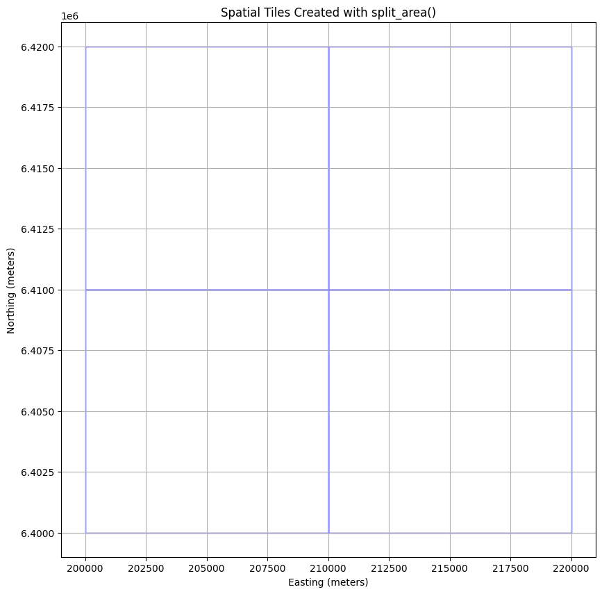
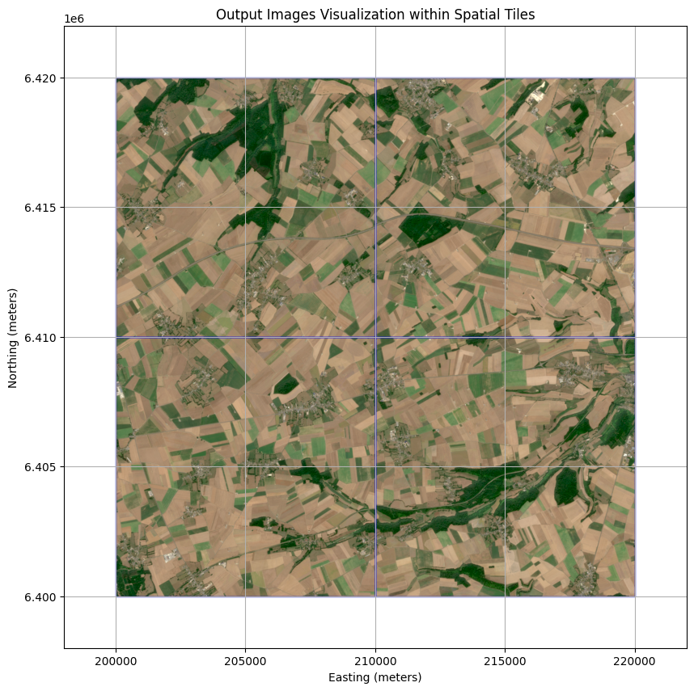

# EO Data Processing with the openEO MultiBackendJobManager

In this notebook, we will demonstrate how to use the [MultiBackendJobManager](https://open-eo.github.io/openeo-python-client/cookbook/job_manager.html) to set-up and track multiple jobs at once using OpenEO.

This example will specifically focus on how to a manage a compositing workflow over a large spatial extent.

### Key features

1.  Job Splitting: Divide a large area into smaller tiles and create separate openEO jobs for each tile.
2.  Job Tracking: Keep track of jobs their statuses and results across different backends.
3.  Database Support: Persist job metadata using CSV or Parquet files, allowing you to resume tracking after interruptions.

### Table of Contents

1.  [Import Libraries and Define Constants](#import-libraries-and-define-constants)
2.  [Creating the Jobs Database](#creating-the-jobs-database)
3.  [Creating the Job](#creating-the-job)
4.  [Managing Jobs Using MultiBackendJobManager](#managing-jobs-using-multibackendjobmanager)
5.  [Visualizing the outputs](#visualize-output)

## Import Libraries and Define Constants

We will start by importing the necessary libraries and defining some constants for our compositing workflow.

Note: the `split_area()` function has been introduced in version 0.50.0 of the openeo-python-client. If you are using an older version, you can update it using `pip install --upgrade openeo`.

``` python
# %pip install -U "openeo>=0.50" geopandas matplotlib numpy pandas rasterio pyarrow
```

``` python
from pathlib import Path

import geopandas as gpd
import matplotlib.pyplot as plt
import numpy as np
import openeo
import pandas as pd
import rasterio

from openeo.extra.job_management import (
    MultiBackendJobManager,
    create_job_db,
    split_area,
)

# Constants
TILING_PROJECTION = "EPSG:3857"
AREA_OF_INTEREST = {
    "west": 200_000.0,
    "south": 6_400_000.0,
    "east": 220_000.0,
    "north": 6_420_000.0,
    "crs": TILING_PROJECTION,
}
TILE_SIZE = 10_000  # 10 km in meters
```

## Creating the Jobs Database

The `MultiBackendJobManager` uses a jobs database to set up, start, and monitor all desired jobs.

In this updated example, we use the built-in `split_area()` helper to turn a larger area of interest into one job per tile.

`split_area()` returns a `geopandas.GeoDataFrame`, which can be used directly as the starting point for the jobs database.

If your environment still uses an older `openeo-python-client` release, upgrade it first so `split_area()` is available.

### Split the Area of Interest Into Tiles

Each row in the resulting `GeoDataFrame` represents one 10 km x 10 km tile that the job manager can process as an individual batch job.

``` python
jobs_database = split_area(
    aoi=AREA_OF_INTEREST,
    tile_size=TILE_SIZE,
    projection=TILING_PROJECTION,
)
# We add a tile_id column to the database for easier reference to the tiles when creating and managing jobs
jobs_database["tile_id"] = jobs_database.index

jobs_database.head()
```

|     | geometry                                          | tile_id |
|-----|---------------------------------------------------|---------|
| 0   | POLYGON ((210000 6400000, 210000 6410000, 2000... | 0       |
| 1   | POLYGON ((210000 6410000, 210000 6420000, 2000... | 1       |
| 2   | POLYGON ((220000 6400000, 220000 6410000, 2100... | 2       |
| 3   | POLYGON ((220000 6410000, 220000 6420000, 2100... | 3       |

We can illustrate how the defined windows map across the area of interest.

``` python
def visualize_spatial_extents(jobs_database: gpd.GeoDataFrame):
    """Visualize the job tiles generated by split_area()."""
    _, ax = plt.subplots(figsize=(10, 10))

    jobs_database.plot(ax=ax, facecolor="none", edgecolor="blue")

    plt.xlabel("Easting (meters)")
    plt.ylabel("Northing (meters)")
    plt.title("Spatial Tiles Created with split_area()")
    plt.grid(True)
    plt.show()


visualize_spatial_extents(jobs_database)
```



## Creating the Job

The next step is to define a `start_job` function. This function will instruct the `MultiBackendJobManager` on how to initiate a new job on the selected backend. The `start_job` functionality should adhere to the following structure `_start_job(row: pd.Series, connection: openeo.Connection, **kwargs)_`.

In this example, the `MultiBackendJobManager` will iterate through the provided jobs database and run a basic compositing workflow for each individual row of the jobs database.

While this example demonstrates a basic compositing workflow, the `MultiBackendJobManager` is capable of handling multiple high-computation jobs simultaneously.

``` python
def start_job(row: pd.Series, connection: openeo.Connection, **_) -> openeo.BatchJob:
    """Start a new job for a single split_area tile."""

    west, south, east, north = row.geometry.bounds
    spatial_extent = {
        "west": west,
        "south": south,
        "east": east,
        "north": north,
        "crs": TILING_PROJECTION,
    }

    # Build the openEO process
    scl = connection.load_collection(
        collection_id="SENTINEL2_L2A",
        spatial_extent=spatial_extent,
        temporal_extent=["2022-06-01", "2022-09-01"],
        bands=["SCL"],
        properties={"eo:cloud_cover": lambda x: x.lte(60)},
    )

    cloud_mask = scl.process(
        "to_scl_dilation_mask",
        data=scl,
        kernel1_size=17,
        kernel2_size=77,
        mask1_values=[2, 4, 5, 6, 7],
        mask2_values=[3, 8, 9, 10, 11],
        erosion_kernel_size=3,
    )

    s2_cube = connection.load_collection(
        collection_id="SENTINEL2_L2A",
        spatial_extent=spatial_extent,
        temporal_extent=["2022-06-01", "2022-09-01"],
        bands=["B02", "B03", "B04"],
        properties={"eo:cloud_cover": lambda x: x.lte(60)},
    )
    # Mask out clouds
    s2_cube = s2_cube.mask(cloud_mask)

    # Create a composite by taking the mean
    s2_cube = s2_cube.reduce_temporal(reducer="median")

    return s2_cube.create_job(
        title=f"MultiBackendJobManager - Tile {row['tile_id']}",
        out_format="GTiff",
    )
```

## Managing Jobs Using MultiBackendJobManager

With our split tiles and job definition set up, we can now run the jobs using the `MultiBackendJobManager`. This involves defining a path to where we will store the persistent job tracker.

### Steps to Run the Jobs:

1.  Create a persistent job database: Use `create_job_db()` to initialize a CSV or Parquet-backed tracker from the `GeoDataFrame` returned by `split_area()`.

    The job tracker will also include bookkeeping columns such as `status`, allowing you to monitor which jobs have been created, are running, have finished, or encountered an error.

    **Caution:** If the tracker file already exists, `on_exists="skip"` reuses it instead of overwriting it. Delete the file first if you want to start from a clean slate.

  

2.  Initialize the MultiBackendJobManager: We create an instance of the `MultiBackendJobManager` and add a backend of our choice, which will be responsible for executing the jobs.

    **Caution:** The number of parallel jobs refers to how many jobs the job manager tracks at once. However, the backend itself limits the actual number of jobs that can start and run at the same time to 2.

  

3.  Run Multiple Jobs: Use `manager.run_jobs` to create the desired jobs and send them to the backend. The selected job tracker will be updated with the actual job statuses and usage metrics.

``` python
# Generate a unique name for the tracker
job_tracker = "community_example_job_tracker.parquet"
job_db = create_job_db(job_tracker, df=jobs_database, on_exists="skip")

# Initiate MultiBackendJobManager
manager = MultiBackendJobManager()
connection = openeo.connect(url="openeo.dataspace.copernicus.eu").authenticate_oidc()
manager.add_backend("cdse", connection=connection, parallel_jobs=2)

# Run the jobs
manager.run_jobs(job_db=job_db, start_job=start_job)

print("All jobs have finished running.")
```

    Authenticated using refresh token.
    All jobs have finished running.

## Visualize Output

Once a job is finalized, the output is automatically downloaded into a dedicated folder named after the job ID. The data is saved in GeoTIFF format.

With this data in hand, we can now visualize the results of our various jobs.

``` python
S2_RGB_GAMMA = 2.2
S2_RGB_STRETCH = {
    "red": (0.02, 0.40),
    "green": (0.02, 0.40),
    "blue": (0.02, 0.45),
}


def normalize(
    array: np.ndarray, min_reflectance: float, max_reflectance: float
) -> np.ndarray:
    """Apply one fixed Sentinel-2 reflectance stretch across all tiles."""
    reflectance = array.astype(np.float32) / 10_000.0
    clipped = np.clip(reflectance, min_reflectance, max_reflectance)
    normalized = (clipped - min_reflectance) / (max_reflectance - min_reflectance)
    corrected = np.power(normalized, 1 / S2_RGB_GAMMA)
    return (corrected * 255).astype(np.uint8)


def visualize_output(output_df: gpd.GeoDataFrame):
    """Visualize output images for finished jobs within their spatial tiles."""
    _, ax = plt.subplots(figsize=(10, 10))
    x_min, x_max, y_min, y_max = (
        float("inf"),
        float("-inf"),
        float("inf"),
        float("-inf"),
    )

    finished_jobs = output_df[output_df["status"] == "finished"]

    for _, row in finished_jobs.iterrows():
        west, south, east, north = row.geometry.bounds
        extent_bounds = (west, east, south, north)
        image_path = Path(f"job_{row['id']}") / "openEO.tif"

        if not image_path.exists():
            continue

        with rasterio.open(image_path) as src:
            band_blue = normalize(src.read(1), *S2_RGB_STRETCH["blue"])
            band_green = normalize(src.read(2), *S2_RGB_STRETCH["green"])
            band_red = normalize(src.read(3), *S2_RGB_STRETCH["red"])

        rgb_image = np.dstack((band_red, band_green, band_blue))

        x_min = min(x_min, west)
        x_max = max(x_max, east)
        y_min = min(y_min, south)
        y_max = max(y_max, north)

        ax.imshow(rgb_image, extent=extent_bounds, origin="upper", alpha=1)
        ax.add_patch(
            plt.Rectangle(
                (west, south),
                east - west,
                north - south,
                linewidth=1,
                edgecolor="blue",
                facecolor="none",
            )
        )

    if x_min == float("inf"):
        raise FileNotFoundError(
            "No finished job outputs were found for the requested date."
        )

    padding = TILE_SIZE / 5
    ax.set_xlim(x_min - padding, x_max + padding)
    ax.set_ylim(y_min - padding, y_max + padding)
    plt.xlabel("Easting (meters)")
    plt.ylabel("Northing (meters)")
    plt.title("Output Images Visualization within Spatial Tiles")
    plt.grid(True)
    plt.show()


output_df = gpd.read_parquet(job_tracker)
visualize_output(output_df)
```


