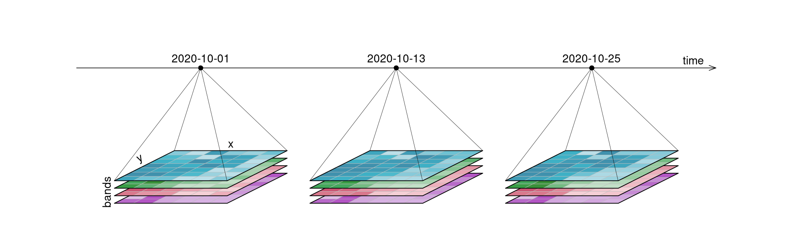
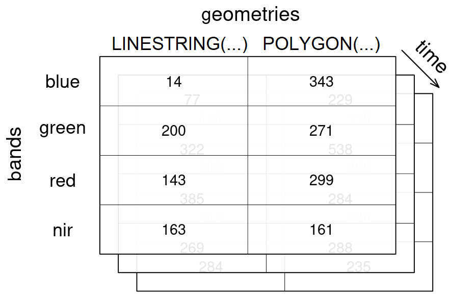
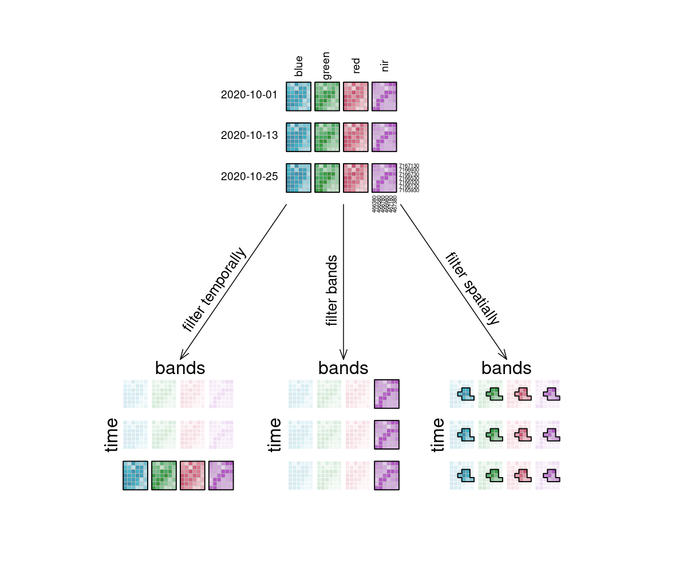

# openEO Datacubes

An **openEO datacube** is the main way Earth Observation data is represented in openEO. In simple terms, it is a structured, multidimensional array with metadata describing what each axis represents.

That sounds technical, but the idea is straightforward: instead of thinking in terms of separate image files, dates, and bands, you work with a single consistent data object that can be filtered, transformed, combined, and analysed.

As described in the [Glossary](../../documentation/key_concepts/glossary.llms.md), a spatiotemporal datacube is a multidimensional array with one or more spatial or temporal dimensions. In openEO, datacubes can represent both raster and vector-based Earth Observation data.

## What is a datacube?

A datacube is a way of organising data along multiple dimensions. For Earth Observation, the most common dimensions are:

- **x** and **y** for space,
- **t** for time, and
- **bands** for spectral channels such as red, green, blue, or near-infrared.

So instead of treating satellite data as a folder full of individual scenes, openEO lets users work with one coherent structure that answers questions like:

- where it happened,
- when it happened,
- in which band it was observed, and
- how that value changes when processes are applied.

In practice, a single value in the cube is identified by its position along these dimensions. For example, one pixel value may correspond to:

- one x coordinate,
- one y coordinate,
- one timestamp, and
- one spectral band.



Example raster datacube dimensions

## Raster and vector datacubes

The common openEO datacubes are:

- **Raster datacubes**: usually built from gridded imagery such as Sentinel products or similar. These typically have at least the spatial dimensions `x` and `y ', and often also`t`and`bands\`.
- **Vector datacubes**: built around geometries such as points, lines, or polygons, often combined with time and attributes.

For most users, the raster case is the first one they encounter. But vector datacubes are equally important when you want to work with field boundaries, administrative regions, sampling points, or spatial aggregates.



Vector datacube example

## Dimensions and metadata

A datacube is more than a block of numbers, each dimension carries meaning. Typical dimension properties include:

- **name**,
- **type**,
- **labels**,
- **resolution**,
- **reference system**, and
- **units**.

Here is a simplified example of a raster datacube structure:

| Dimension | Type | Example labels | Meaning |
|----|----|----|----|
| `x` | spatial | `466380`, `466580`, `466780` | horizontal position |
| `y` | spatial | `7167130`, `7166930`, `7166730` | vertical position |
| `bands` | bands | `blue`, `green`, `red`, `nir` | spectral channels |
| `t` | temporal | `2020-10-01`, `2020-10-13`, `2020-10-25` | observation dates |

Dimension labels are usually numeric or textual. Temporal labels are typically encoded as date or datetime strings, while geometries or geometry identifiers may represent geometry labels.

Dimensions with a natural order, such as spatial and temporal axes, are normally ordered. Dimensions without a natural order, such as bands, keep the order defined by metadata or by user operations.

Values inside the cube are usually scalar values such as numbers, booleans, or strings. Their meaning comes from the surrounding dimensions and metadata.

## Why datacubes matter in openEO

Datacubes are central to openEO because they provide users with a common way to work with the available Earth Observation data. The main reasons for handling EO data as a datacube in openEO are:

- **Consistency**: different collections can be accessed through a similar model.
- **Subsetting**: users can request only the area, time range, and bands they need.
- **Scalability**: processing happens close to the data on the backend.
- **Interoperability**: the same workflow idea can often be reused across backends.
- **Reproducibility**: the cube and the operations on it are described explicitly in the process graph.

Furthermore, the datacubes concept also helps hide file-level complexity. Users do not have to manually stack tiles, sort scenes, or reorganise raw assets before starting analysis.

In many workflows, values are sampled either as:

- **area samples**, such as raster cells or polygon-based measurements, or
- **point samples**, where each value refers to a specific location.

## Resolution and reference systems

Each dimension gives an idea of spacing or granularity. For example:

- spatial resolution describes pixel spacing,
- temporal resolution describes the interval between observations, and
- spectral resolution relates to the spacing or meaning of bands.

For spatial raster dimensions, the coordinate reference system (CRS) is also crucial. It defines how pixel coordinates relate to real-world locations.

If data from different coordinate reference systems must be combined, resampling or reprojection is often required. This is useful, but it can also be computationally expensive and may introduce small changes to the data.

## How users build datacubes in openEO

For most users, a datacube starts when they load data from a collection.

Common entry points include:

- loading an EO collection,
- loading STAC-based data,
- loading vector data or geometries,
- constructing a cube from a reusable process, or
- building a cube from a process graph representation in a client library.

In practice, many workflows begin with `load_collection`, optionally combined with spatial, temporal, and band constraints from the start.

For Python users, the common pattern looks conceptually like this:

``` python
cube = connection.load_collection(
    "SENTINEL2_L2A",
    spatial_extent={"west": 5.0, "south": 51.2, "east": 5.1, "north": 51.3},
    temporal_extent=["2024-01-01", "2024-03-01"],
    bands=["red", "nir"]
)
```

openEO uses a lazy evaluation technique, meaning that creating or modifying a datacube usually **does not** execute processing immediately. Instead, in openEO, users combine datacube with processes, creating a process chain called a process graph that describes what should happen once the job runs.

## Working with datacubes

Datacubes become useful when processes are applied to them. The main patterns are:

| Operation type | What it does | Typical processes |
|----|----|----|
| Filter | Keeps only the part of the cube you need | `filter_temporal`, `filter_bbox`, `filter_spatial`, `filter_bands` |
| Apply | Computes new values while keeping the cube structure | `apply`, `apply_dimension`, `apply_kernel`, `apply_neighborhood` |
| Resample | Changes the layout or resolution of a dimension | `resample_spatial`, `resample_cube_spatial`, `resample_cube_temporal` |
| Reduce | Collapses a dimension into summary values | `reduce_dimension`, `reduce_spatial` |
| Aggregate | Groups values and summarizes them by time or geometry | `aggregate_temporal`, `aggregate_temporal_period`, `aggregate_spatial` |
| Reshape | Changes cube structure without necessarily changing meaning | `merge_cubes`, `rename_dimension`, `rename_labels`, `add_dimension`, `drop_dimension` |

If you want the full process-centred explanation, see the [Processes](../../documentation/key_concepts/processes.llms.md) page. For more practical workflow examples, see [openEO Cube Operations](../../documentation/cube_operations.llms.md).



Datacube filter process behavior

## Datacubes, backends, and advanced use

Datacubes are exposed via openEO backends, but backend support can vary.

Differences may include:

- which collections can be loaded into datacubes,
- which dimensions and metadata are available,
- which processes can be applied,
- which file formats can be exported, and
- which advanced capabilities, such as UDFs or STAC loading, are supported?

This means the datacube model is shared, but the exact data and capabilities depend on the backend you choose. For more on that, see [Backends](../../documentation/key_concepts/backend.llms.md).

For advanced usecases, datacubes are also important inside user-defined functions (UDFs). In Python-based UDF tooling, a datacube is commonly represented as an xarray-like structure, along with dimension definitions and coordinates.

## What to do next

Depending on what you want to learn next, a useful follow-up is:

- read [Processes](../../documentation/key_concepts/processes.llms.md) to understand the operations that act on datacubes,
- go to [openEO Cube Operations](../../documentation/cube_operations.llms.md) for workflow-oriented examples,
- read [Backends](../../documentation/key_concepts/backend.llms.md) to understand where data and capability differences come from, or
- return to the [Glossary](../../documentation/key_concepts/glossary.llms.md) for key terminology.
